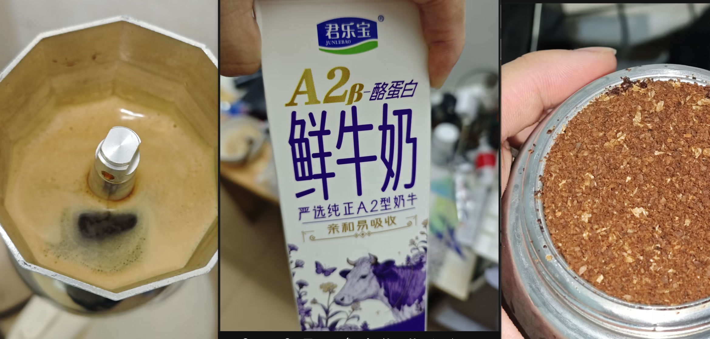
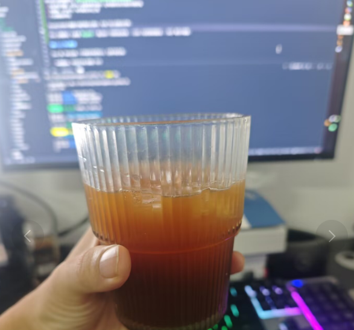
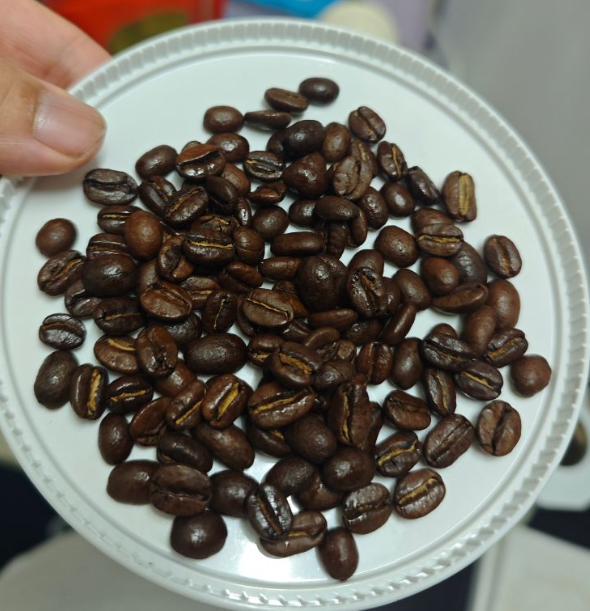

# 辛鹿
##  奶酪曲奇瑰夏
1. 美式

|       |              |
|------|------|
| **烘培度** | 中深烘 |
| **方式** | 摩卡壶，余温出液 |
| **研磨器具** | PDD公版磨豆 |
| **研磨度** | 14 |
| **粉量** | 18g |
| **水量** | 90ml |
| **水粉比** | 1:5 |

加水250ml，不锈钢冰块，入口微苦，回甘不错，果香味还行，不涩口，感觉和奶酪曲奇不咋搭边，红茶味倒不错

**不锈钢冰块还是不行，得用正常冰块**

##  蓝山均衡
1. 直接兑奶

|       |              |
|------|------|
| **烘培度** | 中烘 |
| **方式** | 摩卡壶，余温出液 |
| **研磨器具** | PDD公版磨豆 |
| **研磨度** | 14 |
| **粉量** | 18g |
| **水量** | 90ml |
| **水粉比** | 1:5 |

还得是冰块对胃，直接兑奶感觉像带咖啡味的酥茶？君乐宝这款不赖 就是太贵

## 橘香茉莉SOE
1. 美式

|       |              |
|------|------|
| **烘培度** | 中浅 |
| **机器** | 可数S1 |
| **研磨器具** | 可数磨豆机 |
| **粉量** | 18g |
| **出液** | 28g |
| **温度** | 93℃ |
| **萃取时间** | 30s 算预浸泡 |
| **压力** | 稳11bar |

冰100g 水100g，兑浓缩液，果酸味适中，是恰到好处的酸，酸后的甜感像是大杂烩吧，如果硬要往标注的口味上靠的话，是有类似于橘子的味道，茉莉花这块，，当就当有点吧，作为中浅烘来说，这个酸度刚刚好，比之前摩卡壶煮出来的酸度好很多。

# 白鲸
## 三重奏

很靓的豆子，目前体感最好的一个，就是太贵-=
1. 美式

|       |              |
|------|------|
| **烘培度** | 深烘 |
| **机器** | 可数S1 |
| **研磨器具** | 可数磨豆机 |
| **粉量** | 18g |
| **出液** |  |
| **温度** | 90℃ |
| **萃取时间** |  |

# 高晟庄园