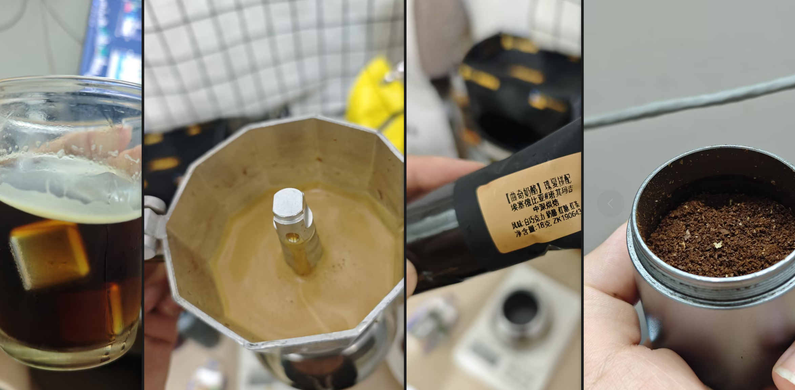

# 辛鹿
##  奶酪曲奇瑰夏
1. 美式

|       |              |
|------|------|
| **烘培度** | 中深烘 |
| **方式** | 摩卡壶，余温出液 |
| **研磨器具** | PDD公版磨豆 |
| **研磨度** | 14 |
| **粉量** | 18g |
| **水量** | 90ml |
| **水粉比** | 1:5 |

加水250ml，不锈钢冰块，入口微苦，回甘不错，果香味还行，不涩口，感觉和奶酪曲奇不咋搭边，红茶味倒不错

**不锈钢冰块还是不行，得用正常冰块**
