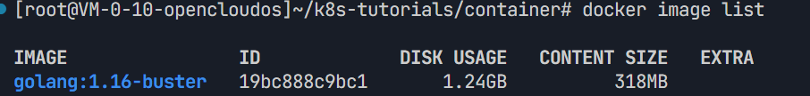
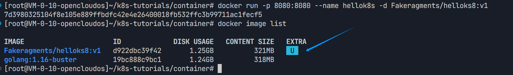
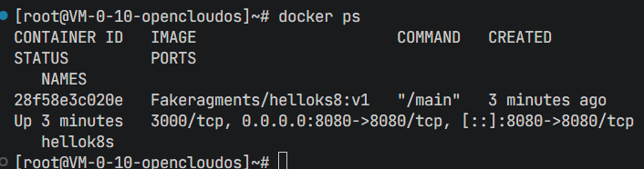
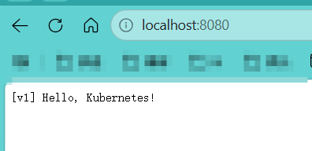
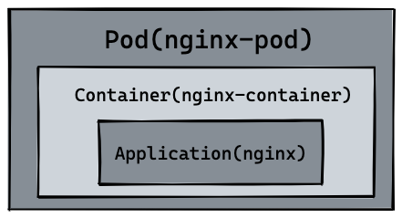
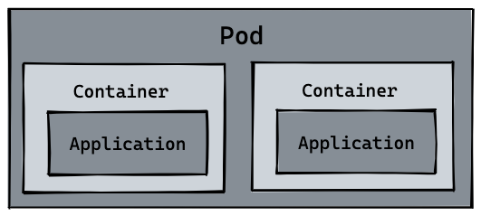

# 1. Docker技术概述
## 1.1 Docker定位
- Docker 是一个开源的应用容器化引擎，基于 Linux 内核的容器技术实现，能够**将应用程序及其依赖、配置、运行环境打包成标准化、可移植的容器**，实现一次构建、随处运行。
- 解决了传统软件部署中环境不一致、依赖复杂、迁移困难、部署繁琐等问题，**实现容器化、轻量化和标准化**。

## 1.2 Docker组成
- **镜像（Image）**：`只读的应用模板，包含代码、依赖、库、环境变量、配置等，是创建容器的基础。`
- **`容器（Container）`**：镜像的运行实例，是独立、隔离、可启停的轻量级运行环境。
- **Docker 仓库（Registry）**：集中存储、分发镜像的服务，如 Docker Hub、私有仓库。
- **Docker**： 引擎负责管理镜像、容器、网络、数据卷等核心组件的运行时环境。

**container架构:**
```
[物理服务器 Physical Machine]
 ├─ 虚拟机 VM 架构
 │   ├─ Hypervisor 虚拟化层
 │   │   ├─ VM1：完整操作系统 + 应用
 │   │   ├─ VM2：完整操作系统 + 应用
 │   │   └─ VM3：完整操作系统 + 应用
 │
 └─ 容器 Container 架构
     ├─ 操作系统（共享内核）
     │   ├─ Docker/容器引擎
     │   │   ├─ Container1：只打包应用+依赖
     │   │   ├─ Container2：只打包应用+依赖
     │   │   └─ Container3：只打包应用+依赖

```

**容器内部架构:**
```
Container 容器
 ├─ 隔离环境（Namespace）
 │   ├─ 进程隔离 PID
 │   ├─ 网络隔离 Net
 │   ├─ 文件系统隔离 MNT
 │   └─ 用户隔离 User
 ├─ 资源限制（Cgroups）
 │   ├─ CPU 上限
 │   ├─ 内存上限
 │   └─ IO/带宽限制
 ├─ 应用 App
 └─ 依赖库（不包含操作系统内核）
```

## 1.3 基本命令用法

```bash
# 拉取镜像（如官方Nginx镜像）
docker pull nginx
# 运行容器（-d 后台运行，-p 映射端口）
docker run -d -p 80:80 nginx
# 查看运行中的容器
docker ps
# 构建镜像（基于当前目录的Dockerfile）
docker build -t my-app .
# 进入容器内部
docker exec -it <容器ID> /bin/bash
```

## 1.4 基本操作流程
**参考文档：**
::github{repo="guangzhengli/k8s-tutorials"}

1. 新建一个 main.go 文件，内容如下：
```go
package main
l
import (
	"fmt"
	"net/http"
)

func handler(w http.ResponseWriter, r *http.Request) {
	fmt.Fprintf(w, "Hello, Docker!")
}

func main() {
	http.HandleFunc("/", handler)
	http.ListenAndServe(":3000", nil)
}
```
这时没有Go语言环境，因此无法直接运行，但是通过` Container (容器)` 技术，只需要上面的代码，附带着`对应的容器 Dockerfile 文件`，那么你就不需要 golang 的任何知识，也能将代码顺利运行起来。

2. 新建一个 Dockerfile 文件，内容如下：
```dockerfile
# 只用本地已经有的镜像
FROM golang:1.16-buster AS builder
WORKDIR /src
COPY . .
RUN go mod init hello
RUN go build -o main .

#不使用 alpine / scratch / distroless
FROM golang:1.16-buster
WORKDIR /
COPY --from=builder /src/main /main
EXPOSE 3000
ENTRYPOINT ["/main"]
```

golang:1.16-buster = **Go 1.16 + Debian 10 系统**
<br>原方法build的时候一直超时挺烦的，就**手动pull**镜像下来使用，`main.go` 文件需要和 `Dockerfile` 文件在**同一个目录下**。

```bash
 docker pull golang:1.16-buster
```



3. docker build & docker run
```bash
docker build . -t Fakeragments/helloks8:v1
#docker run 命令将容器启动， -p 指定 8080 作为外部访问端口，3000 是容器内部监听端口，--name 指定容器名字，-d 指定后台运行容器。
docker run -d -p 8080:3000 --name hellok8s Fakeragments/helloks8:v1
# 如果提示容器被占用 删除重运行即可
docker rm -f hellok8s
```
> build完之后就是将这段go代码打包成**docker container**了。




4. push 镜像到 Docker Hub
```bash
#login
docker login -u fakeragments

docker push Fakeragments/helloks8:v1
```

5. 查看docker运行状态
```bash
docker ps
```


访问本地监听的8080可以看到代码执行结果：


-----

# 2. Pod技术概述

- 类比就是Pod是房子，Container是住在房子里的人
 
> 图 https://guangzhengli.com/courses/kubernetes/pod
- **Pod是Kubernetes中创建和管理的、最小的可部署的计算单元，即最小调度单位，Container是里面运行的进程**
- 同一个Pod里的所有容器：`共享同一个 IP、同一个网络空间、本地存储、可以互相用 localhost访问`。  
 


## 2.1 环境准备
- 系统：这里备了两套，OpenCloudOS云主机 和 Windows11

- Linux **kubectl安装**（`Kubernetes 的命令行工具`）
```bash
# 下载kubectl
curl -LO "https://dl.k8s.io/release/$(curl -L -s https://dl.k8s.io/release/stable.txt)/bin/linux/amd64/kubectl"
# 添加执行权限
chmod +x kubectl
# 移动到可执行路径
sudo mv kubectl /usr/local/bin/
# 检查版本
kubectl version --client
```
- Linux **minikube安装**（`轻量级的 Kubernetes单节点集群，minikube把一整套K8s环境打包进了一个独立文件里`）
```bash
# 下载minikube
curl -LO https://storage.googleapis.com/minikube/releases/latest/minikube-linux-amd64
# 添加执行权限
chmod +x minikube-linux-amd64
# 移动到可执行路径
sudo mv minikube-linux-amd64 /usr/local/bin/minikube
# 检查版本
minikube version
```
- windows minikube安装，到[官网下载](https://minikube.sigs.k8s.io/) 。下载完到对应目录下执行即可。


## 2.2 Pod创建

1. 创建一个nginx的pod，nginx.yaml文件如下：
```yaml
apiVersion: v1       # Kubernetes 核心API版本，Pod固定用v1
kind: Pod            # 资源类型：Pod
metadata:
  name: nginx-pod    # Pod名字，唯一标识
spec:
  containers:        # 容器列表
    - name: nginx-container  # 容器名字
      image: nginx           # 使用的镜像（官方Nginx）
```

> Pod的资源类型可以理解为K8S中的最小元素


2. 应用YAML创建，此时已经环境已经备好了（docker、kubectl、minikube），需要保证minikube为运行状态。以下命令windows和linux通用。`这里minikube抓取的镜像是作为minikube运行的底层系统镜像`。

```bash
# 启动minikube
minikube start --image-mirror-country=cn  
# 手动加载本地镜像
minikube image load registry.cn-hangzhou.aliyuncs.com/google_containers/kicbase:v0.0.50
# 检查minikube状态
minikube status
# 如果提示 ‘Exiting due to DRV_AS_ROOT: The "docker" driver should not be used with root privileges.’
minikube start --force
# 应用YAML创建Pod
kubectl apply -f nginx.yaml
```


3. Nginx Pod操作
```bash
kubectl get pods
# nginx-pod         1/1     Running   0           6s
kubectl port-forward nginx-pod 4000:80 #将 nginx 默认的 80 端口映射到本机的 4000 端口
# Forwarding from 127.0.0.1:4000 -> 80
# Forwarding from [::1]:4000 -> 80
```