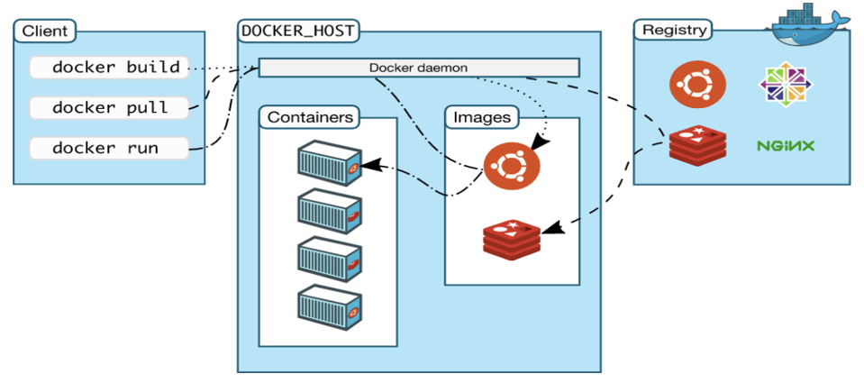
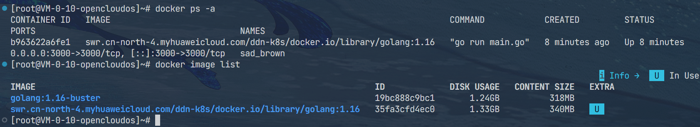
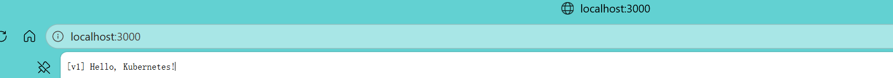
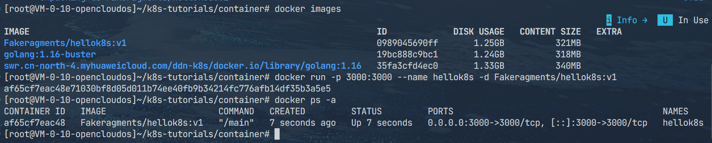

# 1. Docker技术概述
## 1.1 Docker定位
- Docker 是一个开源的应用容器化引擎，基于 Linux 内核的容器技术实现，能够**将应用程序及其依赖、配置、运行环境打包成标准化、可移植的容器**，实现一次构建、随处运行。
- 解决了传统软件部署中环境不一致、依赖复杂、迁移困难、部署繁琐等问题，**实现容器化、轻量化和标准化**。

## 1.2 Docker组成
- **镜像（Image）**：`只读的应用模板，包含代码、依赖、库、环境变量、配置等，是创建容器的基础。`
- **`容器（Container）`**：镜像的运行实例，是独立、隔离、可启停的轻量级运行环境。
- **Docker 仓库（Registry）**：集中存储、分发镜像的服务，如 Docker Hub、私有仓库。
- **Docker**： 引擎负责管理镜像、容器、网络、数据卷等核心组件的运行时环境。

## 1.3 Docker架构
Docker架构[如图](https://www.runoob.com/docker/docker-intro.html)所示：
<br>
- **Docker Client**：`类似于shell，传递用户命令`，docker命令实际上都是 Client 向 Daemon 发送的 API 请求。
- **Docker Daemon**：Docker的核心服务进程；`管理镜像、容器、网络和存储卷；监听Docker API请求并处理`。
- **Docker Engine**：Docker Client + Docker Daemon + REST API， `Docker对外暴露的标准化、RESTful通信接口`。
- **Docker Images**: `只读的、分层的、完整应用运行模板`，包含应用运行所有环境，是容器的基础，不运行、不修改，
- **Docker Containers**：`动态、可写、运行实例、正在跑的程序`，镜像运行起来的一个实例就是一个隔离、独立、轻量的应用进程。
- Docker Registry：`存储和分发Docker镜像`；提供镜像的版本管理；支持公有和私有仓库。
- Docker Compose：`用于定义多容器应用`，通过 YAML 文件描述多个容器之间的关系和依赖关系。
- Docker Swarm：`用于管理多个节点的Docker集群`，提供高可用、自动扩展、服务发现等功能。
- Docker Networks：`用于管理容器之间的网络通信`等功能。
- Docker Volumes：`用于持久化存储容器数据`，提供数据卷的创建备份等操作。


**container架构:**
```
[物理服务器]
 │
 └─ 容器 Container 架构
     ├─ 操作系统（共享内核）
        ├─ Docker/容器引擎
           ├─ Container： #只打包应用+依赖
                ├─ 隔离环境（Namespace）
                │   ├─ 进程隔离 PID
                │   ├─ 网络隔离 Net
                │   ├─ 文件系统隔离 MNT
                │   └─ 用户隔离 User
                ├─ 资源限制（Cgroups）
                │   ├─ CPU 上限
                │   ├─ 内存上限
                │   └─ IO/带宽限制
                ├─ 应用 App
                └─ 依赖库（不包含操作系统内核）
```

## 1.3 基本命令用法

```bash
# 拉取镜像（如官方Nginx镜像）
docker pull nginx
# 构建镜像（. 是当前目录）
docker build -t 名字:标签 .  
# 运行容器（-d 后台运行，-p 映射端口, --name 自定义名, 镜像名）
docker run -d -p 80:80 --name nginx nginx
# 查看所有容器
docker ps -a
# 进入容器内部
docker exec -it <容器ID> /bin/bash
# 启动
docker start nginx
# 停止
docker stop nginx
# 重启    
docker restart nginx  
# 删除（必须先停止）
docker rm nginx       
# 强制删除（运行中也能删）
docker rm -f 容器ID
```

-----

# 2. 基本流程
**案例来源：**

::github{repo="guangzhengli/k8s-tutorials"}


## 2.1 源码准备
环境使用云主机上自带的docker。

这里使用go语言来启动一个监听3000端口的HTTP服务，访问根路径时返回文本。
```go
package main
import (
	"io"
	"net/http"
)
func hello(w http.ResponseWriter, r *http.Request) {
	io.WriteString(w, "[v1] Hello, Kubernetes!")
}
func main() {
	http.HandleFunc("/", hello)
	http.ListenAndServe(":3000", nil)
}
```

## 2.2 Docker镜像拉取和使用
此时的环境是没有能够直接执行该代码的能力，这时候就可以用到docker仓库中提供的镜像，这里使用国内源的golang:1.16，直接使用
```bash
docker pull swr.cn-north-4.myhuaweicloud.com/ddn-k8s/docker.io/library/golang:1.16
```

拉取即可。拉取完成后，`可以直接用这个镜像的环境来运行此代码`：

```bash
# --rm：用完删除；
# -v "$(pwd):/app"：将当前目录挂载到容器的/app目录，并设置为工作目录；
# swr.cn-north-4.myhuaweicloud.com/ddn-k8s/docker.io/library/golang:1.16：使用golang:1.16镜像；
docker run --rm -p 3000:3000 -v "$(pwd):/app" -w /app swr.cn-north-4.myhuaweicloud.com/ddn-k8s/docker.io/library/golang:1.16 go run main.go
```


访问3000端口，可见代码已通过该环境执行：


## 2.3 镜像制作
这个运行的程序，本质上就是**容器（Container）**，只不过这里是临时启动的测试容器，加上 --rm 参数后，容器停止就会自动销毁。
<br>这时需要通过 **Dockerfile** 来**标准化、可重复地从源码直接构建出最小化的生产镜像**。
下面使用多阶段构建的Dockerfile，将Go代码编译并打包为一个仅包含可执行文件的极简镜像：

```dockerfile
# 第一阶段：编译阶段，名字叫builder
# 使用之前拉取的环境，用来编译
FROM swr.cn-north-4.myhuaweicloud.com/ddn-k8s/docker.io/library/golang:1.16 AS builder
# 在容器里创建 /src 目录
RUN mkdir /src
# 把本机当前目录的所有文件，复制到容器的 /src 里，这里dockerfile需要放在和main.go一起的根目录下
ADD . /src
# 进入 /src 目录
WORKDIR /src
# 开启 Go modules 模式（依赖管理）
RUN go env -w GO111MODULE=auto
# 编译 Go 代码，生成可执行文件，名字叫 main
RUN go build -o main .
# 使用谷歌 distroless 极小镜像（无系统、无包、无多余文件）
FROM gcr.io/distroless/base-debian10
# 切换到根目录
WORKDIR /
# 从第一阶段 builder 里，把编译好的 main 复制过来
# 只拷二进制文件，不拷源码、不拷编译环境，这样就保证了镜像的最小化，只保留可执行文件main
COPY --from=builder /src/main /main
# 声明容器会暴露 3000 端口（只是声明，不自动发布）
EXPOSE 3000
# 容器启动时执行的命令：运行 main 程序
ENTRYPOINT ["/main"]
```

执行build，打包容器为镜像：
```bash
# . 是当前目录，-t 是 tag和版本号，Fakeragments/hellok8s:v1 是镜像名和标签
docker build . -t Fakeragments/hellok8s:v1
```

执行成功后就可以在docker image中查看到打包好的镜像，这里打包好后直接调用：
```bash
docker images
# -p 本机端口:容器端口, -d 后台运行
docker run -p 3000:3000 --name hellok8s -d Fakeragments/hellok8s:v1
```


-----

build完后的镜像为本地存储，可以通过docker push 该镜像推送到docker仓库中。
```bash
docker push Fakeragments/hellok8s:v1
```
