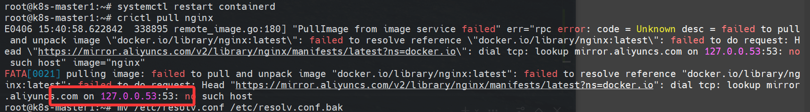

# 环境说明
部署一套 `单Master + 单Worker` 集群。

开始想的是用minikube，但是局限性有太多，网上的教程有点乱，还是想着自己折腾一下。

正好有个核心网+K8S的项目是采用多节点方式部署，这里就使用**kubeadm**方式来部署了，采用为了熟悉命令，不使用dashboard。
- 必须安装containerd、kubelet、kubeadm、kubectl
- crictl查看、拉取、删除镜像，containerd的操作工具

所有节点虚拟机参数如下：
- 系统：ubuntu-24.04.4-live-server-amd64；
- VMware部署，单处理器8核，16G运存，80G磁盘；
- 单网卡做NAT

-----

# Master单节点部署
**k8s安装**，这里安装的是 **1.28** 版本，apt源使用阿里源：
```bash
hostnamectl set-hostname k8s-master1
echo “192.168.24.130 k8s-master1” >> /etc/hosts

swapoff -a
sed -i '/swap/s/^/#/' /etc/fstab

ufw disable

# 调整网络参数
cat <<EOF | tee /etc/modules-load.d/k8s.conf
overlay
br_netfilter
net.bridge.bridge-nf-call-iptables  = 1
net.bridge.bridge-nf-call-ip6tables = 1
net.ipv4.ip_forward                 = 1
EOF

# 安装配置containerd（替代docker）
apt install -y containerd
mkdir -p /etc/containerd
containerd config default > /etc/containerd/config.toml
sed -i 's/SystemdCgroup = false/SystemdCgroup = true/g' /etc/containerd/config.toml
systemctl restart containerd
systemctl enable containerd
systemctl status containerd

# 安装k8s https://developer.aliyun.com/mirror/kubernetes
apt-get update && apt-get install -y apt-transport-https
curl -fsSL https://mirrors.aliyun.com/kubernetes-new/core/stable/v1.28/deb/Release.key |
    gpg --dearmor -o /etc/apt/keyrings/kubernetes-apt-keyring.gpg
echo "deb [signed-by=/etc/apt/keyrings/kubernetes-apt-keyring.gpg] https://mirrors.aliyun.com/kubernetes-new/core/stable/v1.28/deb/ /" |
    tee /etc/apt/sources.list.d/kubernetes.list
apt-get update
apt-get install -y kubelet kubeadm kubectl
```

-----


**到这里container和k8s组件已经基本部署完成，接下来开始初始化k8s：**
:::note[踩坑记录]
这里使用的阿里云的镜像仓库，因此还需要修改container的配置文件。
:::

```bash
sed -i 's|sandbox_image = .*|sandbox_image = "registry.aliyuncs.com/google_containers/pause:3.9"|' /etc/containerd/config.toml
systemctl restart containerd

kubeadm init \
  --apiserver-advertise-address=192.168.24.130 \
  --image-repository registry.aliyuncs.com/google_containers \
  --kubernetes-version v1.28.4 \
  --service-cidr=10.96.0.0/12 \
  --pod-network-cidr=192.168.0.0/16
```

这时候通过`kubectl get nodes`看主节点是连接失败的，需要配置其他组件：
```bash
kubectl get nodes
# E0405 15:48:47.825576   45541 memcache.go:265] couldn't get current server API group list: Get "http://localhost:8080/api?timeout=32s": dial tcp 127.0.0.1:8080: connect: connection refused
# The connection to the server localhost:8080 was refused - did you specify the right host or port?


# 给权限
mkdir -p $HOME/.kube
cp -i /etc/kubernetes/admin.conf $HOME/.kube/config
chown $(id -u):$(id -g) $HOME/.kube/config
kubectl get nodes
#NAME          STATUS     ROLES           AGE   VERSION
#k8s-master1   NotReady   control-plane   17m   v1.28.15

# 网络插件，可以理解为k8s集群中负责通信的网络设备
kubectl apply -f https://raw.githubusercontent.com/projectcalico/calico/v3.31.4/manifests/calico.yaml

# 查看整体
kubectl get pods -n kube-system  &&  kubectl get nodes
# NAME                                       READY   STATUS    RESTARTS   AGE
# calico-kube-controllers-66f8b6cf45-h7cmw   1/1     Running   0          5m21s
# calico-node-fzrsr                          1/1     Running   0          5m21s
# coredns-66f779496c-4j4w7                   1/1     Running   0          25m
# coredns-66f779496c-njdsz                   1/1     Running   0          25m
# etcd-k8s-master1                           1/1     Running   1          25m
# kube-apiserver-k8s-master1                 1/1     Running   1          25m
# kube-controller-manager-k8s-master1        1/1     Running   1          25m
# kube-proxy-bl7zf                           1/1     Running   0          25m
# kube-scheduler-k8s-master1                 1/1     Running   1          25m
# NAME          STATUS   ROLES           AGE   VERSION
# k8s-master1   Ready    control-plane   25m   v1.28.15
```
**到这里 Master 节点已经部署完成了，现在处理工作（Worker）节点。**

# Worker单节点部署
首先在master1节点上**生成worker加入的密钥**：
```bash
kubeadm token create --print-join-command
# kubeadm join 192.168.24.130:6443 --token 199087.5d6po9e0znrwbwkr --discovery-token-ca-cert-hash sha256:90f8f15114f42eebc9625b34a70383b4fb80eb979495aaba22300ebdd95c6c2a
```

**worker节点**使用之前`部署好containerd和K8s组件`的快照，链接克隆就行，修改主机名为`k8s-worker1`：
```bash
# worker1
hostnamectl set-hostname k8s-worker1
# /etc/hosts同步修改

# 重置一下
kubeadm reset -f
rm -rf $HOME/.kube
rm -rf /var/lib/kubelet
rm -rf /etc/kubernetes

# 贴上生成的密钥
kubeadm join 192.168.24.130:6443 --token 199087.5d6po9e0znrwbwkr --discovery-token-ca-cert-hash sha256:90f8f15114f42eebc9625b34a70383b4fb80eb979495aaba22300ebdd95c6c2a
# This node has joined the cluster:
# ...
```
:::tip
containerd配置文件和master1相同，不然纳管的时候抓取calico和proxy镜像时可能一直处于init状态
:::

出现以上字段就说明加入没问题，这时候**回到master1上查看节点状态**：
```bash
kubectl get pods -n kube-system -o wide  | grep -i worker1
# NAME                                       READY   STATUS    RESTARTS      AGE   IP                NODE          NOMINATED NODE   READINESS GATES
# calico-node-5ddj4                          1/1     Running   0             12m   192.168.24.131    k8s-worker1   <none>           <none>
# kube-proxy-5qh7f                           1/1     Running   0             12m   192.168.24.131    k8s-worker1   <none>           <none>
kubectl get nodes
# NAME          STATUS   ROLES           AGE   VERSION
# k8s-master1   Ready    control-plane   17h   v1.28.15
# k8s-worker1   Ready    <none>          11m   v1.28.15
```
worker1的`calico和proxy网络组件处于running`，且worker1 `node状态为ready`，代表worker1已经加入到集群了。

# tips 一些其他踩坑记录：
## crictl images显示有报错
crictl images显示有报错，没有指定用containerd，解决：

```bash
# WARN[0000] image connect using default endpoints...ERRO[0000] validate service connection: unix:///var/run/dockershim.sock: no such file or directory

# crictl连接containerd
cat > /etc/crictl.yaml <<'EOF'
runtime-endpoint: unix:///run/containerd/containerd.sock
image-endpoint: unix:///run/containerd/containerd.sock
timeout: 10
debug: false
EOF

crictl images
# IMAGE                                                             TAG                 IMAGE ID            SIZE
# quay.io/calico/cni                                                v3.31.4             c433a27dd94ce       72.2MB
# quay.io/calico/kube-controllers                                   v3.31.4             ff033cc89dab5       54MB
# quay.io/calico/node                                               v3.31.4             e6536b93706ed       160MB
# registry.aliyuncs.com/google_containers/coredns                   v1.10.1             ead0a4a53df89       16.2MB
# registry.aliyuncs.com/google_containers/etcd                      3.5.15-0            2e96e5913fc06       56.9MB
# registry.aliyuncs.com/google_containers/kube-apiserver            v1.28.15            9dc6939e7c573       34.4MB
# registry.aliyuncs.com/google_containers/kube-apiserver            v1.28.4             7fe0e6f37db33       34.7MB
# registry.aliyuncs.com/google_containers/kube-controller-manager   v1.28.15            10541d8af03f4       33.3MB
# registry.aliyuncs.com/google_containers/kube-controller-manager   v1.28.4             d058aa5ab969c       33.4MB
# registry.aliyuncs.com/google_containers/kube-proxy                v1.28.15            ba6d7f8bc25be       28.3MB
# registry.aliyuncs.com/google_containers/kube-proxy                v1.28.4             83f6cc407eed8       24.6MB
# registry.aliyuncs.com/google_containers/kube-scheduler            v1.28.15            9d3465f8477c6       18.5MB
# registry.aliyuncs.com/google_containers/kube-scheduler            v1.28.4             e3db313c6dbc0       18.8MB
# registry.aliyuncs.com/google_containers/pause                     3.9                 e6f1816883972       322kB
```
----

## crictl镜像拉取问题
crictl在拉取镜像时出现镜像拉取超时，同时报dns解析失败，如图所示：


**这里首先得配置container镜像加速地址**，`/etc/containerd/config.toml` 修改镜像加速配置：

```bash 
      [plugins."io.containerd.grpc.v1.cri".registry.mirrors]
        [plugins."io.containerd.grpc.v1.cri".registry.mirrors."docker.io"]
          endpoint = ["https://docker.m.daocloud.io"]
```

```bash 
systemctl restart containerd
```
**会发现解析就是上面的报错（之前用的阿里云加速，半天找不到能用的），这里是使用的/etc/resolv.conf的配置，这个解析很怪，修改后重启还是127.0.0.53，修改了/etc/systemd/resolved.conf也是不行，就很迷惑ubuntu这个操作。**

**直接把/etc/resolv.conf删了重新加个**：
```bash 
systemctl stop systemd-resolved
systemctl disable systemd-resolved
rm -f /etc/resolv.conf
echo "nameserver 223.5.5.5" > /etc/resolv.conf
systemctl restart containerd

# 看下还用没用127.0.0.53，没用就正常了
dig www.baidu.com

# 再pull一下
crictl pull nginx
# Image is up to date for sha256:0cf1d6af5ca72e2ca196afdbdbe26d96f141bd3dc14d70210707cf89032ea217
crictl images
# IMAGE                                                             TAG                 IMAGE ID            SIZE
# docker.io/library/nginx                                           latest              0cf1d6af5ca72       63MB
```

这下才拉下来-=，有点恶心