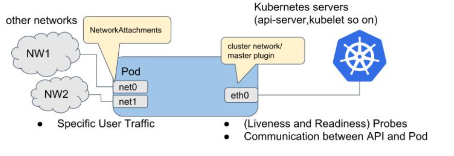

# NAD概述
之前学习K8S基础的时候，pod都是以单网卡的形式工作，`默走集群CNI（Container Network Interface）网络`（Flannel/Calico 等）。

以核心网容器化为例，不同的网元可能需要工作在不同的网段，网络资源需要更明细的划分，其实这只是核心网容器化最最基础的需求，其他的如状态保持之类的就更麻烦。
- 普通**网元一般会区分业务网段和管理网段**，单POD的单网卡限制了这一点
- 使用`NodePort`将POD服务端口映射到节点端口，对于UPF数据转发业务并不适用（GTP封装不允许NAT）。
- 强状态网元也不适用于用`clusterIP`提供服务，如AMF SMF会保留上下文和PDU会话，不能随便负载均衡。

这时候就需要专门的组件来处理多网卡问题：

- `Multus-CNI` 是一个多CNI插件，可以让一个 Pod 能拥有多张网卡，它自己不创建网络，只负责调用其它 CNI ；
- `NAD（Network Attachment Definition）`是K8S的一种资源定义，用于描述一个Pod的网络附件，**记录一张额外网卡的配置信息**；
`Multus` 根据 `NAD` 的定义来为 POD 配置额外的网卡。

Multus-CNI 工作原理如图所示：


# NAD实操
## Multus-CNI镜像导入
worker1节点 使用 ctr 导入准备好的镜像即可：
```bash
# worker1
root@k8s-worker1:~# ctr -n k8s.io images import multus-cni_snapshot.tar
# unpacking ghcr.io/k8snetworkplumbingwg/multus-cni:snapshot (sha256:477accb90081414520b5473adfb732b4ca13e91d8e32f78547e882c99a8d6481)...done
root@k8s-worker1:~# crictl image list
# IMAGE                                                TAG                 IMAGE ID            SIZE
# ghcr.io/k8snetworkplumbingwg/multus-cni              snapshot            deedd5a8d3d7e       426MB
```
这里镜像名称为 `ghcr.io/k8snetworkplumbingwg/multus-cni:snapshot` ，后面yaml文件需要修改下。


## Multus-CNI组件启用
`master1` 上创建 `multus-daemonset.yml` 文件，官方内容基础上修改 `multus-cni` 镜像名称：
```yaml

# Note:
#   This deployment file is designed for 'quickstart' of multus, easy installation to test it,
#   hence this deployment yaml does not care about following things intentionally.
#     - various configuration options
#     - minor deployment scenario
#     - upgrade/update/uninstall scenario
#   Multus team understand users deployment scenarios are diverse, hence we do not cover
#   comprehensive deployment scenario. We expect that it is covered by each platform deployment.
---
apiVersion: apiextensions.k8s.io/v1
kind: CustomResourceDefinition
metadata:
  name: network-attachment-definitions.k8s.cni.cncf.io
spec:
  group: k8s.cni.cncf.io
  scope: Namespaced
  names:
    plural: network-attachment-definitions
    singular: network-attachment-definition
    kind: NetworkAttachmentDefinition
    shortNames:
    - net-attach-def
  versions:
    - name: v1
      served: true
      storage: true
      schema:
        openAPIV3Schema:
          description: 'NetworkAttachmentDefinition is a CRD schema specified by the Network Plumbing
            Working Group to express the intent for attaching pods to one or more logical or physical
            networks. More information available at: https://github.com/k8snetworkplumbingwg/multi-net-spec'
          type: object
          properties:
            apiVersion:
              description: 'APIVersion defines the versioned schema of this represen
                tation of an object. Servers should convert recognized schemas to the
                latest internal value, and may reject unrecognized values. More info:
                https://git.k8s.io/community/contributors/devel/sig-architecture/api-conventions.md#resources'
              type: string
            kind:
              description: 'Kind is a string value representing the REST resource this
                object represents. Servers may infer this from the endpoint the client
                submits requests to. Cannot be updated. In CamelCase. More info: https://git.k8s.io/community/contributors/devel/sig-architecture/api-conventions.md#types-kinds'
              type: string
            metadata:
              type: object
            spec:
              description: 'NetworkAttachmentDefinition spec defines the desired state of a network attachment'
              type: object
              properties:
                config:
                  description: 'NetworkAttachmentDefinition config is a JSON-formatted CNI configuration'
                  type: string
---
kind: ClusterRole
apiVersion: rbac.authorization.k8s.io/v1
metadata:
  name: multus
rules:
  - apiGroups: ["k8s.cni.cncf.io"]
    resources:
      - '*'
    verbs:
      - '*'
  - apiGroups:
      - ""
    resources:
      - pods
      - pods/status
    verbs:
      - get
      - update
  - apiGroups:
      - ""
      - events.k8s.io
    resources:
      - events
    verbs:
      - create
      - patch
      - update
---
kind: ClusterRoleBinding
apiVersion: rbac.authorization.k8s.io/v1
metadata:
  name: multus
roleRef:
  apiGroup: rbac.authorization.k8s.io
  kind: ClusterRole
  name: multus
subjects:
- kind: ServiceAccount
  name: multus
  namespace: kube-system
---
apiVersion: v1
kind: ServiceAccount
metadata:
  name: multus
  namespace: kube-system
---
kind: ConfigMap
apiVersion: v1
metadata:
  name: multus-cni-config
  namespace: kube-system
  labels:
    tier: node
    app: multus
data:
  # NOTE: If you'd prefer to manually apply a configuration file, you may create one here.
  # In the case you'd like to customize the Multus installation, you should change the arguments to the Multus pod
  # change the "args" line below from
  # - "--multus-conf-file=auto"
  # to:
  # "--multus-conf-file=/tmp/multus-conf/70-multus.conf"
  # Additionally -- you should ensure that the name "70-multus.conf" is the alphabetically first name in the
  # /etc/cni/net.d/ directory on each node, otherwise, it will not be used by the Kubelet.
  cni-conf.json: |
    {
      "name": "multus-cni-network",
      "type": "multus",
      "capabilities": {
        "portMappings": true
      },
      "delegates": [
        {
          "cniVersion": "0.3.1",
          "name": "default-cni-network",
          "plugins": [
            {
              "type": "flannel",
              "name": "flannel.1",
                "delegate": {
                  "isDefaultGateway": true,
                  "hairpinMode": true
                }
              },
              {
                "type": "portmap",
                "capabilities": {
                  "portMappings": true
                }
              }
          ]
        }
      ],
      "kubeconfig": "/etc/cni/net.d/multus.d/multus.kubeconfig"
    }
---
apiVersion: apps/v1
kind: DaemonSet
metadata:
  name: kube-multus-ds
  namespace: kube-system
  labels:
    tier: node
    app: multus
    name: multus
spec:
  selector:
    matchLabels:
      name: multus
  updateStrategy:
    type: RollingUpdate
  template:
    metadata:
      labels:
        tier: node
        app: multus
        name: multus
    spec:
      hostNetwork: true
      tolerations:
      - operator: Exists
        effect: NoSchedule
      - operator: Exists
        effect: NoExecute
      serviceAccountName: multus
      containers:
      - name: kube-multus
        image: ghcr.io/k8snetworkplumbingwg/multus-cni:snapshot
        command: ["/thin_entrypoint"]
        args:
        - "--multus-conf-file=auto"
        - "--multus-autoconfig-dir=/host/etc/cni/net.d"
        - "--cni-conf-dir=/host/etc/cni/net.d"
        resources:
          requests:
            cpu: "100m"
            memory: "50Mi"
          limits:
            cpu: "100m"
            memory: "50Mi"
        securityContext:
          privileged: true
        terminationMessagePolicy: FallbackToLogsOnError
        volumeMounts:
        - name: cni
          mountPath: /host/etc/cni/net.d
        - name: cnibin
          mountPath: /host/opt/cni/bin
        - name: multus-cfg
          mountPath: /tmp/multus-conf
      initContainers:
        - name: install-multus-binary
          image: ghcr.io/k8snetworkplumbingwg/multus-cni:snapshot
          command: ["/install_multus"]
          args:
            - "--type"
            - "thin"
          resources:
            requests:
              cpu: "10m"
              memory: "15Mi"
          securityContext:
            privileged: true
          terminationMessagePolicy: FallbackToLogsOnError
          volumeMounts:
            - name: cnibin
              mountPath: /host/opt/cni/bin
              mountPropagation: Bidirectional
      terminationGracePeriodSeconds: 10
      volumes:
        - name: cni
          hostPath:
            path: /etc/cni/net.d
        - name: cnibin
          hostPath:
            path: /opt/cni/bin
        - name: multus-cfg
          configMap:
            name: multus-cni-config
            items:
            - key: cni-conf.json
              path: 70-multus.conf

```


- 其中 kind 为 `CustomResourceDefinition` ，用于自定义新资源。
- 这些pod被归于 `kube-system` 空间。

直接 apply 即可：
```bash
root@k8s-master1:~# kubectl apply -f multus-daemonset.yml
root@k8s-master1:~# kubectl get pods -n kube-system -o wide | grep -i worker1
# calico-node-lp6fk                          1/1     Running   1 (121m ago)   2d    192.168.24.131   k8s-worker1   <none>           <none>
# kube-multus-ds-bmgxw                       1/1     Running   0              14m   192.168.24.131   k8s-worker1   <none>           <none>
# kube-proxy-fwh65                           1/1     Running   1 (121m ago)   2d    192.168.24.131   k8s-worker1   <none>           <none>
```

## NAD资源创建
新建 nad.yaml 文件：
```yaml
---
apiVersion: k8s.cni.cncf.io/v1
kind: NetworkAttachmentDefinition
metadata:
  name: nad-network
  namespace: default
spec:
  config: |
    {
      "cniVersion": "0.3.1",
      "type": "macvlan",
      "master": "ens33",
      "mode": "bridge",
      "ipam": {
        "type": "host-local", 
        "subnet": "192.168.100.0/24" 
      }
    }
```
简单的NAD资源就定义完成了，其含义如下：
- 使用macvlan技术（虚拟出多个独立网卡）
- 复用宿主机网卡 `ens33` 
- 以桥接模式运行
- 由节点本地分配 192.168.100.0/24 网段的ip

执行apply创建资源：
```bash
root@k8s-master1:~# kubectl apply -f nad.yaml
# networkattachmentdefinition.k8s.cni.cncf.io/nad-network created
root@k8s-master1:~# kubectl get network-attachment-definitions
# NAME          AGE
# nad-network   3s
```


## NAD资源使用
以之前创建的 nginx pod 为例，修改 nginx.yaml 文件，metadata 部分新增 NAD 资源：
```yaml
apiVersion: v1
kind: Pod
metadata:
  name: nginx
  annotations:
    k8s.v1.cni.cncf.io/networks: nad-network
spec:
  containers:
    - name: nginx
      image: nginx
      ports:
        - containerPort: 80
```
apply 重新应用，然后查看 nginx pod 是否有新增网卡：
```bash
root@k8s-master1:~# kubectl apply -f nginx.yaml
root@k8s-master1:~# kubectl exec -it nginx -- cat /proc/net/dev
# Inter-|   Receive                                                |  Transmit
#  face |bytes    packets errs drop fifo frame compressed multicast|bytes    packets errs drop fifo colls carrier compressed
#     lo:       0       0    0    0    0     0          0         0        0       0    0    0    0     0       0          0
#  tunl0:       0       0    0    0    0     0          0         0        0       0    0    0    0     0       0          0
#   eth0:     446       5    0    0    0     0          0         0      866      11    0    0    0     0       0          0
#   net1:      60       1    0    0    0     0          0         1      908      12    0    0    0     0       0          0
```
可以看到 nginx pod 已经加上了一张 net1 网卡，net1 是 multus 命名规则生成的。

