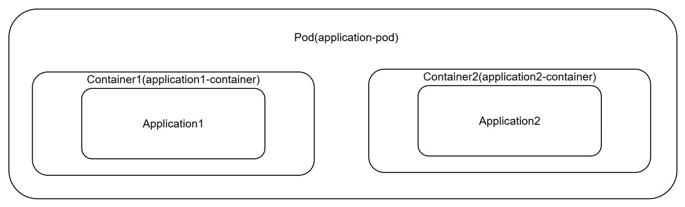

# 1. Pod基本概念
**Pod是Kubernetes中最小的可部署、可管理的运行单位（不是容器）**
- 一个 Pod 里可以包含`一个或多个容器`。
- 同一个 Pod 内的容器：
      共享网络命名空间（同一个IP、端口空间）
      共享存储卷（Volume）
      共享UTS、IPC命名空间
      可以通过localhost互相访问
- Pod是短暂、易销毁、不可变的，一旦删除就重建，IP会变。
- Pod本身不保证高可用，崩溃不会自动重启，需要Deployment管理。

