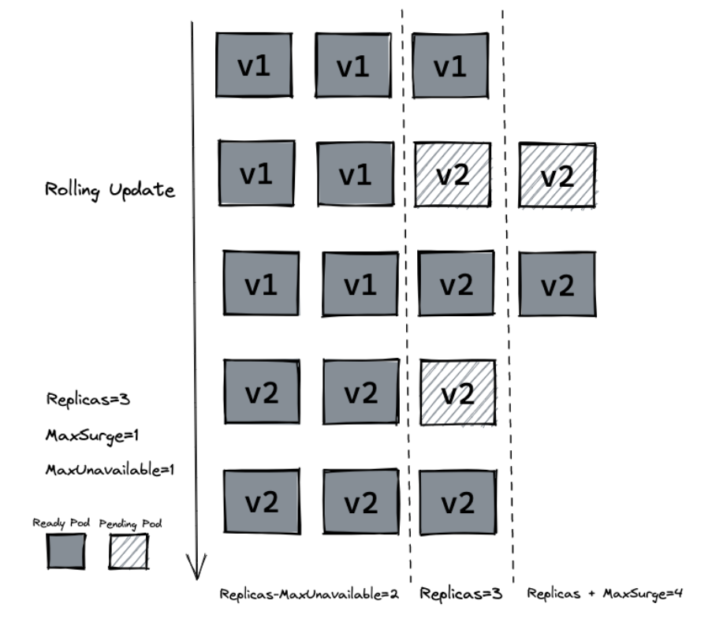

# 概述
**前面有使用过docker来构建自己的镜像，所以这次版本升级不使用crictl从默认源抓取的镜像，而是使用自己构建的镜像**，这样来学习K8S中pod镜像版本升级。

----

# 镜像v2版本升级
将之前学习docker的代码重新构造下，改为v2版本，返回文本为`[v2] Hello, Kubernetes!`：
```go
package main
import (
	"io"
	"net/http"
)
func hello(w http.ResponseWriter, r *http.Request) {
	io.WriteString(w, "[v2] Hello, Kubernetes!")
}
func main() {
	http.HandleFunc("/", hello)
	http.ListenAndServe(":3000", nil)
}
```

再build一下，这里死活登不上docker，直接把镜像打包到本地部署K8S的环境：
```shell
root@VM-0-10-opencloudos~/k8s-tutorials/container# docker build . -t fakeragments/hellok8s:v2
root@VM-0-10-opencloudos~/k8s-tutorials/container# docker save -o hellok8s-v2.tar fakeragments/hellok8s:v2
root@VM-0-10-opencloudos~/k8s-tutorials/container# ls
# Dockerfile  hellok8s-v2.tar  main.go
```

本地worker1节点上，导入上传好的镜像文件：
```bash
root@k8s-worker1:~# ctr -n k8s.io image import hellok8s-v2.tar
root@k8s-worker1:~# crictl images
# IMAGE                                                TAG                 IMAGE ID            SIZE
# docker.io/fakeragments/hellok8s                      v2                  26c3fd4f56721       321MB

```

**修改下上一节部署的deployment文件**，把镜像改为刚刚上传的 `fakeragments/hellok8s:v2` ：
```yaml
apiVersion: apps/v1
kind: Deployment
metadata:
  name: nginx-redis-deployment
spec:
  replicas: 1
  selector:
    matchLabels:
      app: nginx-redis
  template:
    metadata:
      labels:
        app: nginx-redis
    spec:
      containers:
        # 容器1：hellok8s
        - name: hellok8s
          image: fakeragments/hellok8s:v2
          ports:
            - containerPort: 80
        # 容器2：Redis
        - name: redis
          image: redis:alpine
          ports:
            - containerPort: 6379
```

直接再通过 `kubectl apply -f deployment.yaml` 部署：
```bash
root@k8s-master1:~# kubectl apply -f deployment.yaml
# deployment.apps/nginx-redis-deployment configured
root@k8s-master1:~# kubectl get pods
# NAME                                      READY   STATUS    RESTARTS      AGE
# nginx-redis-deployment-846f98c677-85qq8   2/2     Running   0             5s
```

可以看到通过deployment升级了镜像版本，pod状态也正常，再用端口映射来测试下，**注意这里代码是开放的nginx3000端口**。
```bash
#映射
root@k8s-master1:~# kubectl port-forward pod/nginx-redis-deployment-846f98c677-85qq8 8080:3000 6379:6379 --address=0.0.0.0
Forwarding from 0.0.0.0:8080 -> 3000
Forwarding from 0.0.0.0:6379 -> 6379
Handling connection for 8080

root@k8s-master1:~# curl 192.168.24.130:8080
# [v2] Hello, Kubernetes!
```
----

# 滚动更新 rolling update
上面的更新模式会让所有副本在同一时间更新，会导致服务暂时不可用，这时候就需要用到滚动更新模式。

**动更新就是在不停机、不中断服务的前提下，一批一批、逐个替换旧版本应用实例，逐步升级到新版本。**

[在deployment的资源定义中, spec.strategy.type有两种选择](https://guangzhengli.com/courses/kubernetes/deployment#%E5%8D%87%E7%BA%A7%E7%89%88%E6%9C%AC):
- `RollingUpdate`: 逐渐增加新版本的 pod，逐渐减少旧版本的 pod。
- `Recreate`: 在新版本的 pod 增加前，先将所有旧版本 pod 删除。

[滚动更新又可以通过 `maxSurge` 和 `maxUnavailable` 字段来控制升级 pod 的速率](https://guangzhengli.com/courses/kubernetes/deployment#%E5%8D%87%E7%BA%A7%E7%89%88%E6%9C%AC):
- `maxSurge`: 最大峰值，用来指定可以创建的超出期望 Pod 个数的 Pod 数量。
- `maxUnavailable`: 最大不可用，用来指定更新过程中不可用的 Pod 的个数上限。

## 关于版本回退 rollout
可以使用`history`命令来查看历史版本，`--to-revision=2` 来回滚到指定版本。
```bash
# 先看deployment资源名称
root@k8s-master1:~# kubectl get deployments
# NAME                     READY   UP-TO-DATE   AVAILABLE   AGE
# nginx-redis-deployment   1/1     1            1           3d3h
root@k8s-master1:~# kubectl rollout history deployment nginx-redis-deployment
# deployment.apps/nginx-redis-deployment
# REVISION  CHANGE-CAUSE
# 1         <none>
# 2         <none>
# 3         <none>
# 4         <none>
# 5         <none>
# 8         <none>
# 9         <none>

root@k8s-master1:~# kubectl rollout undo deployment/nginx-redis-deployment --to-revision=1
# deployment.apps/nginx-redis-deployment rolled back

root@k8s-master1:~# kubectl get pods
# NAME                                      READY   STATUS    RESTARTS      AGE
# nginx-redis-deployment-6c69b4d46c-r596v   1/1     Running   0             37s
# nginx-redis-pod                           2/2     Running   2 (16h ago)   4d20h

# 最开始版本使用的是crictl拉取的镜像
root@k8s-master1:~# kubectl describe pod nginx-redis-deployment-6c69b4d46c-r596v | grep -i image
#     Image:          nginx
#     Image ID:       docker.io/library/nginx@sha256:7f0adca1fc6c29c8dc49a2e90037a10ba20dc266baaed0988e9fb4d0d8b85ba0
#   Normal  Pulling    60s   kubelet            Pulling image "nginx"
#   Normal  Pulled     59s   kubelet            Successfully pulled image "nginx" in 601ms (601ms including waiting)

```

## 滚动更新
更新`deployment.yaml`文件，新增`strategy=rollingUpdate` , `maxSurge=1` , `maxUnavailable=1` 和 `replicas=3`。

[这个参数配置意味着**最大可能会创建 4 个 hellok8s pod (replicas + maxSurge)**，**最小会有 2 个 hellok8s pod 存活正常提供服务 (replicas - maxUnavailable)。**](https://guangzhengli.com/courses/kubernetes/deployment#%E5%8D%87%E7%BA%A7%E7%89%88%E6%9C%AC)



```yaml
apiVersion: apps/v1
kind: Deployment
metadata:
  name: nginx-redis-deployment
spec:

  strategy:
     rollingUpdate:
      maxSurge: 1
      maxUnavailable: 1

  replicas: 3
  selector:
    matchLabels:
      app: nginx-redis
  template:
    metadata:
      labels:
        app: nginx-redis
    spec:
      containers:
        # 容器1：hellok8s v2
        - name: hellok8s
          image: fakeragments/hellok8s:v2
          imagePullPolicy: IfNotPresent
          ports:
            - containerPort: 80

        # 容器2：Redis
        - name: redis
          image: redis:alpine
          ports:
            - containerPort: 6379
```

应用后查看pod状态：

- 最多4个Pod
- 最少保持2个可用
- 自动完成新旧替换

```bash
root@k8s-master1:~# kubectl apply -f deployment.yaml
root@k8s-master1:~# kubectl get pods
# NAME                                      READY   STATUS              RESTARTS      AGE
# nginx-redis-deployment-578b9464fd-6nqz7   3/3     Running             0             4s
# nginx-redis-deployment-578b9464fd-mrs57   0/3     ContainerCreating   0             1s
# nginx-redis-deployment-578b9464fd-xfnch   3/3     Running             0             4s
# nginx-redis-deployment-6c69b4d46c-d26xs   1/1     Terminating         0             4s
root@k8s-master1:~# kubectl get pods
# NAME                                      READY   STATUS    RESTARTS      AGE
# nginx-redis-deployment-578b9464fd-6nqz7   3/3     Running   0             109s
# nginx-redis-deployment-578b9464fd-mrs57   3/3     Running   0             106s
# nginx-redis-deployment-578b9464fd-xfnch   3/3     Running   0             109s
```