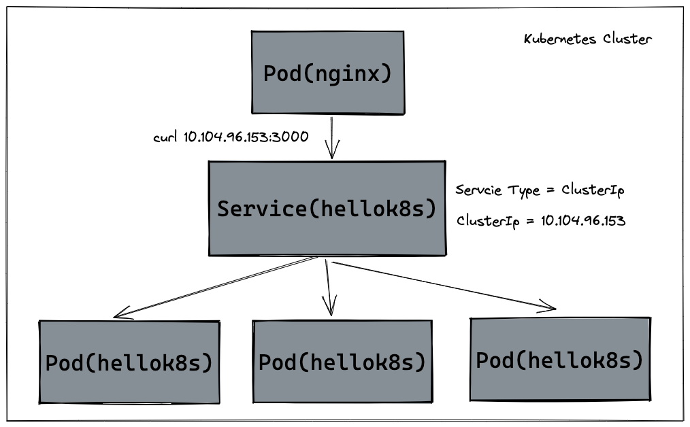
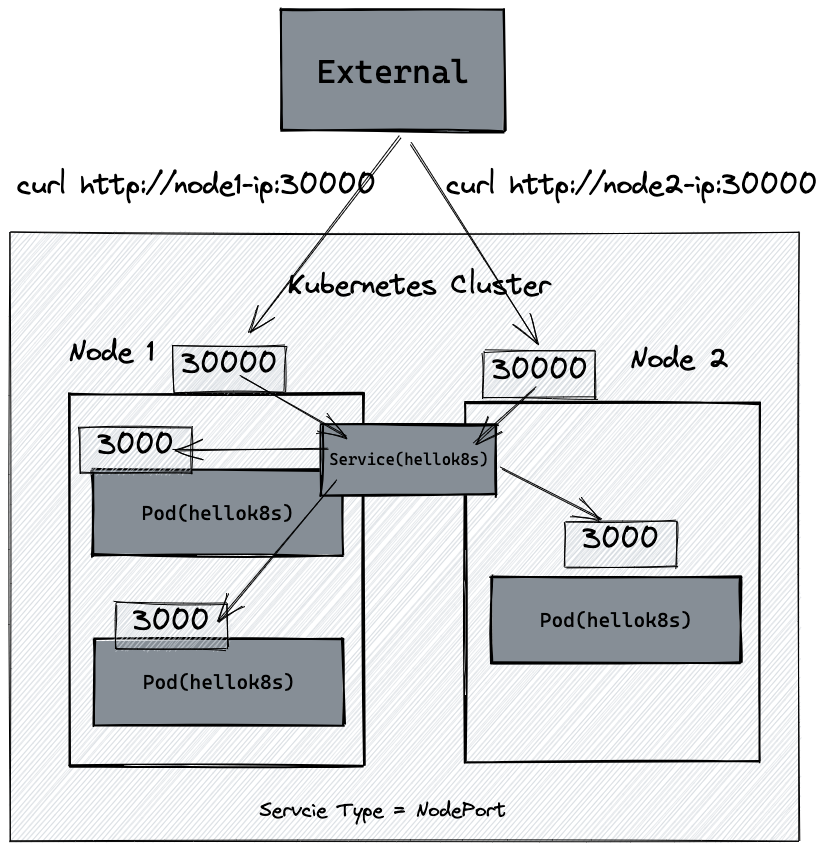
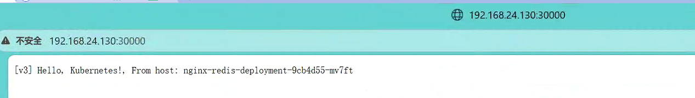

# Service 概述
Service是K8s里的 **固定统一入口 + 负载均衡** 抽象资源。

Service解决的问题：
1. **Pod IP不固定的问题**
- pod ip是动态分配的，之前在实操时也看到了
- 如果直接用pod ip来访问服务，那么pod一变更服务就无法使用，完全用不了
- service ip能够**给一组同类pod绑定一个固定的访问地址，来统一暴露后面的pod服务**，即使pod变化也无感知

2. 多Pod负载均衡问题
- **内置简单轮询负载均衡**分发到多个后端pod

3. 服务发现问题
- service能够**自动生成集群内DNS域名**

4. 故障Pod自动剔除
- 只有pod标记为`Ready状态`，才会被service发现

----

# Service 操作实践
还是把前面的代码拿来改成V3版本，在之前的 hellok8s:v2 版本上加上返回当前服务所在的hostname功能。然后导出上传到k8s `worker1`节点。

```go
package main

import (
	"fmt"
	"io"
	"net/http"
	"os"
)

func hello(w http.ResponseWriter, r *http.Request) {
	host, _ := os.Hostname()
	io.WriteString(w, fmt.Sprintf("[v3] Hello, Kubernetes!, From host: %s", host))
}

func main() {
	http.HandleFunc("/", hello)
	http.ListenAndServe(":3000", nil)
}
```

`master1`上修改`deployment.yaml`文件镜像为v3版本。
```bash
apiVersion: apps/v1
kind: Deployment
metadata:
  name: nginx-redis-deployment
spec:

  strategy:
     rollingUpdate:
      maxSurge: 1
      maxUnavailable: 1

  replicas: 3
  selector:
    matchLabels:
      app: nginx-redis
  template:
    metadata:
      labels:
        app: nginx-redis
    spec:
      containers:
        # 容器1：hellok8s v3
        - name: hellok8s
          image: fakeragments/hellok8s:v3
          imagePullPolicy: IfNotPresent
          ports:
            - containerPort: 3000

        # 容器2：Redis
        - name: redis
          image: redis:alpine
          ports:
            - containerPort: 6379
```

定义一个 `service` 资源，使用 `ClusterIP` 的方式定义，通过 `ClusterIP` 暴露服务。
> `ClusterIP` 是 `Service` 默认类型。会给 `Service` 分配一个仅集群内部可达的虚拟固定 IP，只能在集群内 Pod、节点上访问，外网 / 集群外默认无法访问。

创建 `service.yaml` 文件，内容如下：
```yaml
apiVersion: v1
kind: Service
metadata:
  name: nginx-redis-service
spec:
  selector:
    app: nginx-redis
  ports:
    - port: 80
      targetPort: 3000
      protocol: TCP
      name: http
    - port: 6379
      targetPort: 6379
      protocol: TCP
      name: redis
```

创建后使用apply应用，再查看相关状态：
```bash
root@k8s-master1:~# kubectl apply -f service.yaml
# service/nginx-redis-service created
root@k8s-master1:~# kubectl get endpoints
# NAME                  ENDPOINTS                                                              AGE
# kubernetes            192.168.24.130:6443                                                    6d23h
# nginx-redis-service   172.30.194.85:6379,172.30.194.86:6379,172.30.194.87:6379 + 3 more...   8s
root@k8s-master1:~# kubectl get pods -o wide
# NAME                                      READY   STATUS    RESTARTS      AGE     IP              NODE          NOMINATED NODE   READINESS GATES
# nginx-redis-deployment-578b9464fd-6nqz7   3/3     Running   0             22h     172.30.194.85   k8s-worker1   <none>           <none>
# nginx-redis-deployment-578b9464fd-mrs57   3/3     Running   0             22h     172.30.194.87   k8s-worker1   <none>           <none>
# nginx-redis-deployment-578b9464fd-xfnch   3/3     Running   0             22h     172.30.194.86   k8s-worker1   <none>           <none>

root@k8s-master1:~# kubectl get svc
# NAME                  TYPE        CLUSTER-IP      EXTERNAL-IP   PORT(S)           AGE
# kubernetes            ClusterIP   10.96.0.1       <none>        443/TCP           6d23h
# nginx-redis-service   ClusterIP   10.105.64.217   <none>        3000/TCP,6379/TCP   39s
```

其中 `endpoints` 包含了 `selector` 选择的 `pod` ，这里的kubernetes为k8s自带的service，不管。
> service的selector要和deployment中的selector一致。

再对比下 `pods` 的内部 ip ，可以看到 `endpoints` 中的 ip 和内部保持一致。

将 `deployment.yaml` 的 `replica` 修改为 2 ，应用后再看：
```bash
root@k8s-master1:~# kubectl apply -f deployment.yaml
# deployment.apps/nginx-redis-deployment configured
root@k8s-master1:~# kubectl get endpoints
# NAME                  ENDPOINTS                                                              AGE
# kubernetes            192.168.24.130:6443                                                    6d23h
# nginx-redis-service   172.30.194.88:6379,172.30.194.89:6379,172.30.194.88:3000 + 1 more...   6m33s
root@k8s-master1:~# kubectl get pods -o wide
# NAME                                     READY   STATUS    RESTARTS      AGE     IP              NODE          NOMINATED NODE   READINESS GATES
# nginx-redis-deployment-fcd7c9bcd-jskkj   3/3     Running   0             12s     172.30.194.89   k8s-worker1   <none>           <none>
# nginx-redis-deployment-fcd7c9bcd-mms9f   3/3     Running   0             12s     172.30.194.88   k8s-worker1   <none>           <none>
root@k8s-master1:~# kubectl get svc
# NAME                  TYPE        CLUSTER-IP      EXTERNAL-IP   PORT(S)           AGE
# kubernetes            ClusterIP   10.96.0.1       <none>        443/TCP           6d23h
# nginx-redis-service   ClusterIP   10.105.64.217   <none>        3000/TCP,6379/TCP   12m

```
可以看到 `pod ip` 发生了变化，`service` 中的ip未发生改变，且 `endpoints` 中的ip和 `pod ip` 仍然保持一致。

----

# ServiceTypes 
service类型包含以下几种：
1. **ClusterIP**（默认）
- 只在集群内部可见，分配一个集群内部虚拟ip
- pod之间互访，外部无法使用

2. **NodePort**
- 在 ClusterIP 基础上，在**每个`节点`开放一个端口**
- 外部可通过节点IP:NodePort访问服务，不适合生产高可用

3. LoadBalancer
- 云厂商使用，外部负载均衡器可以将流量路由到自动创建的 NodePort 服务和 ClusterIP 服务上。

4. ExternalName
- 不代理流量、不创建 IP、不关联 Pod，
- 把集群内部的 Service 名字，映射成一个外部的域名。


5. Headless（无头服务，特殊 ClusterIP）
- 不分配虚拟 IP，DNS 直接解析到所有后端 Pod IP
- 用于有状态应用（StatefulSet）、需要直连 Pod 的场景


## 1. ClusterIP
前面说过 `service ip（ClusterIP）`是集群内部可达的，外网 / 集群外默认无法访问。

集群内部创建一个 `nginx.yaml` 文件，内容如下：
```yaml
apiVersion: v1
kind: Pod
metadata:
  name: nginx-pod
spec:
  containers:
    - name: nginx
      image: nginx
```
应用这个 `nginx.yaml` 文件新增个pod：
```bash
root@k8s-master1:~# kubectl apply -f nginx.yaml
# pod/nginx created
root@k8s-master1:~# kubectl get pod -o wide
# NAME                                     READY   STATUS    RESTARTS   AGE     IP              NODE          NOMINATED NODE   READINESS GATES
# nginx                                    1/1     Running   0          15s     172.30.194.90   k8s-worker1   <none>           <none>
```
进入这个 nginx pod 内部，使用`curl`来测试pod service ip 可达状态，之后在master1和worker1上测试 curl service ip：
```bash
root@k8s-master1:~# kubectl exec -it nginx -- /bin/bash
root@nginx:/# curl 172.30.194.88:3000
# [v3] Hello, Kubernetes!, From host: nginx-redis-deployment-fcd7c9bcd-mms9f
root@nginx:/# curl 172.30.194.89:3000
# [v3] Hello, Kubernetes!, From host: nginx-redis-deployment-fcd7c9bcd-jskkj

# master1
root@k8s-master1:~# curl 172.30.194.89:3000
# [v3] Hello, Kubernetes!, From host: nginx-redis-deployment-fcd7c9bcd-jskkj
root@k8s-master1:~# curl 172.30.194.88:3000
# [v3] Hello, Kubernetes!, From host: nginx-redis-deployment-fcd7c9bcd-mms9f

# worker1
root@k8s-worker1:~# curl 172.30.194.88:3000
# [v3] Hello, Kubernetes!, From host: nginx-redis-deployment-fcd7c9bcd-mms9f
root@k8s-worker1:~# curl 172.30.194.89:3000
# [v3] Hello, Kubernetes!, From host: nginx-redis-deployment-fcd7c9bcd-jskkj
```
可以看同一集群内Pod之间通过 `service ip` 是可达的，集群每个节点属于集群内部网络域，节点上能直接访问 ClusterIP。并且两次返回的 `pod` 是不同的，说明了 `service` 的负载均衡机制。

图源：[k8s-tutorials](https://github.com/guangzhengli/k8s-tutorials)


## 2. NodePort
K8S的集群是由多个 Node 组成，NodePort 通过 `Node的IP地址` 和 `静态端口` 来暴露服务，[如图所示](https://github.com/guangzhengli/k8s-tutorials)：

外部通过访问node对外映射的30000端口，来达到访问服务的目的。


新增 `service-nodeport.yaml` 文件，将 `type` 改为 `NodePort`：
```yaml
apiVersion: v1
kind: Service
metadata:
  name: nginx-redis-service
spec:
  type: NodePort
  selector:
    app: nginx-redis
  ports:
    - port: 3000
      nodePort: 30000
      protocol: TCP
      name: http
    - port: 6379
      nodePort: 30001
      protocol: TCP
      name: redis
```
应用 `service-nodeport.yaml`， `selector` 会自动选择 tag 为 `nginx-redis` 的 pod。
```bash
root@k8s-master1:~# kubectl apply -f service-nodeport.yaml
# service/nginx-redis-service created

```

应用成功后查看svc状态，可以看到 service 也会被分配一个 clusterip，`selector` 选择了 `app tag` 为 `nginx-redis` 的pod。3000 和 6379 只在 ClusterIP(10.97.125.187) 上监听，而 30000 和 30001 在**所有节点的真实IP**上监听。至于为啥是所有节点，主要是kube-proxy特性导致的，会监听所有节点的Nodeport端口。
```bash
root@k8s-master1:~# kubectl get svc -o wide
# NAME                  TYPE        CLUSTER-IP      EXTERNAL-IP   PORT(S)                       AGE   SELECTOR
# kubernetes            ClusterIP   10.96.0.1       <none>        443/TCP                       9d    <none>
# nginx-redis-service   NodePort    10.97.125.187   <none>        3000:30000/TCP,6379:30001/TCP   74s   app=nginx-redis
```
这时候在集群外部（宿主机）访问 节点IP:30000，可以正常访问到服务。
