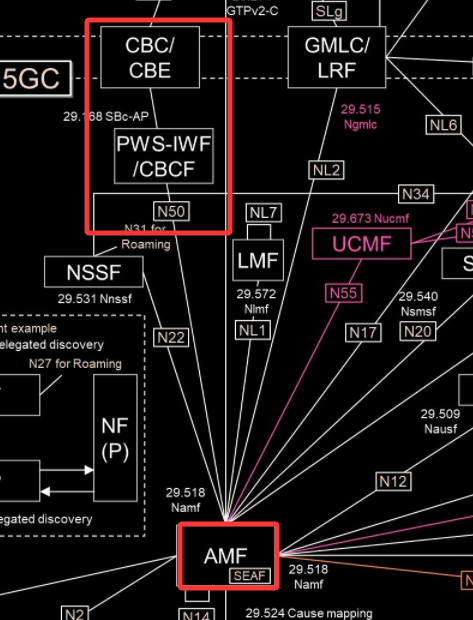
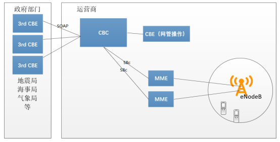
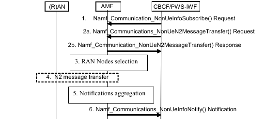
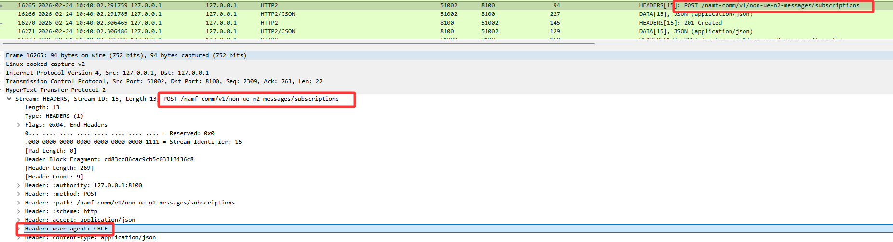
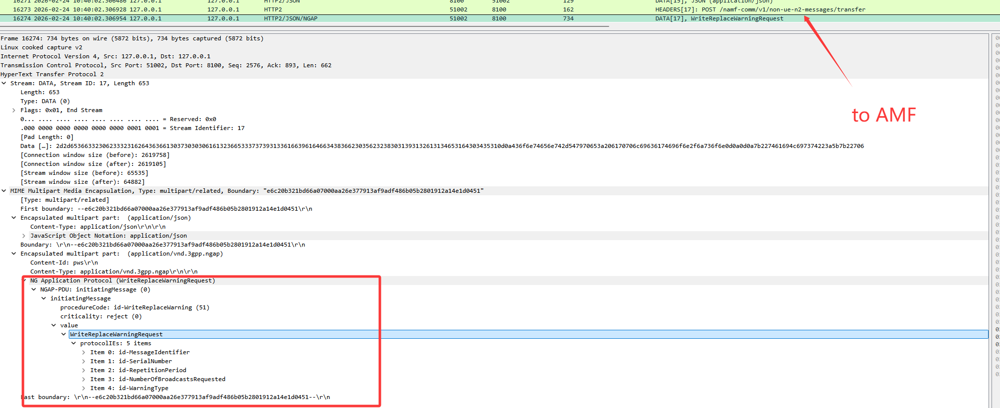
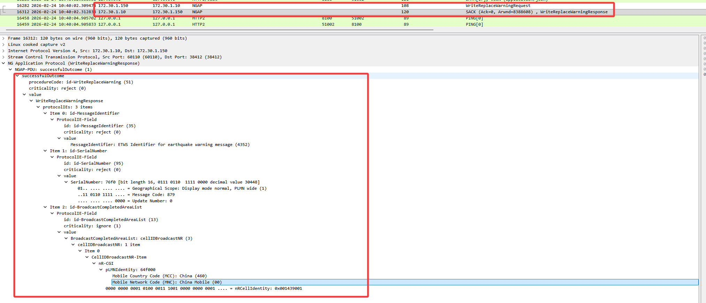
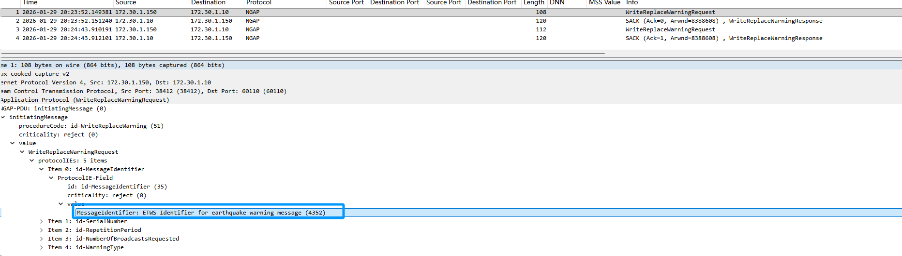
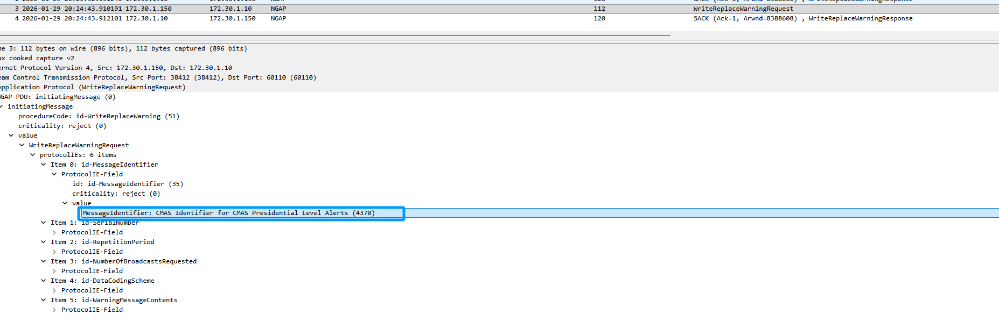
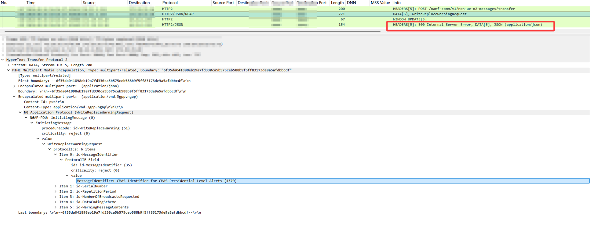

前阵子项目上碰到要做PWS（Public Warning System，公共预警系统）的需求，说白了就是地震预警、极端天气通知这类需要通过基站群发消息的功能。CBC这块还是头一次接触，这次有个CBC对接华为AMF的测试，正好做个复盘。

# 1. CBC 基本概念

## 1.1 什么是CBC

**CBC（Cell Broadcast Centre，小区广播中心）** 是5GC中负责公共预警消息下发的网元。它接收来自外部应急预警系统（比如国家地震预警系统、气象预警平台）的消息，然后通过核心网和无线侧最终把预警信息广播给指定区域内的所有UE。

和常规的点对点短信不同，**小区广播是一对多的，不需要知道UE的具体位置，只要在覆盖范围内的终端都能收到**。这条特性在自然灾害预警场景下很关键——不需要知道谁在这个区域里，只要在这个小区覆盖下，所有人都能收到应急消息。

:::tip
**CBC在4G和5G中都有**，功能基本一致，只是接口名称和信令流程有所区别。4G里CBC直连MME，5G里CBC通过N50接口连AMF。有些厂商会把CBC和CBCF（Cell Broadcast Function）做在一起，也有些是分开部署的。
:::

----

## 1.2 PWS 系统架构

**PWS（Public Warning System）** 是整个公共预警消息投递系统的总称，涉及多个网元协同：

```
外部预警系统（如地震台网）
        |
    +---v---+
    | CBCF  |  （Cell Broadcast Function，可选）
    +---+---+
        |
    +---v--------------------+
    |         CBC            |
    |   (Cell Broadcast      |
    |       Centre)          |
    +---+--------------------+
        | N50
    +---v--------------------+
    |         AMF            |
    +---+--------------------+
        | N2 (NGAP)
    +---v--------------------+
    |         gNB            |
    +---+--------------------+
        | 空口 (SIB)
    +---v--------------------+
    |    UE (所有在网终端)    |
    +------------------------+
```

看流程还是比较好理解，就是外部消息源发到CBC，CBC再通过N50接口调用AMF，AMF再通过N2接口调用gNB，gNB再把预警消息广播给所有在网终端，串起来就行了。

3gpp网络架构中如下：


现网架构如下：



| 网元/层次 | 职责 |
|----------|------|
| **外部预警系统** | 生成原始预警内容（震级、影响区域、预警级别等） |
| **CBCF** | 可选网元，负责消息格式转换和区域映射 |
| **CBC** | 核心网入口，管理预警消息的生命周期，决定消息下发策略 |
| **AMF** | 接收CBC请求，通过N2接口转发给gNB列表 |
| **gNB** | 将预警消息映射到SIB（系统信息块），在空口广播 |
| **UE** | 接收并解析SIB，呈现预警通知（震动+弹窗+声音） |

----

# 2. 5G PWS 接口流程

1. 当 CBC/CBCF 支持接收通知，可以通过 **Namf_Communication_NonUeInfoSubscribe （NF ID）订阅通知**。
	- Indications 类型：发送和撤销的反馈消息上报。
	- Restart & Failed 类型：基站重启和失败的消息上报


2. 除 5G Tai of List，Indication 等 IE 外，其余 CBS PWS 消息内容包裹在 N2 Container 中。


3. AMF 将 CBS PWS 消息经过 5G Tai of List 的选择后，将内容透穿给基站。


4. 当基站失败，或者重启后。AMF 通过步骤 1 中的信息，通过 Namf_Communication_NonUeInfoNotify 将例如 PWS Restart Indication 的消息上报给 CBC/CBCF。
----

# 3. 预警消息类型

## 3.1 ETWS（Earthquake and Tsunami Warning System）

地震和海啸预警系统，3GPP最早定义的紧急预警类型，分两个通知级别：

| 类型 | SIB | 说明 |
|------|-----|------|
| **Primary Notification** | SIB6 | 最高优先级，最简单内容（如"地震预警"），要求UE立即呈现 |
| **Secondary Notification** | SIB6 | 详细内容（震级、震源、预计到达时间等），数据量更大 |

- ETWS消息不需要UE预注册，**所有终端无条件接收**
- Primary Notification要求**5秒内**在UE上呈现
- 这是3GPP最早定义的预警标准，日本和墨西哥等地用得比较多


## 3.2 CMAS（Commercial Mobile Alert System）

商业移动预警系统，也叫 **PWS（Public Warning System）** 或 **EU-Alert**（欧洲叫法）：

| SIB | 用途 |
|-----|------|
| **SIB7** | CMAS消息广播，支持分级预警（总统级、极端威胁、严重威胁、儿童绑架预警等） |
| **SIB8** | 额外的CMAS相关数据 |

- CMAS支持消息分类和地理范围精确控制
- 可以指定消息的语言、有效期、重复次数
- 美国和欧洲主要用这个标准


## 3.3 消息参数

一条完整的预警消息包含以下关键参数：

| 参数 | 说明 |
|------|------|
| **Message Identifier** | 消息唯一标识，用于区分不同的预警 |
| **Serial Number** | 序列号，配合Message ID唯一确定一条消息 |
| **Warning Area** | 影响区域，可以是TA List、小区列表或地理坐标列表 |
| **Message Content** | 预警文本内容 |
| **Repetition Period** | 重复广播周期 |
| **Number of Broadcasts Requested** | 请求广播次数 |
| **Warning Type** | 预警类型（地震、海啸、极端天气等） |

----

# 5. CBC 的功能特性

## 5.1 区域映射能力

CBC需要把外部系统描述的"地理区域"转换成5G网络能理解的"网络区域"：

| 外部描述方式 | CBC转换 |
|-------------|---------|
| 地理坐标（经纬度+半径） | 映射为覆盖该区域的小区/TA列表 |
| 行政区划（省/市/区县） | 查询配置好的行政-网络映射表 |
| TA列表 | 直接透传 |
| 指定基站列表 | 透传 |

这个映射能力很关键——地震台网可能告诉你说"北纬XX度、东经XX度、半径50公里"，CBC得自己算出来这圈里有哪些基站。

## 5.2 消息生命周期管理

CBC负责管理每条预警消息的完整生命周期：

- **激活（Active）**：消息正在下发和广播中
- **更新（Updated）**：新消息替换了同Message ID的旧消息
- **取消（Cancelled）**：显式取消广播
- **过期（Expired）**：超过有效期自动停止
- **完成（Completed）**：达到请求广播次数且未续期

----

# 6. CBC 对接华为AMF调测
**前置条件：**
1. CBC部署完成，对端华为的信息已经配置完成
2. 链路网络已打通


**对接调测：**
- 第一条 Namf_Communication_NonUeInfoSubscribe 看包华为是能够返回成功，说明NonUeInfoSub消息没出问题；
- 构造一条cmas消息发到华为AMF时，华为返回了个500，说明是内部错误，反馈华为检查。


---

# 7. 简单总结

1. **CBC的核心价值在于"区域映射+消息管理"**：把外部系统的地理描述翻译成网络拓扑能理解的基站列表，同时管理消息的生命周期
2. **PWS是纯控制面流程，不走用户面**：预警消息通过NGAP信令下发到gNB，gNB编入SIB广播，整个过程不涉及UPF
3. **ETWS和CMAS**：ETWS偏地震海啸，CMAS偏综合预警，国内目前主要是地震预警在推
4. **N50接口是HTTP/2**，排障思路和调其他SBI接口（比如N11、N7）差不多，抓包看JSON请求体就行，整体流程比较清晰。
5. **实际项目中CBC往往是和AMF同一厂家的**，N50接口虽然是标准定义的，但不同厂家之间对接还是得注意字段兼容性
