SMS（Short Message Service）从2G时代沿用至今，是移动通信中最基础也最顽强的业务之一。随着网络从2/3G演进到4G、IMS、5G乃至MIoT，SMS的承载协议也在不断变迁——从最初的MAP over SS7，到SGs/SGd Diameter，再到IMS SIP，每一次演进都有其历史背景和技术考量。

本文基于 **GSMA NG.111 SMS Evolution v3.0（2024年6月）** 官方文档，以文档中的架构图为主线，系统梳理SMS承载协议的演进路径、归属架构、漫游方案、端到端信令流程及全球部署趋势。

> 本文章由助手CoCo生成~

---

# 1. SMS 基本概念

## 1.1 SMS 业务模型

SMS分为两个步骤：

1. **消息提交（Message Submission）** — 发送方将短消息提交至SMSC
2. **消息投递（Message Delivery）** — SMSC将短消息投递给接收方，可选投递状态报告

用途场景涵盖三类：

| 场景 | 说明 |
|------|------|
| **P2P（Person-to-Person）** | 用户间的普通文本短信 |
| **A2P（Application-to-Person）** | 应用发起的短信，在批发互连收入中占重要比重，也用于MIoT |
| **技术使能（Technical Enabler）** | OTA空中写卡用于USIM配置、IP会话唤醒等 |

## 1.2 SMS-MO（Mobile Originated）

- 文本消息被路由到 **SMSC（短消息服务中心）**，本质是一个电子消息存储
- SMSC成功接收后向发起方发送确认（手机上显示"消息已发送"——这**不等同于**接收方已收到）
- 如果发送失败，手机可能显示"消息发送失败"提示

## 1.3 SMS-MT（Mobile Terminated）

- SMSC成功收到消息后，尝试向接收方手机投递
- 如果接收方手机关机或不在覆盖区，SMSC会**保留消息并重试**（retry机制 + alerting机制）
- 只有发送方选择了"投递确认"选项时，才会知道接收方是否已收到

:::note
关键约束：**短消息发送方始终使用其归属网络的SMSC**。该SMSC负责将消息投递给接收方（即使接收方在漫游或属于其他网络）。
:::

## 1.4 MTC/MIoT 的 SMS 需求

在MTC/MIoT场景中，SMS作为关键技术使能器，具有以下功能：

- **IP会话唤醒**：向设备发送SMS以唤醒IP会话，基于MTC-IWF架构
- **无CS附着的SMS投递**：减少MSC使用，特别适用于大规模IoT设备部署
- **OTA空中写卡**：通过SMS进行USIM配置更新

:::note
根据GSMA调查，LTE-M明确确认SMS将部署于全球LTE-M场景，但NB-IoT社区尚未形成一致的SMS部署计划。
:::

## 1.5 SMS 安全挑战

| 安全威胁 | 描述 |
|---------|------|
| **SMS垃圾信息** | 未经请求发送给用户的SMS |
| **SMS洪泛攻击** | 向一个或多个目的地发送大量消息 |
| **SMS伪造** | SCCP或MAP发起方地址被操纵 |
| **SMS欺骗** | 非法使用HPMN SMSC，操纵A-MSISDN |
| **GT扫描** | 向网络所有GT发送SM-MO以检测开放SMSC |
| **开放SMSC** | 不控制A号码的SMSC，可被非法使用 |

经过一系列SS7漏洞审计后，SMS作为可信赖解决方案的地位受到挑战。同样需要关注Diameter、SIP等新协议的安全漏洞。

---

# 2. SMS 协议演进

SMS的承载协议随代际演进，目前主要涉及五种协议路径，以下按每类协议的架构图展开。

## 2.1 2/3G SMS over MAP

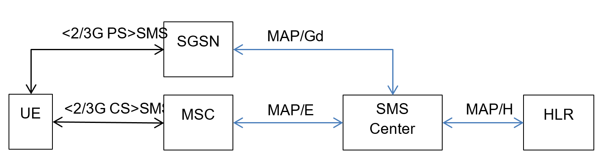

**MAP（Mobile Application Part）** 是2/3G时代SMS的基础承载协议，运行在SS7协议栈之上，可通过TDM或SIGTRAN传输。定义了三个MAP接口支持SMS：

| 接口 | 连接网元 | 用途 |
|------|---------|------|
| **H接口** | HLR ↔ SMS-GMSC | 获取路由信息 |
| **E接口** | MSC ↔ SMSC（SMS-GMSC/IWMSC） | CS域消息传递 |
| **Gd接口** | SGSN ↔ SMSC（SMS-GMSC/IWMSC） | PS域SMS传递 |

SMS可通过两条路径到达SMSC：
- **CS域路径**：UE → MSC → **MAP/E** → SMSC
- **PS域路径**：UE → SGSN → **MAP/Gd** → SMSC

对于仅需要PS数据的M2M设备，如果SGSN支持SMS且HLR/HSS允许，UE**无需附着CS域**即可收发短信。SMSC通过MAP/H接口查询HLR获取用户信息和路由。

## 2.2 4G SMS over SGsAP

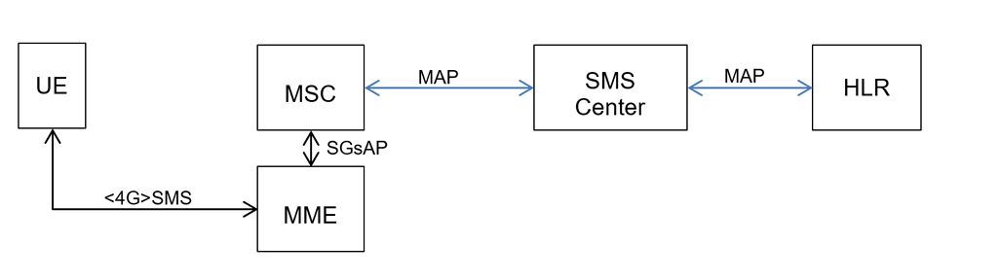

4G初期，在没有IMS的环境下，3GPP定义了**SGs接口**作为过渡方案。这是一种混合方案——通过LTE无线传输来自CS基础设施的原生SMS。

**SGs** 是基于Gs的演进接口，运行于SCTP之上，在3GPP TS 29.118中定义。其主要用途是EPS与CS域之间的移动性管理和寻呼流程，但也用于SMS的MO/MT传递。

关键点：
- SGs SMS**独立于CSFB**（Circuit Switched Fall Back），不要求LTE与2/3G重叠覆盖
- UE通过 **Combined EPS/IMSI Attach** 流程附着，可在ATTACH REQUEST中标识为"SMS only"
- MME与MSC/VLR之间建立SGs关联，MME通过 **SGsAP** 协议连接MSC

在LTE网络中，SMS传输路径为：UE → MME → **SGsAP** → MSC → **MAP/E** → SMSC，4G网络通过SGs"借用"2/3G CS基础设施来处理SMS。

## 2.3 4G SMS over Diameter

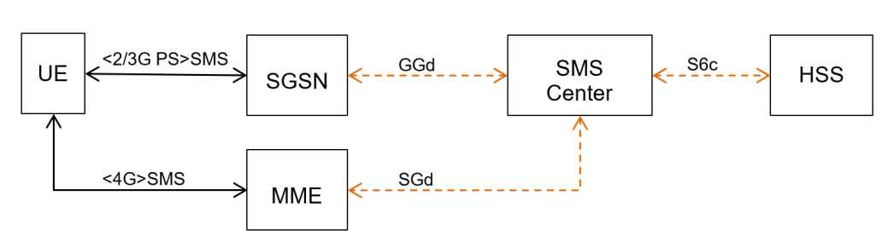

随着4G网络成熟，Diameter协议被引入承载SMS，实现了**MME直接与SMSC通信**，无需MSC参与。

定义的Diameter接口：

| 接口 | 连接网元 |
|------|---------|
| **S6c** | HSS ↔ SMS-GMSC/SMS Router |
| **SGd** | MME ↔ SMS-IWMSC/SMS-GMSC/SMS Router |
| **Gdd** | SGSN ↔ SMS-IWMSC/SMS-GMSC/SMS Router |

**NAS传输机制**：根据3GPP TS 24.301，SMS消息（CP-DATA、CP-ACK、CP-ERROR）封装在Uplink/Downlink NAS Transport消息的NAS Message Container IE中，在UE与MME之间传递。

核心路径对比：
- **SGs方案**：MME → SGsAP → MSC → MAP → SMSC（需MSC参与）
- **Diameter方案**：MME → SGd/Diameter → SMSC（无需MSC，减少CS附着）

## 2.4 IMS SMS over MAP/Diameter
IMS SMS over Diameter架构：

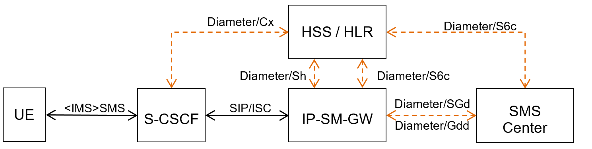

IMS SMS over MAP架构：
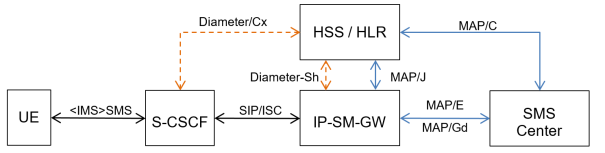

**两种对接方式主要区别在对接的域不同。**

IMS中的SMS通过**IP-SM-GW（IP Short Message Gateway）** 实现SIP与MAP/Diameter的互通。IP-SM-GW在IMS网络中充当Application Server的角色。

架构核心要点：

**用户面路径**：UE → S-CSCF（SIP/ISC）→ IP-SM-GW → SMSC

**控制面路径**：
- S-CSCF ↔ HSS：使用 **Diameter/Cx** 接口进行用户鉴权和Profile获取
- IP-SM-GW ↔ HSS：使用 **Diameter/Sh** 接口获取应用数据（SMS Profile）
- IP-SM-GW ↔ HSS：使用 **MAP/J** 接口查询路由信息
- SMSC ↔ HSS：使用 **MAP/C** 接口查询用户漫游状态

**两种互通模式**：
- **SLI（Service Level Interworking）** — 支持Session或Page Mode Messaging （只做 IP ↔ CS 透传）
- **TLI（Transport Level Interworking）** — 仅支持SMoverIP（SMS over IP），规范在3GPP 24.341 （完整会话支持）

IP-SM-GW核心功能：
- 识别短消息应在CS、PS还是IMS域投递
- 对传统网络透明——SMS-GMSC认为IP-SM-GW就是MSC/SGSN（通过MAP连接）
- 使用自己的地址响应HSS的路由信息请求，完成域选
- 将MSISDN/IMSI转换为TEL URI或SIP URI

## 2.5 5G SMS over NAS

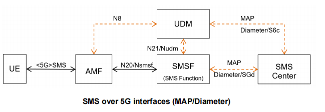
5G中SMS的定义在3GPP TS 23.501 §4.4.2和3GPP TR 29.891 §9.1中明确。核心变化是引入了**SMSF（SMS Function）** 网元。

架构特点：
- **AMF**：通过N1接口使用NAS传输SMS
- **SMSF**：5G核心网专用的SMS功能网元，每个UE关联唯一的SMSF
- **UDM**：支持MAP或Diameter S6c接口接续传统SMS-GMSC/SMS Router
- **N20/NSmsf**：AMF与SMSF之间的服务化接口

| 参考点 | 用途 |
|--------|------|
| **N1** | UE ↔ AMF，通过NAS传输SMS |
| **N8** | AMF ↔ UDM，获取SMSF地址 |
| **N20** | AMF ↔ SMSF，传输SMS |
| **N21** | SMSF ↔ UDM，订阅和通知 |

5G信令基于HTTP2/JSON（SBA架构），不再使用SCTP。SMSF通过MAP或Diameter接口支持与传统SMSC互通。

**AMF重定位时SMSF保持不变**：源AMF在UE上下文传输中将SMSF标识传递给目标AMF，确保SMS业务连续性。

---

# 3. SMS 归属架构

## 3.1 当前归属架构

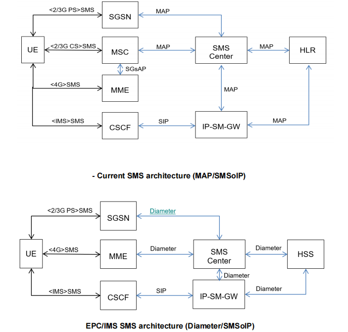
当前SMS归属网络架构呈现多代际共存的状态：

- **2/3G用户**：通过MSC使用MAP over SS7进行SMS收发（CS域），或通过SGSN使用MAP（PS域）
- **4G用户**（无IMS）：通过MME使用 **SGsAP** 接口回程MSC，再通过MAP接续SMSC
- **IMS用户**：通过S-CSCF使用SIP接续 **IP-SM-GW**，IP-SM-GW与SMSC之间使用MAP/Diameter
- **5G用户**：通过AMF使用NAS传输，SMSF接续SMSC（MAP或Diameter）

:::tip
核心思路：**无论接入网如何演进，SMSC始终作为SMS的核心存储转发节点**，变化的只是接入侧的路由方式。
:::

## 3.2 未来归属架构趋势

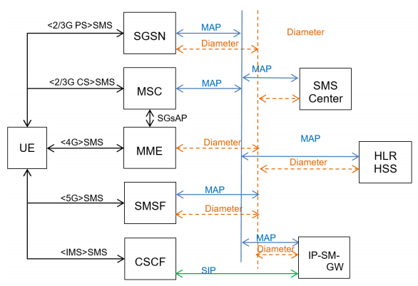
GSMA NG.111展望的未来架构中，用户分类和承载协议将出现分化：

| 用户类型 | 当前方案 | 演进方向 |
|---------|---------|---------|
| **Legacy用户** | SS7 MAP | 维持现状，无明确迁移计划 |
| **IMS用户** | SIP over VoLTE | 全面SIP化，漫游SIP互通 |
| **IoT/对象** | Diameter SGd | 扩展到Gdd、S6c接口 |

**协议优缺点比较**：

| 协议 | 优点 | 缺点 |
|------|------|------|
| **MAP** | 2/3/4G通用传输机制 | 需要MSC参与 |
| **Diameter** | 4G/IMS通用协议，绕过MSC（无需CS附着），启用IP唤醒 | 需从MAP迁移，有Diameter安全漏洞 |
| **SIP** | VoLTE通用协议，无需CS附着 | 技术效率低，无法用于IP唤醒 |

关键结论——**SMS技术演进不是一刀切，而是按用户类型分化。**

---

# 4. SMS 漫游

## 4.1 当前漫游架构

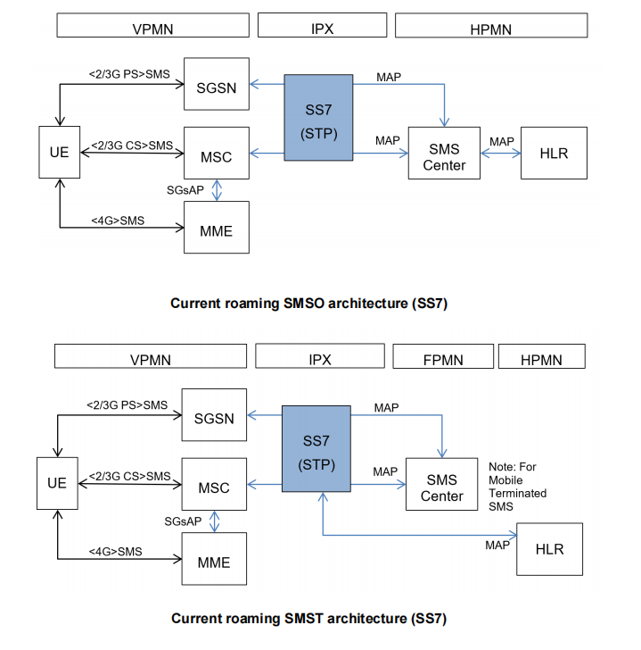
当前SMS漫游主要基于SS7 MAP路由：

- **SMS-MO**：拜访网络MSC/SGSN通过MAP E接口将消息路由至归属网络SMSC，经由IPX（SS7/STP）转发
- **SMS-MT**：归属网络SMSC通过HLR/HSS查询获取拜访网络MSC地址，经SS7路由投递

漫游场景下，VPMN侧的接入方式：
- **2/3G PS**：UE → SGSN
- **2/3G CS**：UE → MSC
- **4G**：UE → MME（通过SGsAP连接MSC）

所有漫游SMS均通过SS7网络路由，4G SMS锚定在MSC上。

## 4.2 未来漫游架构

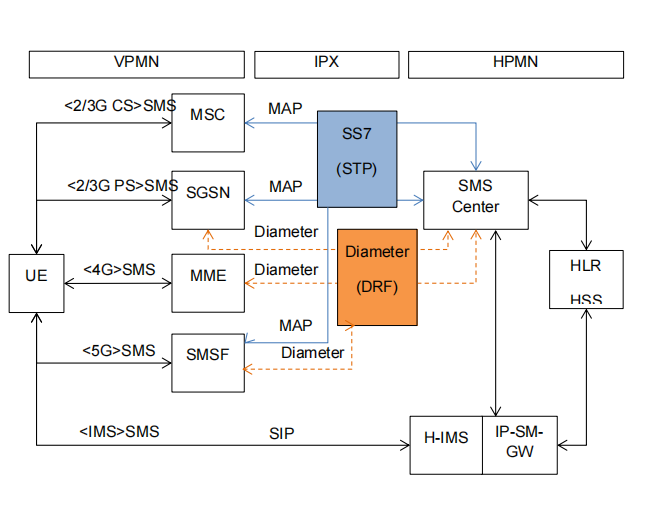
随着2/3G退网（包括MSC能力关闭），拜访网络可能关闭MAP E接口。未来的解决方案是通过**IWF（InterWorking Function）** 进行协议转换。
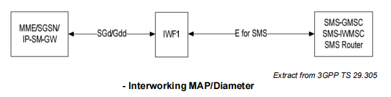
**两种关键方案**：

**方案一：纯Diameter漫游**
- 拜访网络MME通过Diameter SGd直接连接归属网络SMSC
- 无需SGs接口和MSC参与
- 需在所有漫游合作伙伴间部署SGd接口

**方案二：IWF互通方案**
- 拜访网络使用Diameter SGd → IWF → 归属网络通过MAP或Diameter接续
- IWF可部署在拜访网络或IPX中
- IWF需具备CDR生成能力（MME本身不产生SMS CDR，对漫游批发计费至关重要）

**重要前提**：为使IWF方案的SMS-MT可行，归属SMSC需要通过MAP C HLR查询或S6c HSS查询检索MME客户位置。有两种选项：
- **选项1**：HSS中不支持S6c → 通过MAP C接口包含MME相关信息（非3GPP标准，依赖厂商实现）
- **选项2**：HSS中支持S6c → 通过SRR收集SMSoNAS MT路由的拜访MME信息

**MAP vs Diameter 漫游选择**：

| 方案 | 优势 | 劣势 |
|------|------|------|
| MAP | 2/3/4G通用传输机制，5G仍可能继续支持 | SS7安全需持续关注 |
| Diameter | 减少SS7投资，无需CS附着，支持IP唤醒，面向5G | 新漫游接口，Diameter安全漏洞需通过Signed AVP等方案解决 |
| IWF | 避免归属网络部署Diameter SGd/Gdd | 限于HLR/HSS查询能提供MME客户位置 |

---

# 5. 互连架构

## 5.1 当前互连

当前所有SMS互连通过SS7网络路由。接收方网络中，SMS防火墙（SMS Firewall）负责Home Routing所有入向SMS，以防护信令安全漏洞。
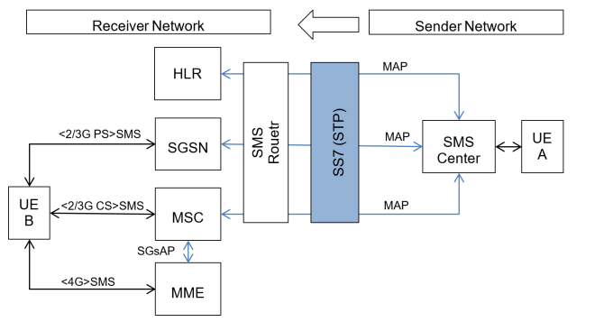
:::note
部署**SMS Router**以防护信令安全漏洞。
:::

## 5.2 未来互连

互连接口（NNI）也面临从MAP到Diameter的演进，核心挑战是**号码可移植性（NP）的解决**。
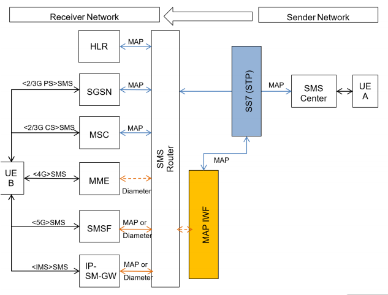
**NNI方案对比**：

| NNI方案 | 优势 | 劣势 |
|---------|------|------|
| MAP | 通用传输机制，NP解析成熟 | SS7安全问题 |
| Diameter | 减少SS7投资，面向5G | NP解析需重建，Diameter漏洞需要签名AVP防护 |

## 5.3 SMS Hubbing 架构

SMS类似于一个集线（HUB），负责协议转换。
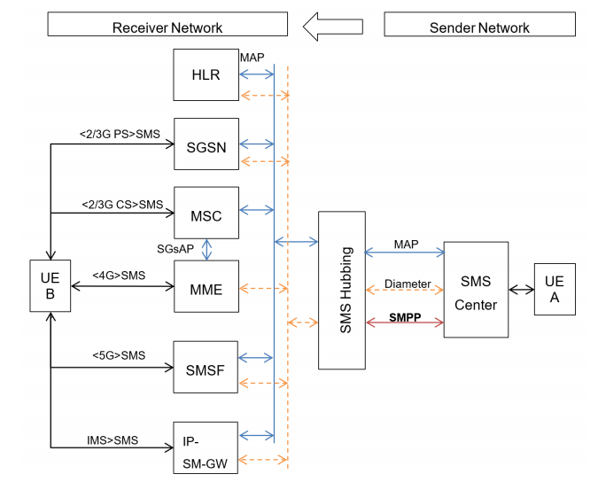

---

# 6. 端到端信令流程

## 6.1 2/3G SMS over MAP 信令流程

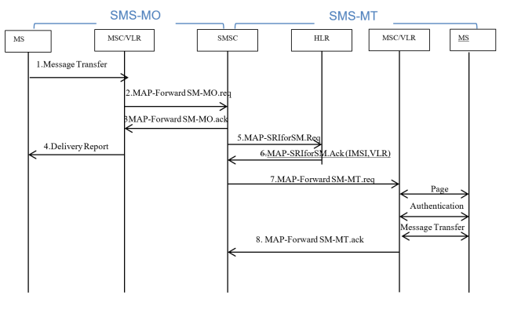

完整SMS事务分为SMS-MO和SMS-MT两个阶段。

**SMS-MO（移动台发起）：**

| 步骤 | 操作 | 说明 |
|------|------|------|
| 1 | MS → MSC | MS将SM传输给MSC，MSC查询VLR验证补充业务和限制 |
| 2 | MSC → SMSC | MSC通过 `MAP forwardShortMessage(MO)` 将SM发送至SMSC |
| 3 | SMSC → MSC | SMSC确认接收成功 |
| 4 | MSC → MS | MSC向MS返回MO-SM操作结果 |

**SMS-MT（移动台终止）：**

| 步骤 | 操作 | 说明 |
|------|------|------|
| 5 | SMSC → HLR | SMSC查询HLR获取接收方路由信息（MAP SRIforSM） |
| 6 | HLR → SMSC | HLR返回接收方IMSI和VLR地址 |
| 7 | SMSC → MSC | SMSC通过 `MAP forwardShortMessage(MT)` 将SM发送至接收方MSC |
| - | MSC → MS | Page → 鉴权 → 消息传递（MSC从VLR获取用户信息） |
| 8 | MSC → SMSC | MSC返回操作结果，如需状态报告则返回投递状态 |

## 6.2 4G SMS over SGs 流程 — MO

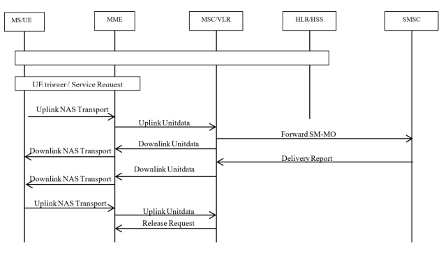

1. EPS/IMSI Attach完成后，UE触发Service Request发起MO SMS
2. **Uplink NAS Transport**：SMS封装在NAS消息中发送至**MME**
3. **Uplink Unitdata**：MME将SMS转发至**MSC/VLR**，MSC/VLR向UE确认接收
4. **Forward SM-MO**：SMS被转发至**SMSC**，SMSC返回Delivery Report
5. Delivery Report逐级（MSC/VLR → MME → UE）回传
6. UE确认接收，MSC/VLR告知MME不再需要隧道NAS消息（Release Request）

## 6.3 4G SMS over SGs 流程 — MT

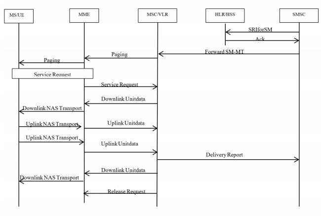.png)

1. **SMSC** 向**HLR**请求路由信息（SRIforSM），SMS转发至正确的**MSC/VLR**
2. MSC/VLR向**MME**发起Paging
3. MME向TA范围内的LTE基站发起Paging
4. UE响应Service Request，MME向MSC/VLR发起Service Request
5. MSC/VLR构建SMS，通过MME以NAS消息封装（Downlink NAS Transport）转发给UE
6. UE确认接收（Uplink NAS Transport），可选发送Delivery Report
7. Delivery Report经MSC/VLR回传至SMSC
8. Release Request释放连接

## 6.4 4G SMS over Diameter 流程

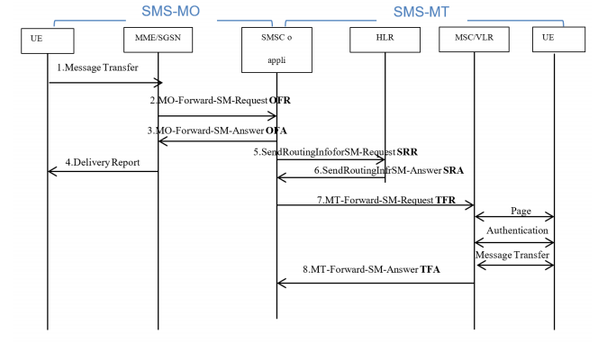

| 步骤 | 操作 | 说明 |
|------|------|------|
| 1 | UE → MME/SGSN | UE发送SM，MME检查ODB等订阅限制 |
| 2 | MME/SGSN → SMSC | `forwardShortMessage(OFR)` 将SM发送至SMSC |
| 3 | SMSC → MME/SGSN | 确认接收（OFA） |
| 4 | MME/SGSN → UE | 返回MO-SM结果 |
| 5 | SMSC → HSS | 查询Serving MME/SGSN的路由信息（SRR） |
| 6 | HSS → SMSC | 返回路由信息（SRA） |
| 7 | SMSC → MME/SGSN | `forwardShortMessage(TFR)` 发送SM至Serving MME/SGSN |
| 8 | MME/SGSN → UE | 将SM传递给UE |
| 9 | MME/SGSN → SMSC | 返回投递结果（TFA），可选状态报告 |

:::note
Diameter SMS操作对应MAP操作：
- **OFR** = MAP MO-ForwardShortMessage
- **OFA** = MAP MO-ForwardShortMessage Ack
- **TFR** = MAP MT-ForwardShortMessage
- **TFA** = MAP MT-ForwardShortMessage Ack
:::

## 6.5 IMS SMS 架构

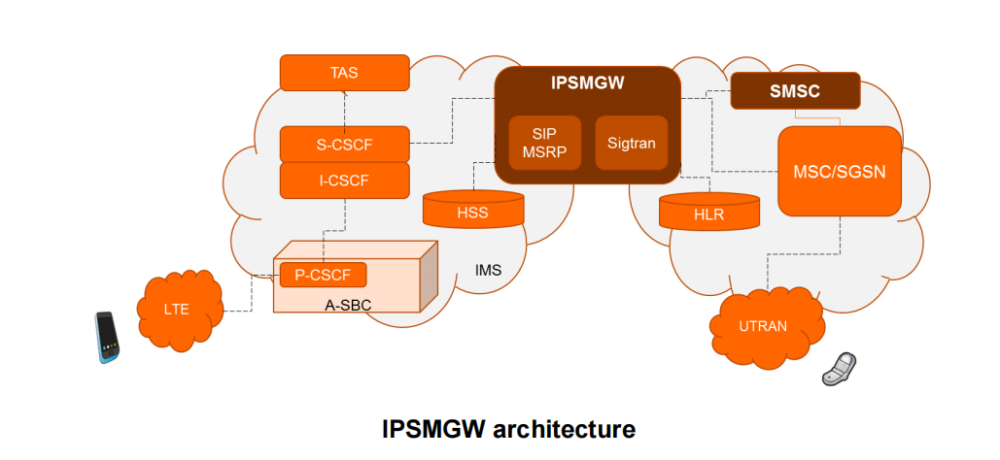

IP-SM-GW是IMS与传统网络之间的桥梁。在IMS域中，LTE用户接入A-SBC(P-CSCF) → I-CSCF → S-CSCF，S-CSCF根据iFC将SMS转发至IP-SM-GW。IP-SM-GW通过SIGTRAN将SIP转换为MAP，接续传统SMSC和HLR。

## 6.6 IMS SMS 流程

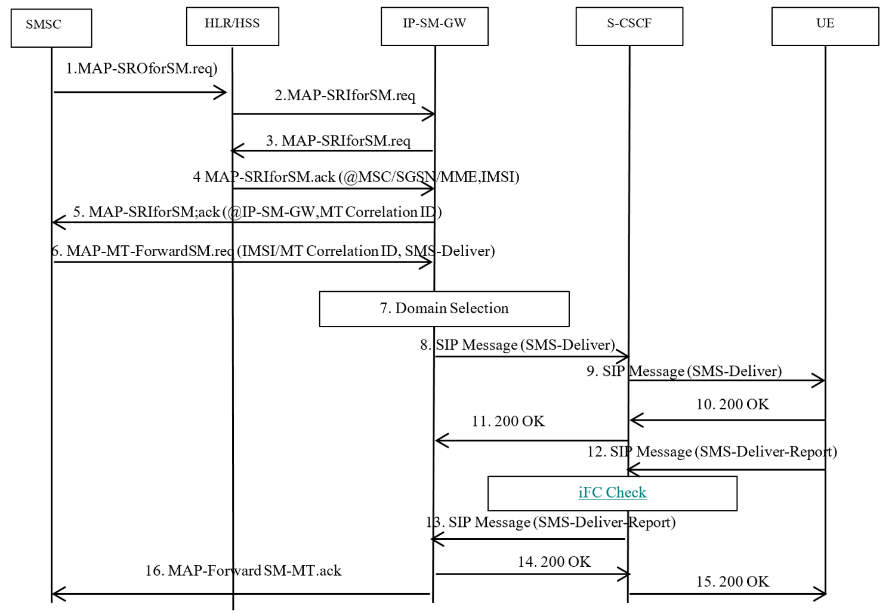
**阶段1：路由信息查询（步骤1-5）**

**阶段2：消息转发与域选（步骤6-7）**

**阶段3：IMS投递（步骤8-11）**

**阶段4：投递报告（步骤12-16）**

| 步骤 | 操作 | 说明 |
|------|------|------|
| 1 | UE → S-CSCF | 通过**SIP MESSAGE**发送SMS-Submit |
| 2 | S-CSCF → IP-SM-GW | 根据iFC将消息转发至IP-SM-GW |
| 3 | IP-SM-GW → S-CSCF | 返回202 Accepted（消息已收到但未投递） |
| 4 | S-CSCF → UE | SIP 202确认回传 |
| 5 | IP-SM-GW → SMSC | 业务鉴权后，提取SMS-Submit，通过**MAP**转发至SMSC |
| 6 | SMSC → IP-SM-GW | MAP确认 |
| 7 | IP-SM-GW → S-CSCF | 通过SIP MESSAGE发送SUBMIT-REPORT |
| 8-10 | S-CSCF → UE → S-CSCF | SUBMIT-REPORT送达UE，UE返回200 OK确认 |
| 12-13 | UE通过SIP MESSAGE返回SMS-DELIVER-REPORT |
| 14-15 | IP-SM-GW确认，200 OK回传至UE |

## 6.8 5G SMS over NAS 流程

5G的SMS流程核心参与者：UE ↔ AMF（N1/NAS）↔ SMSF（N20）↔ UDM（N21）↔ 传统SMSC（MAP/Diameter）

**MO流程**：
1. UE通过NAS（UL NAS Transport）将SMS提交至AMF
2. AMF通过N20/NSmsf转发至SMSF
3. SMSF通过MAP/Diameter转发至SMSC
4. SMSC确认，反向路径返回

**MT流程**：
1. SMSC通过MAP/Diameter S6c查询UDM获取路由信息
2. UDM返回SMSF地址
3. SMSC通过MAP/Diameter SGd将SMS发送至SMSF
4. SMSF通过N20/NSmsf发送至AMF
5. AMF通过NAS（DL NAS Transport）投递给UE

---

# 7. 全球部署架构与演进总结

## 7.1 当前全局架构

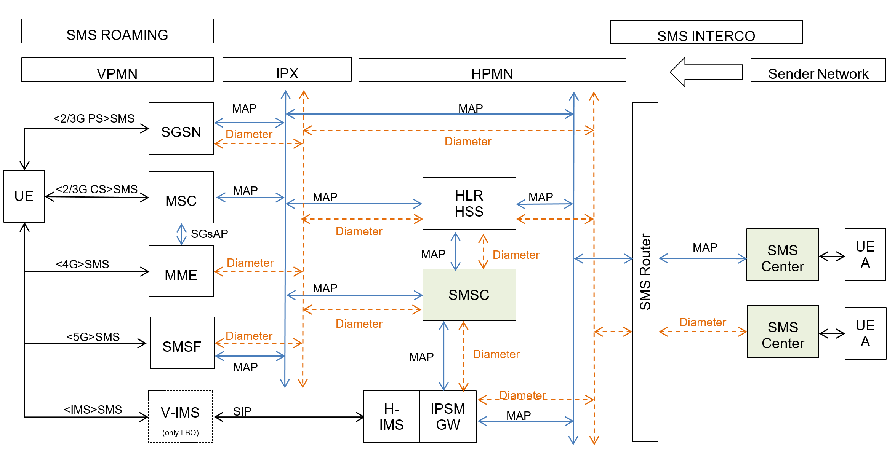

当前全局架构呈现多协议并存的局面。漫游和互连场景下：
- **SS7（MAP）**：承载不同用户类型（Legacy、IMS、IoT）的漫游信令
- **Diameter**：在归属网络逐步部署（SGd优先），但漫游/互连迁移为时尚早

## 7.2 GSMA调查结论

基于12家运营商的完整调查，关键结论：

1. **SMS是MIoT的强制技术使能**（OTA/IP唤醒），需要免CS附着的投递方案
2. **SMS将逐步迁移至Diameter**，SGd是第一个接口，未来3年扩展到Gdd和S6c
3. **SMSoIMS在归属网络已成现实**，漫游将逐步开放，SMSoIMS网间互通仍以MAP为主
4. **SMS漫游/互连迁移到Diameter为时尚早**
5. **Diameter安全漏洞**仍是运营商迁移SMS到Diameter的主要顾虑

## 7.3 按用户类型的演进趋势

| 用户分类 | 归属网络 | 漫游 | 互连 |
|---------|---------|------|------|
| **Legacy用户** | SS7 | SS7 | SS7 |
| **IMS用户** | SIP | SIP | SS7 |
| **IoT/对象** | Diameter | Diameter | N/A |

:::tip
SMS技术的演进对所有用户来说不会是一致的，而是取决于三大用户类别的特定需求：传统用户、IMS用户和物联网设备。IMS用户的SMS over IP迁移已在顺利进行中，而IoT设备的SMS over Diameter迁移仍处于早期阶段。
:::

---

> 本文章由助手CoCo生成~
