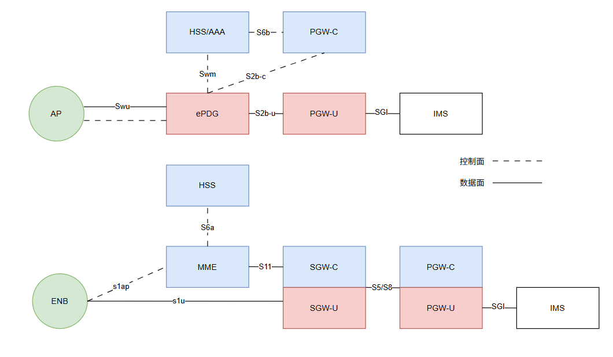
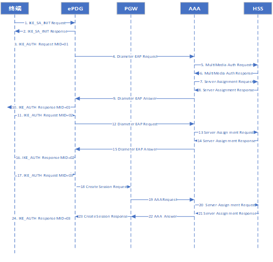
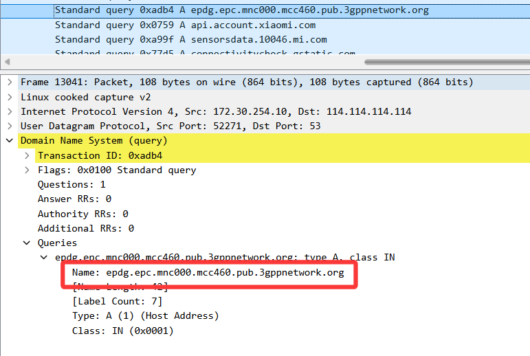
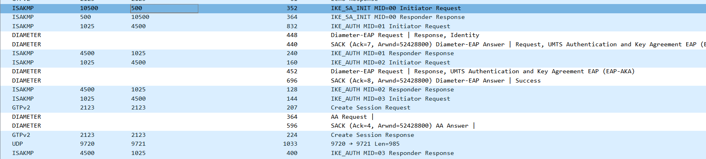
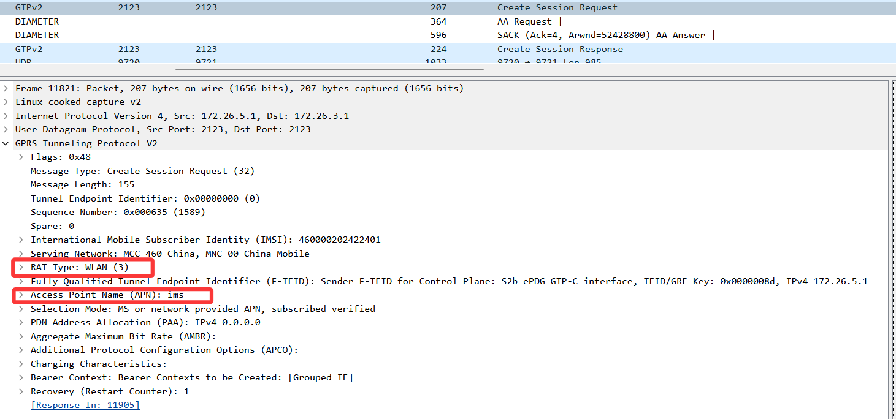
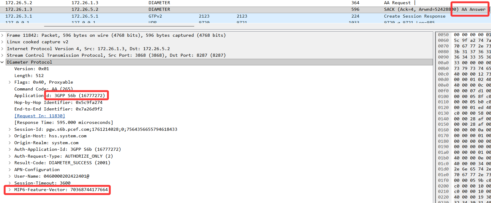
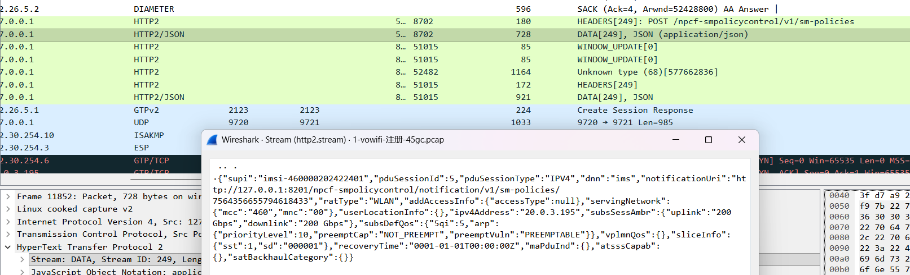
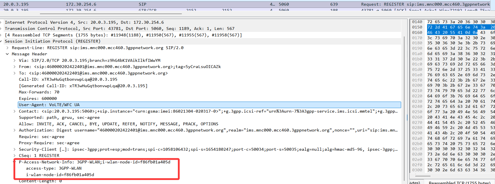

老规矩 先说概念
# VoWIFI概述
- VoWiFi（Voice over Wi-Fi，Wi-Fi语音）是一种通过 Wi-Fi 网络进行语音通话的技术。
- 相较于VoLTE（Voice over LTE），两者更多是无线接入技术的不同：
- VoWIFi使用WiFi+ePDG替代eNode+MME+SGW。对于IMS而言没有很大的差别，毕竟IMS强调与接入无关。

-----

# VoWiFi架构和接口说明
如图所示，VoWiFi架构相较于普通EPC架构，主要区别在于ePDG（Evolved Packet Data Gateway）的引入，ePDG替代了mme在接入方面的功能，通过IPsec的ISAKMP协议进行安全协商进行用户鉴权，通过s2bc/u接口和GW交互。

这里说明下epdg的接口作用：
接口|	连接对象|	核心协议|	主要作用
|------|------|------|------|
SWu|ePDG ↔ UE（WLAN）|	IKEv2、IPsec|	建立安全 IPsec 隧道，实现非可信 Wi-Fi 接入的加密通信、用户鉴权与地址分配
S2b|ePDG ↔ P-GW|	GTPv2、PMIPv6（Proxy Mobile IPv6，代理移动 IPv6）|	承载用户会话与数据转发，完成非 3GPP 接入到 EPC 核心网的互通，分为C面和U面。
SWm|ePDG ↔ HSS/AAA Server|	Diameter|	执行用户认证、授权（EAP-AKA/AKA’），传递鉴权与策略数据

-----

# vowifi接入流程分析
vowifi接入流程图如下：

结合报文简单说明vowifi的接入流程。
1. **手机开启vowifi功能，会根据SIM卡自动生成epdg的FQDN**，在wifi链接时会自动发送搜寻。同一plmn下这个构造的FQDN是唯一的，如图所示。这里可以通过路由器下发DNS解析地址为epdg的IP地址，在epdg机器上配置bind来实现解析。这里没保存返回的EPDG地址抓包。

2. 在获取epdg swu地址后
    - 终端会进行SA协商，建立安全隧道
    - 之后epdg收到终端带上的认证信息向HSS/AAA Server发送认证交互，核心网根据UE信息，获取鉴权向量，并将AUTN、RAND、MAC返回UE
    - UE返回认证结果

3. **ePDG校验从AAA获取的MSK校验UE的AUTH参数成功后，向PGW发送会话建立流程**，ePDG将结果返回给UE，并携带PGW分配的UE IP，AUTH参数，SA参数，TSI，TSR参数

-----

> 可以看到，这里直接请求的是IMS的APN，接入方式是WLAN；

> xGW会通过S6b向HSS/AAA查用户是否允许使用PMIPv6附着（简单说就是锚定这个用户在ims这个apn的ip），鉴权成功信息如图所示：

> 补充一下SMF/xGW到PCF拿volte策略的流程，http2忘过滤了-=

> 顺便看看ims承载建立后的sip注册，可以看到接入方式是WLAN

----

# VoWifi和VoNR平滑切换流程分析

----

# 交付处理思路
- 要部署的是一套演示环境，比较简单，因此直接采用单台服务器起KVM拉三台虚拟机，45GC+EPDG+IMS，不使用DPDK
- 路由器没啥限制，WAN口直接和SWu处于同网段最方便，终端通过wifi接入通过WAN口NAT访问epdg
- 主要是终端，国内商用终端实测在特定PLMN下才会支持vowifi开关，抓包看小米会携带46011的EPDG地址查询
- 验证vowifi和5G的无缝切换，通过制造wifi信号和5G信号的切换带实现，在该区域来回移动来验证即可。

