从二层开始复习吧，本来基础就不是很牢固，已经忘了很多了（恼

这次打算是带着为什么去写，而不是是什么。

# 概述
## 为什么叫二层网络？
- 二层网络指的是工作在同一个广播域内的网络
- 对应OSI模型里的第2层（数据链路层）
  
> 早期并没有二层这个说法，在OSI模型标准化之后才有；

----

## 关于MAC地址
**最早的MAC（Media Access Control Address）地址（由Xerox定义）设计初衷只是作为网卡在生产时的唯一“序列号”，用于工厂质检和库存管理**，后来才被IEEE接手并标准化为网络第二层的寻址工具。在此之前是令牌环网、X.25等。
- X.25: `虚电路（Virtual Circuit）`和`存储转发 + 差错校验`机制，专门用于广域网，速度太慢且开销大。
- 令牌环网: `令牌传递（Token Passing）`机制，逻辑上数据是在一个环形里单向传输，有确定性，但成本高且会有单点故障。

----

## 关于二层技术
二层技术本质就是局域网内部如何让数据从一台设备送到另一台设备的技术。

----
## 以太网
以太网（Ethernet）是二层（数据链路层）的一种具体实现，但二层不等于以太网，以太网是二层协议族中最成功、最主流的一个具体实现。
以太网定义了什么？
- 用`MAC地址`（48位）
- 用`以太网帧`格式（带源MAC、目标MAC、类型字段等）
- 早期用CSMA/CD，现在用全双工交换,不再需要抢空闲资源
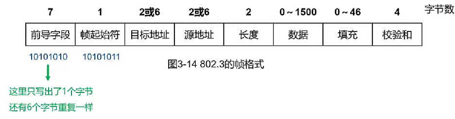

----

## LLC子层
**LLC（逻辑链路控制子层）**：紧跟在以太网帧头后面，用一个3字节的标签（DSAP/SSAP）标明数据类型。

其本质设计是为了充当翻译层，识别协议类型（IP/STP/IPX等），提供流量控制和错误通知。

:::tip
运行在IEEE 802.3标准原始格式下的非IP协议，才会使用LLC头，如：STP（生成树协议）BPDU（DSAP/SSAP = 0x42）
:::

----

# STP 802.1D
理解STP（Span Tree Protocol）协议的产生，首先需要了解环路的产生。

以太网环路的根源在于：
1. 交换机`MAC地址的动态学习机制`（通过监听以太网帧，保存MAC地址和端口的映射关系）
2. 物理线路的多条路径（设备接口的多条物理线路）
3. `未知单播帧`的洪泛（未知单播帧会从除收到的端口外的所有端口发送）
4. `广播帧洪泛`（广播帧会从所有端口发出）
5. 没有TTL和检查机制（环路情况下广播帧会无限循环）

STP是一个用于局域网中`消除环路`的协议。运行该协议的设备通过彼此交互信息而发现网络中的环路，并适当对某些端口进行阻塞以消除环路。

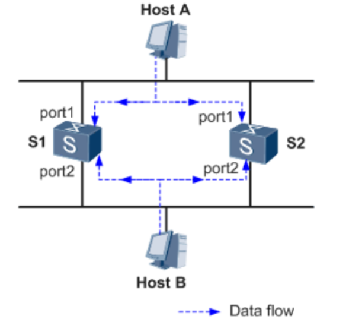

如图，在该网络下，如果不存在STP：
1. 环路会导致广播报文在链路上不断循环发送，导致资源耗尽。
2. 当HOST B移除时，HOST A向HOST B发出的单播报文，会因为`HOST B的MAC地址丢失转为未知单播帧广播`，进而导致该帧在port之间不断转发，导致MAC地址表震荡。

----

## STP基本概念

> **ID**
  - **BID（Bridge ID）**：IEEE 802.1D 标准中规定 BID 是由 `16 位的桥优先级`（Bridge Priority）与`桥 MAC 地址`构成。BID 桥优先级占据高 16 位，其余的低 48 位是 MAC 地址。
  - **PID（Port ID）**：PID 由两部分构成的，高 4 位是端口优先级，低 12 位是端口号。

> **路径开销**
  - 路径开销（Path Cost）是一个端口变量，是 STP 协议用于选择链路的参考值。
  - 某端口`到根桥累计的路径开销就是所经过的各个桥上的各端口的路径开销累加而成`，这个值叫做根路径开销（Root Path Cost）


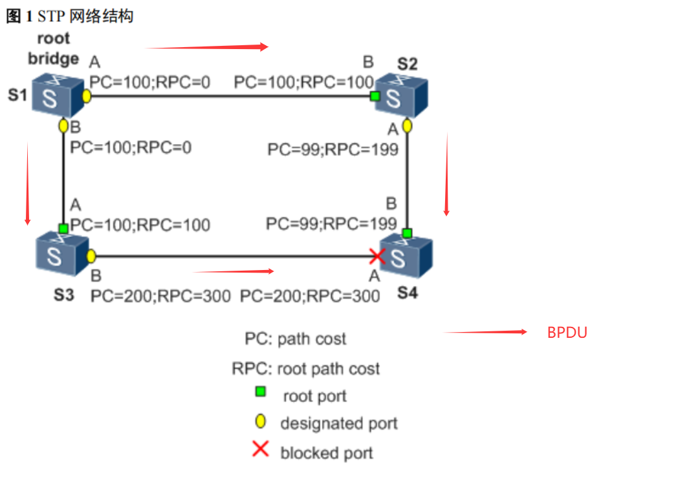

1. **根桥 RB**
   - `树根`
   - 是网桥 ID 最小的桥，通过交互配置 BPDU 协议报文选出最小的 BID。
   - 根桥（Root Bridge）对于一个 STP 网络，根桥在全网中只有一个，它是整个网络的逻辑中心，但不一定是物理中心。
   - 根桥会根据网络拓扑的变化而动态变化。网络收敛后，根桥会按照一定的时间间隔产生并向外发送配置BPDU，其他设备仅对该报文进行处理，传达拓扑变化记录，从而保证拓扑的稳定。

2. **根端口 RP**
   - `往根桥的端口`，向上
   - 去往根桥路径`开销最小的端口`，`根端口负责向根桥方向转发数据`，这个端口的选择标准是依据根路径开销判定。
   - 一台STP设备根端口有且只有一个，根桥上没有根端口。

3. **指定端口 DP**
   - `向下的口`
   - 指定桥转发配置消息的端口，`负责转发数据给下游交换机或终端`。
   - 每台非根交换机上只有一个，拥有指定端口的交换机也称为指定桥（Design Bridge）（在这个网段上的）。
   - `只有指定端口才发BPDU`

4. **阻塞端口 BP**
   - 逻辑上被阻塞，不转发数据，`只监听BPDU报文`，`不发送BPDU报文`。

数据流向根桥的逻辑上的向上向下，这样可能好理解点：
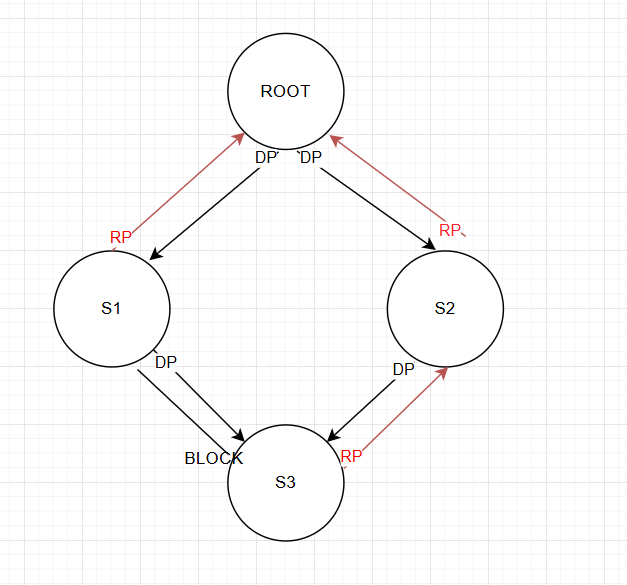

:::tip
需要注意的是 STP中 **BPDU是单向流动（从根桥往外发，RP只收不发）**
:::

----


## 网桥协议数据单元BPDU
在了解比较原则前，先了解BPDU的帧。

BPDU(Bridge Protocol Data Unit)报文被封装在`以太网数据帧`中，`目的 MAC 是组播 MAC：01-80-C2-00-00-00`，Length/Type字段为 MAC 数据长度，后面是 LLC 头，LLC 之后是 BPDU 报文头。
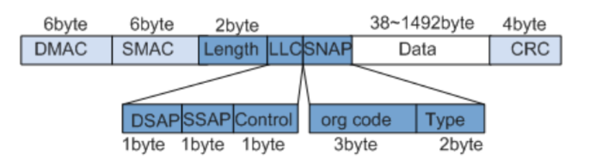

BPDU帧一般分为两种：

1. **配置BPDU**（Configuration BPDU）：用于生成树计算，选举根桥、根端口、指定端口。
- 在初始化过程中，每个桥都主动发送配置 BPDU。但在网络拓扑稳定以后，只有根桥主动发送配置BPDU，其他桥在收到上游传来的配置 BPDU 后，才触发发送自己的配置 BPDU。

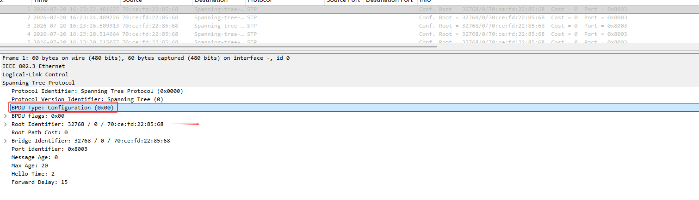

2. **TCN BPDU**（Topology Change Notification BPDU）：当网络拓扑发生变化（比如端口挂了或恢复了），交换机用它向根桥打报告，根桥收到后会发送标志位通知全网快速刷新MAC地址表，避免数据包被错误转发。
- 置位的 TC 标记的配置 BPDU 报文主要是`上游设备用来告知下游设备拓扑发生变化，请下游设备直接删除桥 MAC 地址表项，从而达到快速收敛的目的`。
- 置位的 TCA 标记的配置 BPDU 报文主要是`上游设备用来告知下游设备已经知道拓扑变化，通知下游设备停止发送 TCN BPDU 报文`。


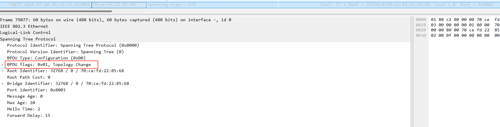

ps: 看华为手册 TCN的类型应该是 0x80，但CE12800实际触发带的是0x01

----

## STP五种端口状态

| 端口状态 | 转发用户流量？ | 处理BPDU？ | 构建MAC地址表？ | 本质说明 | 典型场景/归宿 |
| :--- | :--- | :--- | :--- | :--- | :--- |
| **Forwarding（转发）** | ✅  | ✅ （仅指定端口发送，根端口只收） | ✅  | **最终正常工作状态**，既转发数据又参与STP计算 | 只有被选举为**根端口**或**指定端口**的端口才能进入此状态 |
| **Learning（学习）** | ❌  | ✅  | ✅  | **过渡状态**，静默学习MAC地址，防止临时环路 | 从Listening向Forwarding过渡的中间环节 |
| **Listening（监听）** | ❌  | ✅  | ❌  | **过渡状态**，在此阶段选举根桥、根端口和指定端口 | 从Blocking向Learning过渡的中间环节 |
| **Blocking（阻塞）** | ❌ | ✅ （仅接收） | ❌  | **最终阻塞状态**，逻辑上阻断数据，仅监听BPDU | 既不是根端口也不是指定端口的端口最终停留在此状态 |
| **Disabled（禁用）** | ❌  | ❌  | ❌  | **彻底关闭状态**，不处理任何报文 | 端口被手动`shutdown`或物理链路Down |


```markdown
isabled（初始）
    ↓ （端口Up，全局STP开启）
Blocking（等待20秒Max Age，监听BPDU）
    ↓ （被选举为根端口或指定端口）
Listening（等待15秒，选举端口角色）
    ↓ （端口角色确认）
Learning（等待15秒，学习MAC地址）
    ↓ （Forward Delay超时）
Forwarding（正常转发数据）
```

:::tip
华为设备默认运行在MSTP，且端口状态仅有 Forwardinging、Learning、Discarding三种
:::

----

## STP选举原则
所有STP选举都基于BPDU（桥协议数据单元）中的四个关键字段，依次比较，数值`越小越优`：

整体流程： 选根桥 → 选根端口 → 选指定端口 → 选阻塞端口

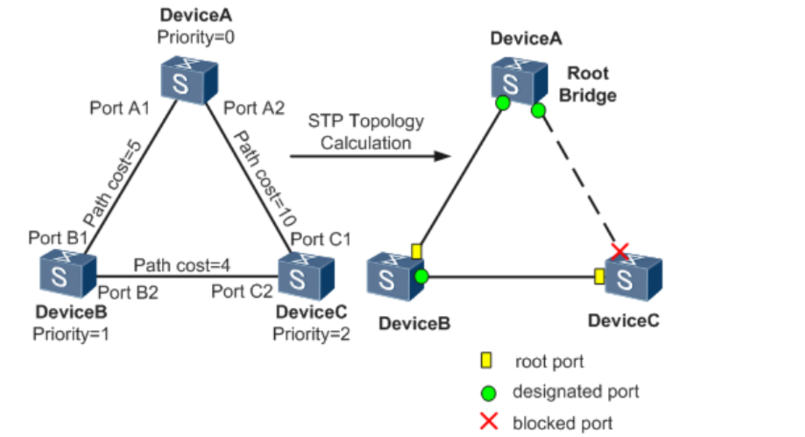

1. **选举根桥**

- 选举规则：`依据桥ID选举`，优先级数值最小 → 若优先级相同，则 `MAC地址最小` 者胜出。


2. **选举根端口**

比较内容（依次比较，数值小者优）：
- 根路径开销（到达根桥的路径开销累计值）。
- 发送者桥ID（对端交换机的桥ID，即BPDU中的Sender Bridge ID）。
- 发送者端口ID（对端交换机的端口ID，即BPDU中的Sender Port ID）。
每台`非根交换机只有一个根端口`（朝向根桥的最优路径）。


3. **选举指定端口**

比较内容（本质是比谁发的BPDU更优）：
- 根路径开销（该交换机到达根桥的路径开销）。
- 桥ID（若开销相同，比较该交换机的桥ID）。
- 端口ID（若桥ID也相同，比较该端口的端口ID）。
`每个网段（即一条链路的两个端口之间）只有一个指定端口`。


4. 选举阻塞端口

既不是根端口，也不是指定端口的端口，被逻辑阻塞。

# RSTP 802.1W
**RSTP（Rapid Spanning Tree Protocol）** 是一种快速收敛的STP变种，基于 STP 协议，对原有的 STP 协议进行了更加细致的修改和补充。

RSTP出现原因主要由于STP协议存在以下问题：
- 收敛慢：依赖定时器、且BPDU只由根桥发送，其他设备处理整理传播
- 状态区分不细致

----

## RSTP的改进点
1. 端口角色增加：**新增Alternate Port 和 Backup Port**
   
| 端口角色 | 对应STP角色 | 核心区别 |
| :--- | :--- | :--- |
| 根端口  | 根端口 | 不变，指向根桥的最优路径 |
| 指定端口  | 指定端口 | 不变，每个网段的转发出口 |
| 替代端口（Alternate Port）  | 阻塞端口（Blocked） | 根端口的备份，如果根端口挂了，它立刻顶上去|
| 备份端口  | （无） | 是指定端口的备份，同一台交换机上的冗余端口（用于共享链路或环路） |

> 阻塞端口有了明确的分工（替根端口还是替指定端口）

2. 端口状态从5种减为`3种`

| RSTP状态 | 含义 | 对应STP状态 |
| :--- | :--- | :--- |
| Discarding（丢弃） | 不转发用户流量也不学习 MAC 地址 | Disabled + Blocking + Listening |
| Learning（学习） | 不转发用户流量但是学习 MAC 地址 | Learning |
| Forwarding（转发） | 既转发用户流量又学习 MAC 地址 | Forwarding |

> RSTP取消了长达15秒的Listening状态，端口一旦确定角色，直接进入Learning或Forwarding。

3. 收敛机制改变

- **STP**：下游交换机必须被动等待根桥发来的BPDU（每2秒一次），如果等不到，要硬等20秒（Max Age）才敢切换，收敛要50秒。
- **RSTP**：引入Proposal/Agreement（提议/同意）握手机制。
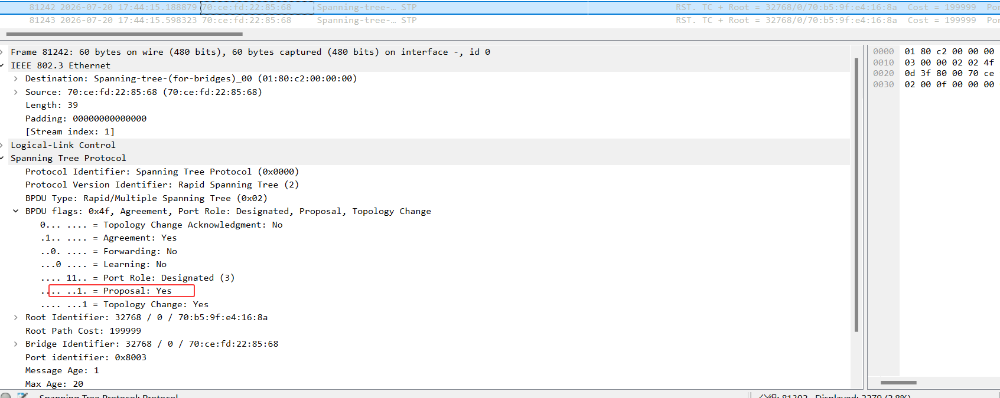

> 直连链路故障时，收敛时间从50秒缩短到毫秒级（通常<1秒）；网络边缘（连接终端）零等待。

4. 新增边缘端口
- **作用**：连接PC、服务器、打印机的端口，不参与STP计算，一插上立即进入Forwarding状态（跳过Discarding和Learning），加速收敛。
- **安全增强（BPDU保护）**：如果边缘端口意外收到了BPDU（说明有人私接交换机），RSTP会立即将其转换为普通STP端口，重新参与计算，防止环路。

5. 其他安全增强
- **根保护**：启用 Root 保护功能的指定端口，其端口角色只能保持为指定端口，Root 保护功能只能在指定端口上配置生效。
- **环路保护**：根端口或Alternate 端口长时间收不到来自上游的 RST BPDU 时，则向网管发出通知信息（如果是根端口则进入 Discarding 状态）。而阻塞端口则会一直保持在阻塞状态，不转发报文，从而不会在网络中形成环路。
- **防TC-BPDU攻击**：启用防 TC-BPDU 报文攻击功能后，在单位时间内，交换设备处理 TC BPDU 报文的次数可配置。

在配置 BPDU 报文的格式上，除了保证和 STP 格式基本一致之外，RSTP 作了一些小变化：
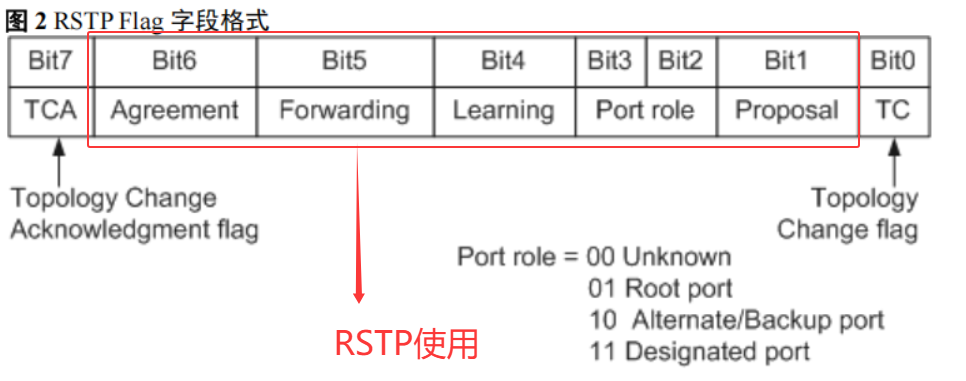

- Type 字段，配置 `BPDU 类型不再是 0 而是 2`，所以运行 STP 的设备收到 RSTP 的配置BPDU 时会丢弃。
- Flags 字段，`使用了原来保留的中间 6 位`，这样改变的配置 BPDU 叫做 RST BPDU

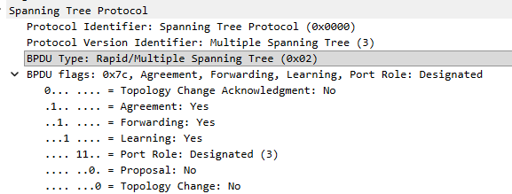

| 维度 | STP（802.1D） | RSTP（802.1w） |
| :--- | :--- | :--- |
| 收敛速度 | 30~50秒 | 毫秒~秒级（<1秒） |
| 端口状态数 | 5种 | 3种（合并了Disabled/Blocking/Listening） |
| BPDU发送方 | 只有根桥发 | 所有交换机都发 |
| 链路恢复方式 | 被动等待超时（20秒） | PA机制 |
| 终端端口 | 需额外配置（PortFast） | 标准化为边缘端口（Edge Port） |
| 兼容性 | 不支持RSTP | 向下兼容STP（可对接老设备） |

----

## PA机制
P/A握手的核心是 优`者发起提议，劣者回应同意`。发起方一定是`BPDU更优`的那一端（指定端口），而不是固定指“下游”。

> P/A（Proposal/Agreement）本身就是RSTP BPDU，不是独立的新报文。

- 场景A（下游主动）：如新加入一台交换机，下游交换机主动发出Proposal，加入网络同步
- 场景B（上游主动）：如两台交换机互联，BPDU更优的交换机主动发出Proposal，要求劣方立刻同步，确保新链路秒级开通。

:::tip
P/A 机制要求两台交换设备之间链路必须是点对点的全双工模式。一旦 P/A 协商不成功，指定端口的选择就需要等待两个 Forward Delay，协商过程与 STP 一样。
:::


----

# MSTP 802.1S
为什么需要MSTP?
> 局域网内`所有的 VLAN 共享一棵生成树`，因此无法在 VLAN 间实现数据流量的负载均衡，链路被阻塞后将不承载任何流量，造成带宽浪费，还有可能造成部分 VLAN 的报文无法转发。

如图所示，网络采用STP或RSTP，蓝线为收敛后的生成树，S3 S6之间只允许VLAN3，又因为收敛之后的树导致 S1S4 S2S5之间被堵塞，导致HOSTB无法到达HOSTA。
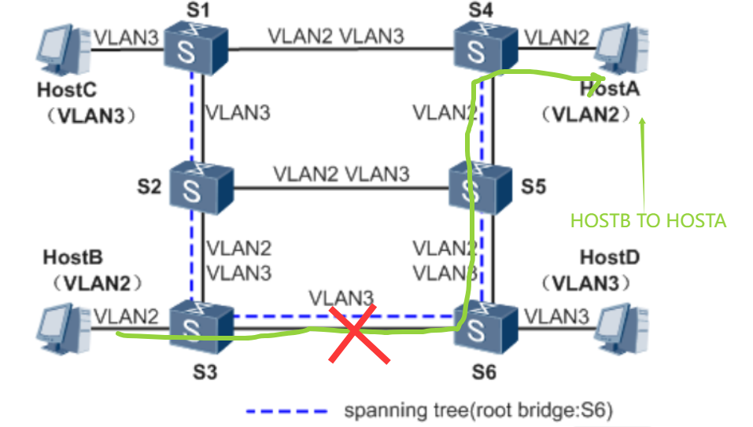

MSTP解决了什么？
> 通过 MSTP 把一个交换网络`划分成多个域，每个域内形成多棵生成树，生成树之间彼此独立`，既可以快速收敛，又提供了数据转发的多个冗余路径，在数据转发过程中实现 VLAN 数据的负载均衡。

----

## MSTP基本概念
通过 MSTP 把一个交换网络划分成多个域，每个域内形成多棵生成树，生成树之间彼此独立。每棵生成树叫做一个多生成树实例 `MSTI（Multiple Spanning Tree Instance）`，每个域叫做一个` MST域（MST Region：Multiple Spanning Tree Region）`。

一个MSTP域在逻辑上可以划分为多个MSTI，MSTI是所有运行STP/RSTP/MSTP 的交换设备经MSTP协议计算后形成的树状网络。
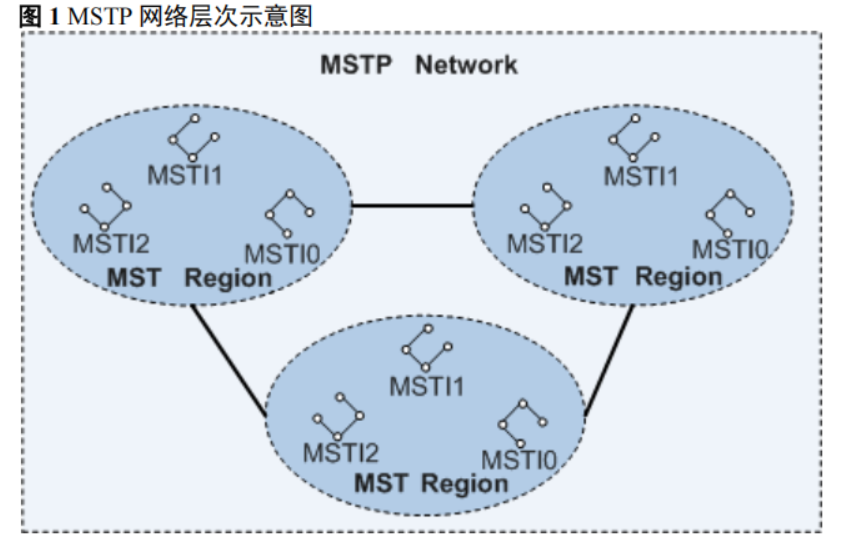

----

`MST域` 是`多生成树域`（Multiple Spanning Tree Region），由交换网络中的多台交换设备以及它们之间的网段所构成。通一个MST域包含以下特征：
- 都启动了 MSTP
- 具有相同的域名
- 具有相同的 VLAN 到生成树实例映射配置
- 具有相同的 MSTP 修订级别配置
  
**MST域所具有的属性：**
1. **VLAN 映射表**
   
- 维护VLAN和MSTI的映射关系
- 一个MSTI可包含多个VLAN，但一个VLAN只能属于一个MSTI

2. **总根**
总根是 `CIST（Common and Internal Spanning Tree）`的根桥。
这里就有几个概念：
- `CST（Common Spanning Tree）`：全局，公共生成树 CST（Common Spanning Tree）是连接交换网络内所有 MST 域的一棵生成树。
- `IST（Internal Spanning Tree）`：局部，内部生成树 IST（Internal Spanning Tree）是各 MST 域内的一棵生成树。IST 是一个特殊的 MSTI，MSTI 的 ID 为 0，通常称为 MSTI0。
- `CIST（Common and Internal Spanning Tree）`：公共内部生成树，通过 STP 或 RSTP 协议计算生成的，连接一个交换网络内所有交换设备的单生成树，包含了CST和IST，即 `CST + 所有域内 Instance 0 的全集`

CST IST CIST如图所示，其中总根是CIST的根桥。
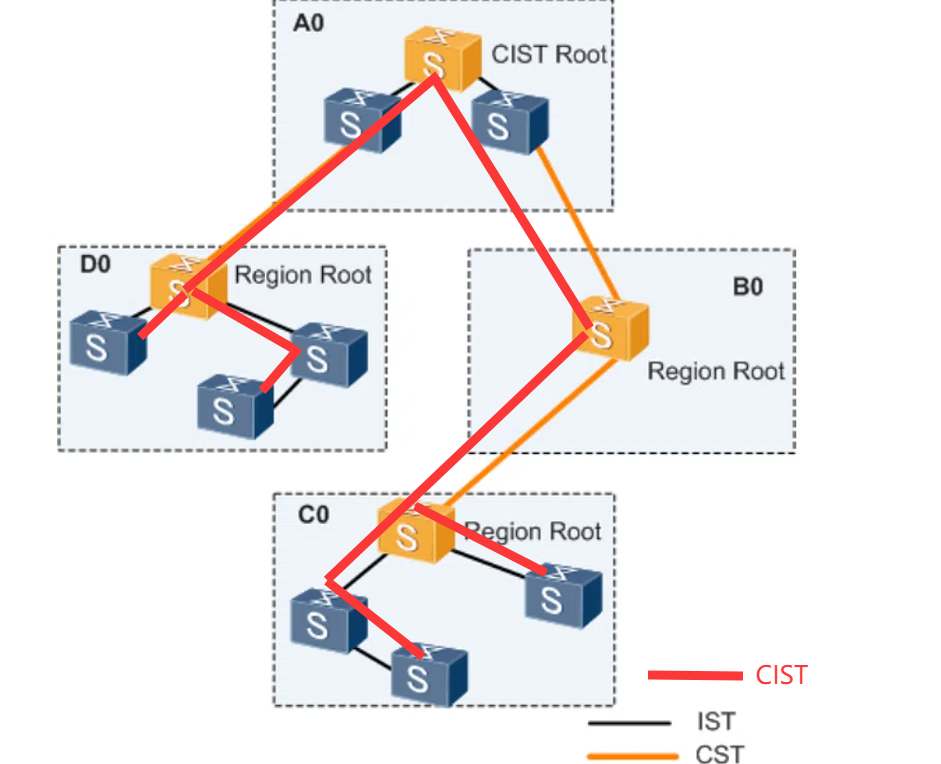


3. **主桥（Master Bridge）**
也称为 `IST（Internal Spanning Tree）Master`，它是域内距离总根最近的交换设备，如果总根在 MST 域中，则总根为该域的主桥，如上图中的黄色设备。

4. **域根**
域根（Regional Root）分为 IST 域根和 MSTI 域根。如上图所示，在 B0、C0 和 D0 中，IST 生成树中`距离总根（CIST Root）最近的交换设备是 IST 域根`。


---

## MSTP报文
MSTP 使用多生成树桥协议数据单元 MST BPDU（Multiple Spanning Tree Bridge Protocol Data Unit）作为生成树计算的依据。

`因为MSTP是在RSTP的基础上扩展的，无论是域内的 MST BPDU 还是域间的，前 36 个字节和 RST BPDU 相同。但MSTP在尾部增加了MSTI专属信息：`
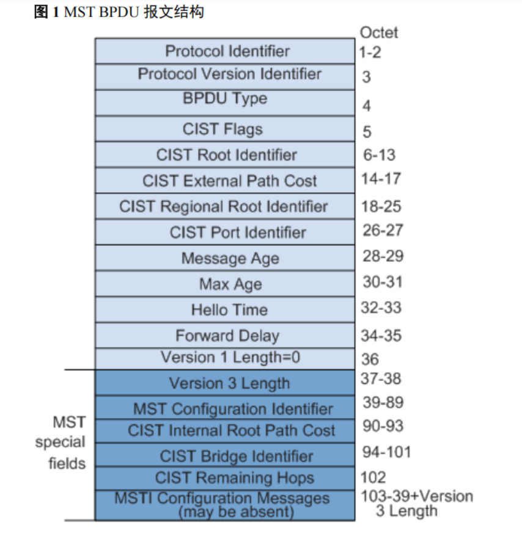


**MSTP拓展部分：**
从第 37 个字节开始是 MSTP 专有字段。最后的 MSTI 配置信息字段由若干 MSTI 配置信息组连缀而成
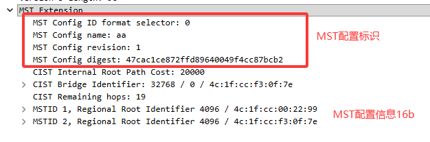

之前提过MSTP会维护一个VLAN映射表，实际上MSTP不会携带VLAN信息，而是根据`MST Configuration Digest`字段来判断是否在同一域。

 **Region Name + Revision Level + Configuration Digest**。三者完全一致才在同一域，才会处理MSTI信息。

## MSTP状态和角色
