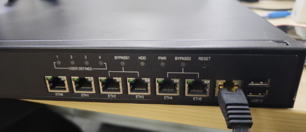
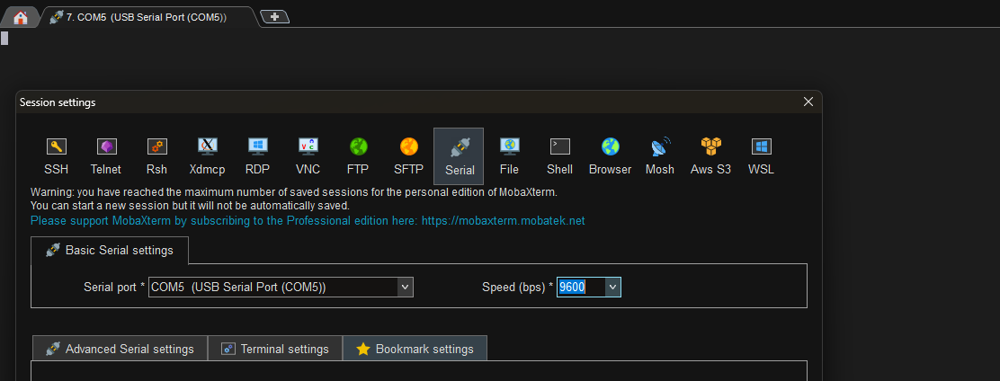
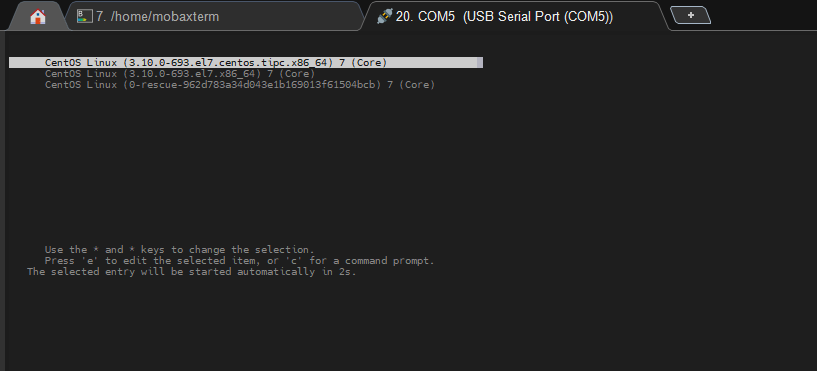
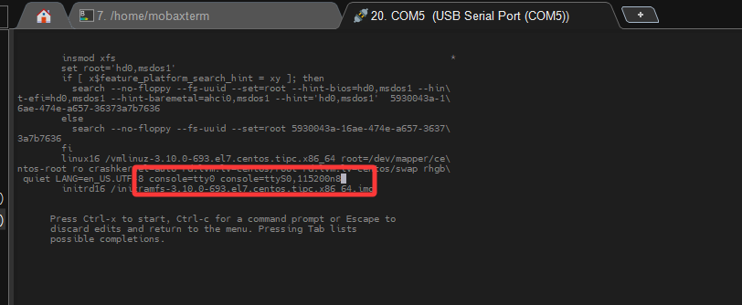
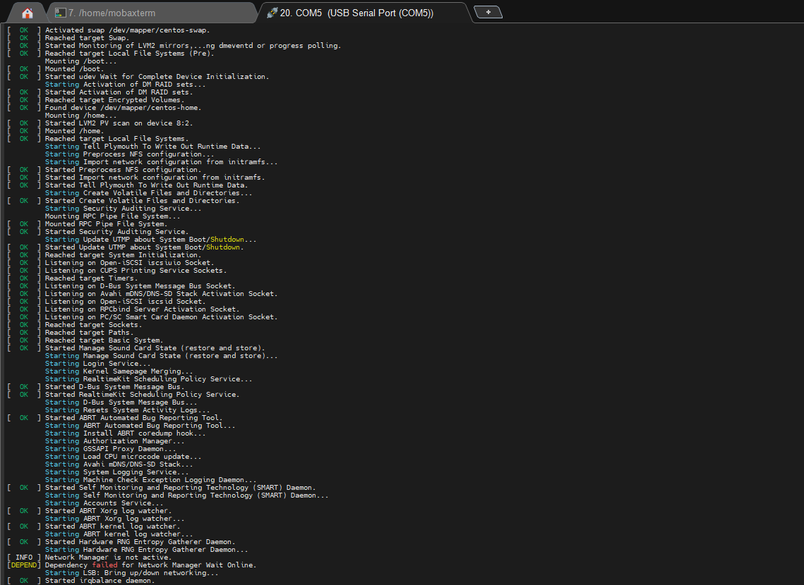

# 1. 情况说明
一台旧工控机需要重装系统，具体标签什么的都不在了，只有console线能够接入，VGA或HDMI线都没有。



串口速率都试了个遍，按回车都没有输出。



# 2. 解决方法
1. 在其他波特率下，上下电服务器会出现乱码。波特率不匹配导致，后锁定波特率为115200。
2. 上电后，该波特率下会出现GRUB菜单，很快进入系统启动，**之后便没有输出**。




:::TIP
原因： **串口重定向未完全配置的问题，开机时的 GRUB/BIOS 阶段能显示，是因为主板固件本身支持串口输出。进入系统后黑屏，是因为操作系统没有把控制台输出重定向到串口。**
:::

3. 编辑GRUB文件，将输出重定向到串口。`Ctrl+X`保存启动。



```sh frame="none"
console=tty0 console=ttyS0,115200n8
```

4. 正常进入系统。



# 3. 持久化解决
> 永久修改 GRUB 配置编辑`/etc/default/grub` 文件，修改以下两行：
```bash
GRUB_CMDLINE_LINUX_DEFAULT="quiet splash console=tty0 console=ttyS0,115200n8"
GRUB_TERMINAL="serial console"
```

> 执行：
```bash
# Debian
sudo update-grub

# CentOS
sudo grub2-mkconfig -o /boot/grub2/grub.cfg
```