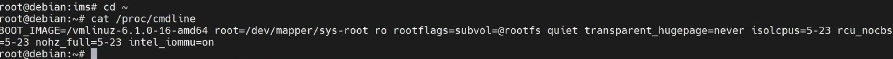
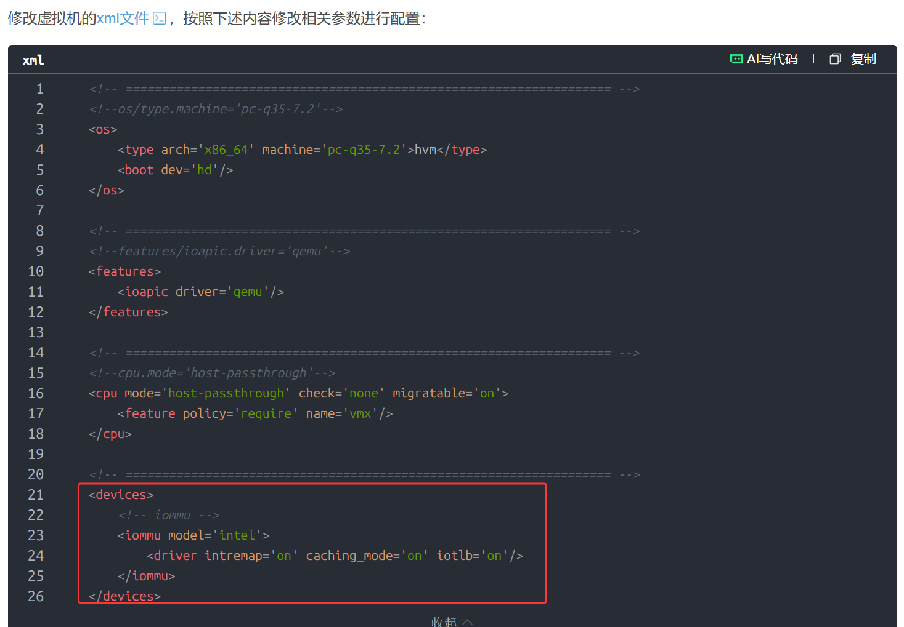
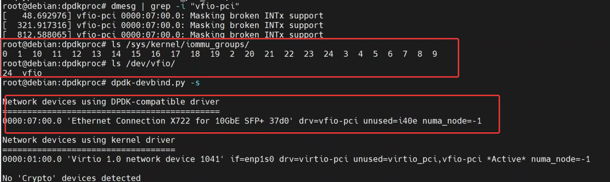

# 1. 情况说明
> 需要将一张Intel X722/X710网卡直通到虚拟机中绑定DPDK做UPF数据面。

- **CPU passsthrough、核隔离已经加入到启动项中生效**

- **DPDK 进程能够正常启动**

其他信息如下：
| 组件      | 版本/配置                            |
| ------- | -------------------------------- |
| 宿主机 OS  | Ubuntu                    |
| VM OS  | Debian12                  |
| libvirt | 10.0.0                           |
| QEMU    | 8.2.2                            |
| 虚拟机机器类型 | `pc-q35-7.2` (Q35)               |
| CPU 模式  | `host-passthrough`               |
| 网卡      | Intel X722/X710 (8086:37d0/1572) |


查看dpdk绑定的网卡驱动信息如下：
```bash
root@debian:bin# ./dpdk-devbind.py -s

Network devices using kernel driver
===================================
0000:01:00.0 'Virtio 1.0 network device 1041' if=enp1s0 drv=virtio-pci unused=virtio_pci,vfio-pci *Active* numa_node=-1

Other Network devices
=====================
0000:07:00.0 'Ethernet Connection X722 for 10GbE SFP+ 37d0' unused=i40e,vfio-pci
```

# 问题排查
按之前这些配置都是能正常绑上DPDK的，但是这次出现了绑定失败的问题，但网管上DPDK进程是能够正常拉起的。
1. `尝试手动在dpdk-devbind.py中绑定网卡驱动`
```bash
root@debian:bin# ./dpdk-devbind.py -b vfio-pci 0000:07:00.0
Error: bind failed for 0000:07:00.0 - Cannot bind to driver vfio-pci
vfio-pci: probe of 0000:00:06.0 failed with error -22
```
> [IOMMU(八)-vIOMMU - 惠伟的文章 - 知乎](https://zhuanlan.zhihu.com/p/403727428)

查看了大佬文章， `-22` 这个报错码，**error -22（EINVAL）指向 IOMMU Group 缺失**。

2. 查看`宿主机和虚拟机内核是否都开启了IOMMU Group`相关配置

```bash
# 宿主机
virt-host-validate
# QEMU: Checking for device assignment IOMMU support : PASS
# QEMU: Checking if IOMMU is enabled by kernel: PASS
```

```bash
# 虚拟机内
ls /sys/kernel/iommu_groups/ # 空目录，无 Group
ls /dev/vfio/
# 仅 vfio 主设备，无 group 设备
dmesg | grep-i iommu
# 仅有 "DMAR: IOMMU enabled"，无 Intel-IOMMU 初始化
```

到这基本判断是**vIOMMU没有生效** ，但为什么没生效这完全不清楚，只能上网查。

# 问题解决
> [基于kvm的虚拟机配置开启iommu_group](https://blog.csdn.net/pengxb0v0/article/details/140690795) 

**libvirt 中 Intel IOMMU 的配置，用于虚拟化环境中的 PCI 设备直通**，需要放在`devices`段，不能是features：

编辑虚拟机配置文件 `45GIMS.xml`，添加以下内容：
```xml
	<devices>
		<!-- iommu -->
		<iommu model='intel'>
			<driver intremap='on' caching_mode='on' iotlb='on'/>
		</iommu>
	</devices>
```

添加完后又出现了报错：
```bash
fferror: unsupported configuration: IOMMU interrupt remapping requires split I/O APIC (ioapic driver='qemu')
Failed. Try again? [y,n,i,f,?]:
```
需要在xml文件的 `features` 段中添加以下内容：
```xml
<<features>
    <acpi/>                    <!-- 高级配置与电源接口 -->
    <apic/>                    <!-- 高级可编程中断控制器 -->
    <ioapic driver='qemu'/>     <!-- I/O APIC，由 QEMU 模拟 -->
</features>
```

重启后正常能够正常绑定到DPDK了。


就比较奇怪，之前viommu是没做过这种配置，这次需要手动加上，才能正常绑定DPDK。可能是libvirtd版本原因？

# 总结
- 查看宿主机KVM组件版本信息，是否支持Q35机型的vIOMMU配置。
- 首先检查当前虚拟机是否支持vIOMMU配置。
- 确认宿主机和虚拟机内核是否都开启了IOMMU Group。
```bash
ls /sys/kernel/iommu_groups/
# 预期：0, 1, 2... 目录
ls /dev/vfio/
# 预期：0, 1, 2... 数字设备
```
- 检查虚拟机配置文件是否正确，是否缺少vIOMMU配置。