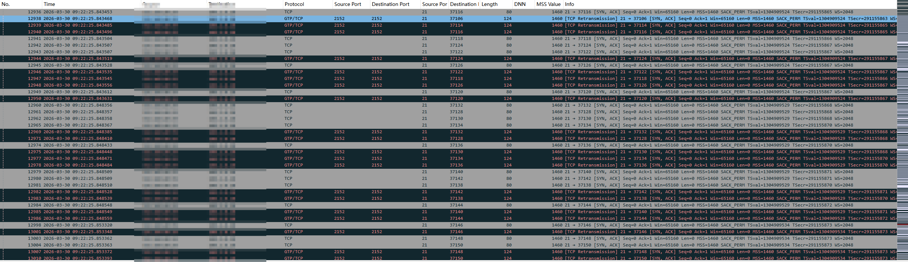
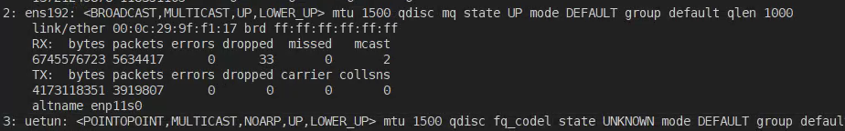
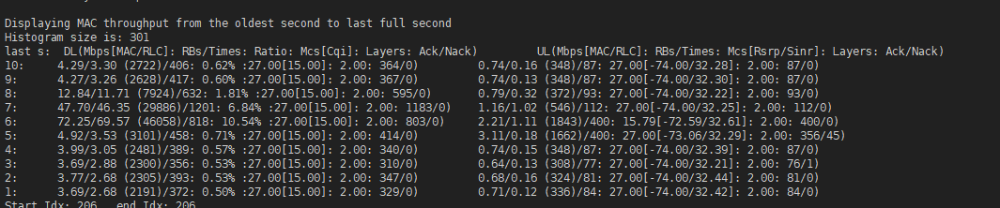
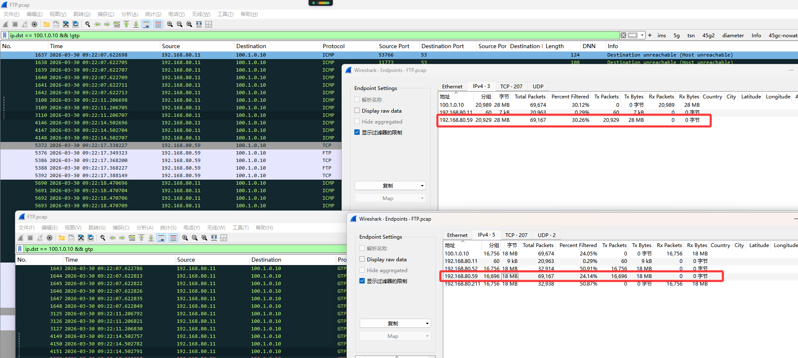
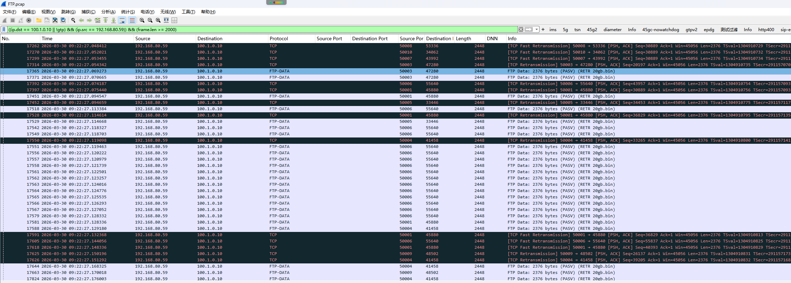
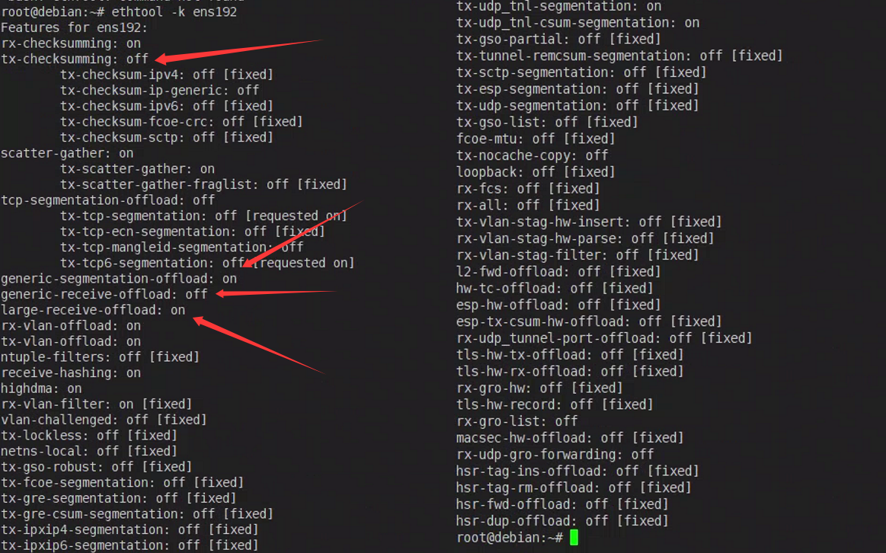
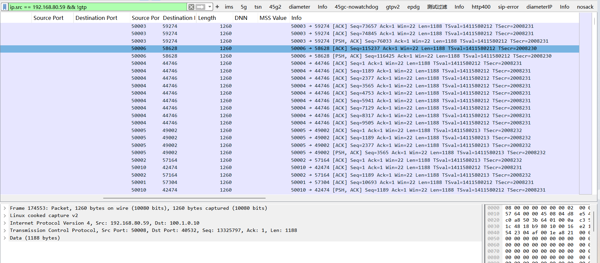

# 情况概述
客户反馈使用FTP业务时出现丢包和速率下降问题；该环境5GC核心网部署在虚拟机上，未使用DPDK加速。查看抓包有大量重传：


# 排查过程
1. 先看系统状态，查看后台负载情况，发现负载、进程占用、磁盘占用都处于正常状态；核心网grafana数据统计也处于正常状态。
```bash
uptime
top -b -n 1 | head -20
free -h
df -h
```
2. 查看网卡是否存在丢包情况，结果也是正常状态。


3. 排查空口质量，结果也是为正常范围。


4. 排查UPF是否有做丢包处理，可以看到对于FTP服务`上下行GTP封装包`和`上下行N6出口包`都持平，未出现丢包。


5. 后发现抓包里有多个大包，怀疑是ftp传输到N6时这些包未被接收。


# 解决方法
使用`ethtool -k ens192`查看网卡配置参数：<br>
```bash
ethtool -k ens192
```


----

> 可以看到gro自动合包、tx网卡拆包已关闭；<br>
> 这里看到 `generic-segmentation-offload: on` 和 `large-receive-offload: on`；
```bash
ethtool -K ens192 gro off # 通用分段卸载 关闭网卡拆包（内核把大包交给网卡，让网卡


拆成符合 MTU 的小包发出去）
ethtool -K ens192 lro off # 大接收卸载 关闭网卡合包（网卡把收到的多个小包合并成一个大包，再交给内核）
```

修改后再让客户测试，反馈下载速率恢复正常，且无丢包现象。<br>
查看抓包可以看到n6口收到的ftp流量没有大包，且没有大量重传。<br>
可以判断为N6下行对合并大包的大小有限制，超过一定大小会丢弃。
