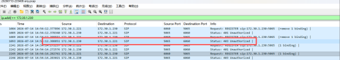
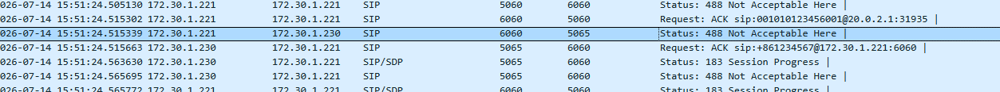
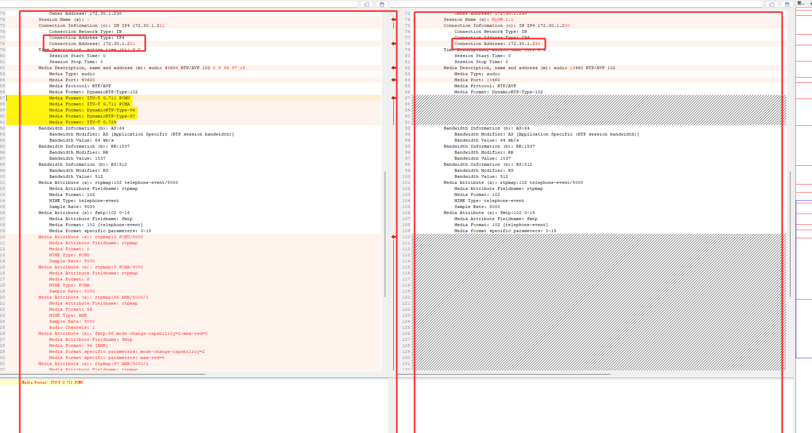
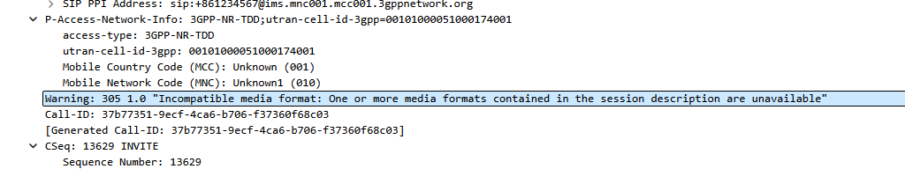
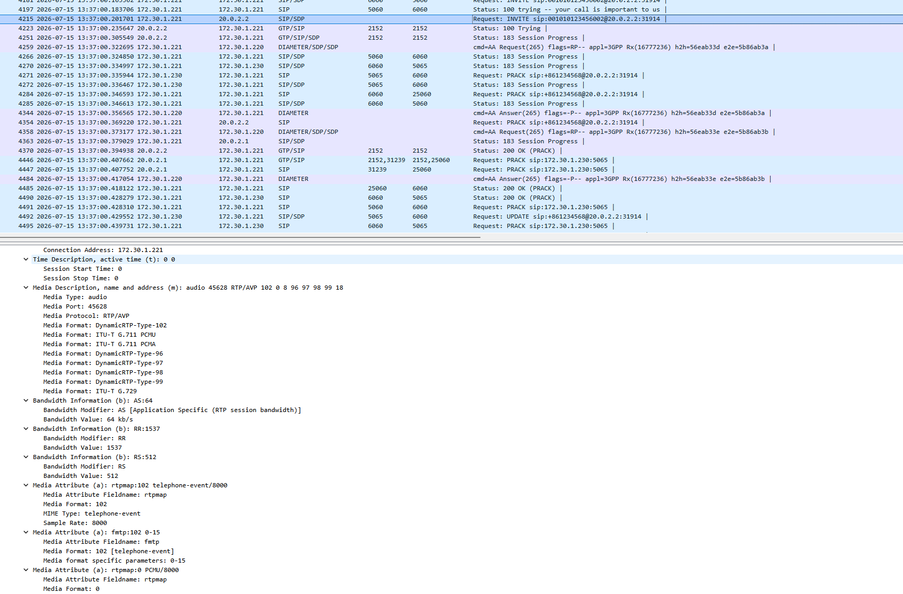

对接AS服务器问题处理。
# Q1 部署AS后，手机终端注册不成功
抓包分析，确认注册消息已发给AS

AS回了403，解决方法：

`AS关闭对用户的鉴权配置。`

# Q1 部署AS后，手机终端注册不成功
抓包分析，确认注册消息已发给AS

AS回了403，解决方法：

`AS关闭对用户的鉴权配置。`

# Q2 部署调度AS后，手机语音和视频不通
PCSCF 开启RTP代理的情况下，能够接通，但是语音和视频都不通；关闭RTP代理，UE会回复488

对比PCSCF向UE发起的invite，**左边为rtp代理开启，右边为关闭**：

关闭RTP代理后，PCSCF直接向UE发送的invite中缺少PCMU PCMA等语音编解码，即调度AS把编码都删除了，导致UE回复488，未回复183.

解决：
在PCSCF上开启 ` allow_no_tel_event（允许不带tel事件开关）`,该参数用于控制P-CSCF/A-SBC在处理SDP协商时，是否要求编码必须携带对应的 telephone-event。

- 当开关关闭（设为0/OFF）：要求终端模拟器每个编码必须携带对应的tel-event（samplerate一致），如果没有对应tel-event，认为该SDP编码无效，会忽略。
- 当开关打开（设为1/ON）：不判断tel-event，允许编码协商通过。

简单说 这个设置用来 允许 ASBC 将不完整的 SDP 传递给终端，或触发 ASBC 的 SDP 修补机制。

正常携带：
