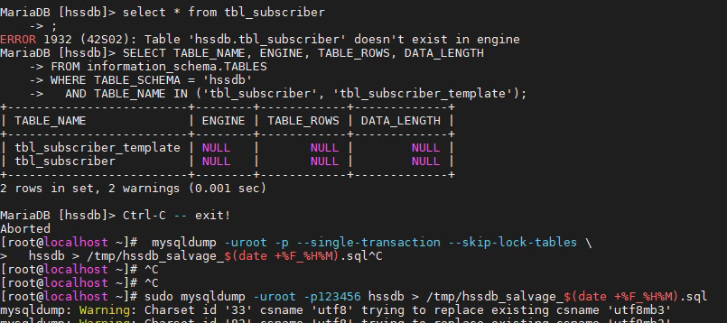

# InnoDB 表缺失恢复 — MariaDB 实例重建全流程

> **场景：** 暴力下电导致 MariaDB 数据目录元数据损坏，无法通过单表修复恢复  
> **核心操作：** 导出健康库 → 重建整个 `/var/lib/mysql` → 初始化新实例 → 导入

## 故障背景

某现场，客户暴力下电导致 `oamsmfagent` 拉起异常，日志报 `tbl_SmfserviceTemplate` 损坏。InnoDB 数据字典（ibdata1）中的残留记录已损坏，所有单表修复手段（REPAIR TABLE、ALTER、CREATE LIKE、DISCARD TABLESPACE）均因依赖数据字典而失败。



## 恢复流程

### 阶段一：导出所有健康库

先确认坏表，并记录好表结构（重建空表时需要用到）：

```bash
# 1. 尝试全量备份（会因损坏表中断，用于确认坏表）
mysqldump -uroot -p123456 5gc_dev_mgr > /tmp/5gc_dev_mgr_backup.sql

# 2. 查看坏表结构（记录 CREATE TABLE 语句，重建空表用）
SHOW CREATE TABLE tbl_SmfUserKpi;

# 3. 导出 5gc_dev_mgr（忽略坏表）
mysqldump -uroot -p123456 \
  --ignore-table=5gc_dev_mgr.tbl_SmfUserKpi \
  --ignore-table=5gc_dev_mgr.tbl_SystemResourceKpi \
  > /tmp/5gc_dev_mgr_backup.sql

# 4. 全库导出，通过 --ignore-database 跳过损坏库
mysqldump -uroot -p123456 \
  --all-databases \
  --single-transaction \
  --skip-lock-tables \
  --force \
  --ignore-database=5gc_dev_mgr \
  > /root/all_healthy_dbs_$(date +%F_%H%M).sql \
  2> /tmp/healthy_dump_errors.log
```

导出完成后立即验证备份完整性：

```bash
ls -lah /root/all_healthy_dbs_*.sql
tail -3 /root/all_healthy_dbs_*.sql
grep -c "CREATE DATABASE" /root/all_healthy_dbs_*.sql
grep -c "Dump completed" /root/all_healthy_dbs_*.sql
```

### 阶段二：重建 MariaDB 实例

:::TIP
**关键区别：** 这里直接重建整个数据目录，而不是只删 ibdata1。这样能避免残留损坏元数据影响其他数据库。
:::

```bash
# 1. 停止服务
systemctl stop mariadb

# 2. 备份整个旧数据目录
mv /var/lib/mysql /var/lib/mysql.disaster_backup_$(date +%F_%H%M)

# 3. 创建全新空目录
mkdir -p /var/lib/mysql
chown mysql:mysql /var/lib/mysql
chmod 755 /var/lib/mysql

# 4. 重新初始化数据库
mysql_install_db --user=mysql --datadir=/var/lib/mysql

# 5. 启动
systemctl start mariadb

# 6. 设置 root 密码
mysqladmin -u root password "123456"
```

### 阶段三：导入数据

分两步导入：先导入健康库，再单独处理损坏的 `5gc_dev_mgr`：

```bash
# 1. 导入所有健康库
mysql -uroot -p123456 < /root/all_healthy_dbs_*.sql

# 2. 创建 5gc_dev_mgr 空库
mysql -uroot -p123456 -e \
  "CREATE DATABASE 5gc_dev_mgr CHARACTER SET utf8mb4;"

# 3. 强制导入 5gc_dev_mgr（用 --force 跳过损坏表）
mysql -uroot -p123456 --force \
  5gc_dev_mgr < /路径/5gc_dev_mgr_backup.sql \
  2> /tmp/5gc_import_errors.log

# 4. 检查导入结果
grep "ERROR" /tmp/5gc_import_errors.log | head -10
grep "CREATE TABLE" /tmp/5gc_import_errors.log | wc -l

# 5. 恢复用户权限
GRANT ALL PRIVILEGES ON *.* TO 'myuser'@'%' IDENTIFIED BY 'your_password';
FLUSH PRIVILEGES;
```

最后重建损坏表的空表结构（用之前记录的 DDL）：

```sql
DROP TABLE IF EXISTS `tbl_SmfUserKpi`;
CREATE TABLE `tbl_SmfUserKpi` (
  `recordingTime` varchar(32) NOT NULL COMMENT '记录时间',
  `sessionRate` varchar(16) NOT NULL COMMENT 'SMF DNN session 创建成功率',
  `sessionActiveNm` varchar(32) NOT NULL COMMENT 'SMF 当前激活 session 数量',
  `sessionImsUserNm` varchar(32) NOT NULL COMMENT 'SMF IMS用户 session 数量',
  `onlineNum` varchar(32) NOT NULL COMMENT 'SMF当前在线用户数',
  `smfNode` varchar(16) NOT NULL COMMENT '节点',
  `sign` tinyint(4) DEFAULT 0,
  UNIQUE KEY `KEY1` (`smfNode`,`recordingTime`) USING BTREE
) ENGINE=InnoDB DEFAULT CHARSET=utf8mb3;
```

## 经验总结

1. **思路为先：** "导出健康库 → 删除 ibdata1 → 重建实例 → 导入"
2. **单库跳过：** 使用 `--ignore-database` 跳过损坏库做全量导出，避免导出中断
3. **彻底重建：** InnoDB 表缺失时不要只删 ibdata1，应备份并重建整个 `/var/lib/mysql` 目录，避免残留损坏元数据
4. **强制导入：** 历史备份导入时使用 `--force` 参数跳过损坏表，确保其余健康表可以正常恢复
5. **备份验证：** 导出后立即检查 `Dump completed` 标记和 `CREATE DATABASE` 计数，确保备份完整可靠

---

*本文章由助手CoCo生成~*
