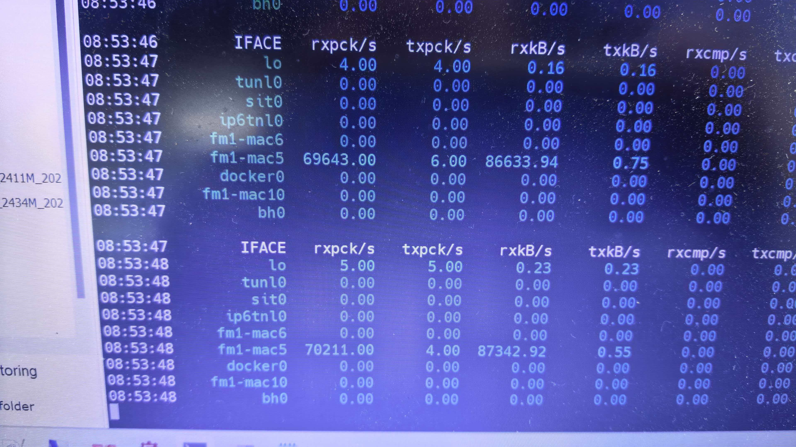
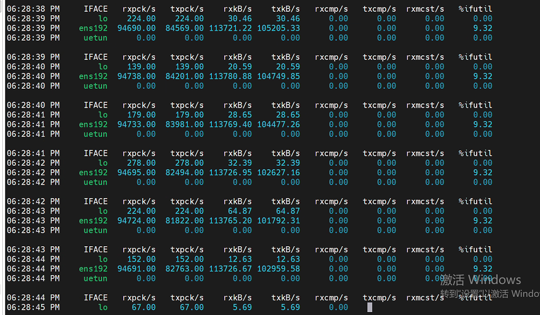

# 1. 情况说明
使用VMware ESXi作为平台：
- vCPU 4核 无预留频率 
- 内存 32GB 预留32GB
- 无DPDK
- 磁盘200GB
- 单网卡

核心网部署完成，使用iperf从DN侧向UE打UDP流，速率900Mb/s，发现gtp包到基站的速率只有700Mb/s不到。

4G和5G接入都存在这个情况。


# 2. 解决方法
由于使用的是内核模式，造成该现象的原因可能是**内核频繁调度切换的时候会跑不满并且收发低**

打流时使用`top`查看进程：
```bash
top
# PID USER      PR  NI    VIRT    RES    SHR S  %CPU  %MEM     TIME+ COMMAND
#      26 root      20   0       0      0      0 R  98.3   0.0   1:10.08 ksoftirqd/2
#    3218 root      20   0 2502188 448880  21452 R  77.5   1.4   1:25.47 upfDpeProcess
#      31 root      20   0       0      0      0 S   3.6   0.0   0:02.28 ksoftirqd/3
```

可以看到CPU2上ksoftirqd/2处理软中断的内核线程已经占满了，其他的CPU如CPU3几乎处于空闲态，存在频繁的调度切换。

首先查看下网络的收包队列：
```bash
cat  /sys/class/net/ens192/queues/rx-0/rps_cpus
# 0
```

输出的0不关联任何rx队列，收包不做任何cpu分发，导致软中断和UPF业务来回切换，进而导致发包速率下降。
```bash
cat  /sys/class/net/ens192/queues/rx-0/rps_cpus
# 0
```

调整收包队列，让所有CPU参与收包。
```bash
echo "f"  > /sys/class/net/ens192/queues/rx-0/rps_cpus
```

再看看打流速率，速率恢复正常。
