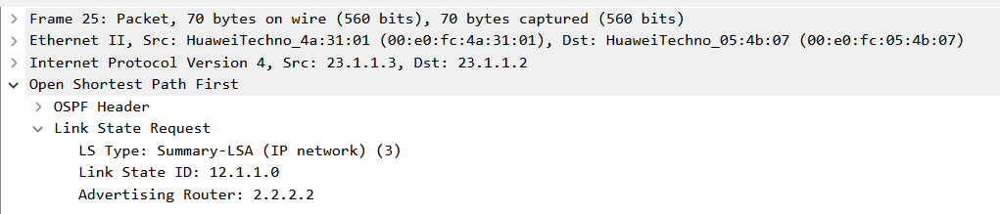
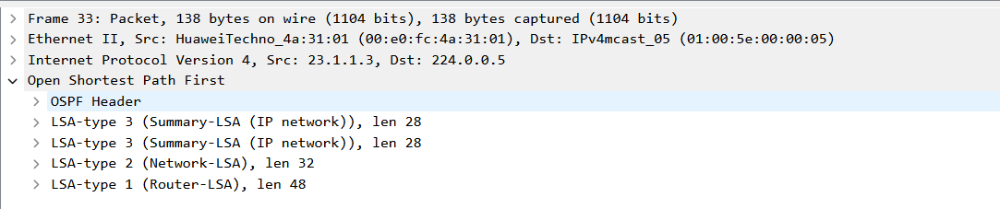

最开始考完IE想着找一个数通或者数据中心的活干，结果投来投去莫名其妙干了核心网，项目数通几乎不由我设计，学的路由协议那些也很少用到了，正好折腾博客可以重新回顾下。

# 1. OSPF基本概念
## 1.1 协议概述
**OSPF（Open Shortest Path First，开放最短路径优先协议）** 是一个`基于链路状态`的`内部网络路由协议（IGP）`。支持VLSM、路由汇总、等价负载均衡、区域划分、认证。 
-    **管理距离是为110**
-    **IP协议号89**，封装在IP报文中
-    无环路、收敛快、扩展性好
-    OSPFv2支持IPv4、OSPFv3支持IPv6
----
## 1.2 度量方式
OSPF基于物理链路的带宽来计算度量值，OSFP路由条目总cost值为沿路cost值之和。 
默认计算基数= 10^8 bit=100M，`cost=默认计算基数/物理链路带宽（Bit为单位）`  
> 如：100M带宽的接口，100M/100M=1，Cost值为1； 10M带宽的接口，100M/10M=10，Cost值为10
> 可在接口处修改 cost值 或者 修改默认计算基数 。

----

## 1.3 标识 Router-ID
- 在AS（Autonomous System，自治系统）中**唯一标识一台运行OSPF的路由器编号**
- OSPF的路由器都必须有一个Router ID，同一个AS内，Router ID不可重复
- Router ID可以手动指定，也可以系统自动选举产生
> **自动选举优先使用loopbackIP地址，其次为最大活跃物理口IP**

----

## 1.4 OSPF关系
- `邻居Neighbor` 关系： 
两台运行OSPF协议的路由器相连的接口上会互相发出各自的OSPF参数，如果双方的参数符合建立邻居的条件，就会形成**邻居关系**。`状态为2-way`，**代表可以交换信息**。

- `邻接Adjacency` 关系： 
**邻居不一定邻接**，当两台路由设备之间交换链路状态信息，并**根据更新后的数据库计算出OSPF路由，才能称为邻接关系**。`状态为Full`，代表已经交换完信息。

----

## 1.5 DR、BDR和DR other
在以太网接口下，默认的OSPF网络类型为Broadcast，OSPF在广播多路访问的网络上，会进行`DR（Designated Router指定路由器）`和`BDR（Backup Designated Router备份指定路由器）`的选举。
- DR与BDR能够与该链路上`其它路由器（DR other）`建立邻接关系，进入Full状态
- **DR other之间建立邻居，停留在 2-way状态，不会交换LSA**
- DR和BDR是一个`广播域内`选举一个，不是整个区域选举一个
:::tip
**DR/BDR 是接口级概念，不是区域级概念。每个广播域独立选举，互不影响。**
- 接口 1 → 广播域 A → 选举 DR1、BDR1
- 接口 2 → 广播域 B → 选举 DR2、BDR2
- 接口 3 → 广播域 C → 选举 DR3、BDR3
:::

# 2. OSPF邻居发现和建立流程
1. **init -> 2-way** 发现邻居，建立邻居关系状态：通过Hello报文发现并形成邻居关系形成邻居表。

:::tip
每`10s`发送一次hello维护邻居关系，`40s`超时视为邻居失效
:::

2. **2-way -> Full** 邻接关系建立，路由通告，包含`exstart和exchange`两个中间态。
- 在exstart和exchange转换中，会交互DD（database description）报文
- `routerID大的优先发送`
- **DD只携带LSA头部，不携带完整LSA内容，相当于互相发送链路状态数据库目录**。

3. SPF算法路由计算
- 链路状态信息作为使用SPF算法计路由的原材料。
- 链路状态信息即路由器接口状态，包含：
    1. 接口IP地址和掩码
    2. 接口的带宽
    3. 接口邻居
接口链路类型等

> 简单的状态转换就是 down - init - 2way - exstart - exchange - full

-----

# 3. OSPF五种报文类型
`224.0.0.5` 为OSPF组播地址，所有启用 OSPF 的接口都会监听这个地址； 
`224.0.0.6` 所有OSPF指定路由器 (DR/BDR)监听；

类型|	报文类型|	功能
|------|------|------|
1	|Hello 报文	|携带参数，建立和维持邻居关系
2	|DD 数据库描述报文（链路状态摘要，相当于是 LSA 目录）|	携带 LSA 头部信息，向邻居描述 LSDB
3	|LSR 链路状态请求报文	|`向邻居请求特定的 LSA`
4	|**LSU 链路状态更新报文**	| 向邻居通告拓扑信息，**LSA（链路状态通告）封装 在其中，真正包含路由信息**。
5	|LSAck 链路状态应答报文	|对收到的 LSU 中的 LSA 信息进行确认

其中LSU存在`定时更新`和`触发更新`:
- 定时更新：LSA每1800s(30min)更新一次，3600s(1h)失效。
- 触发更新：当链路状态发生变化时立即发送链路状态更新。

还是用报文来看下，比较容易理解：
1. Hello 报文

2. DD 数据库描述报文

3. LSR 链路状态请求报文

4. LSU 链路状态更新报文

5. LSAck 链路状态应答报文

-----