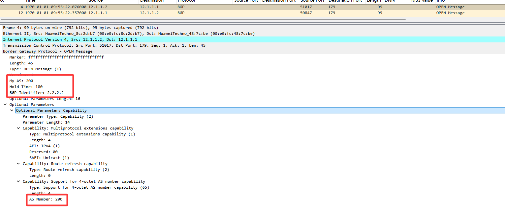
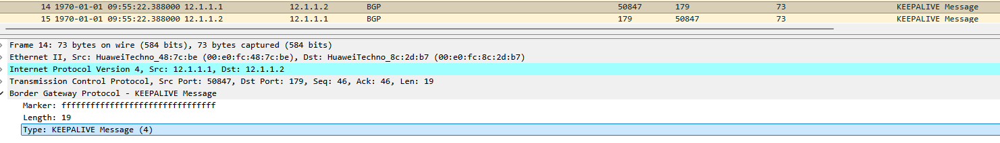
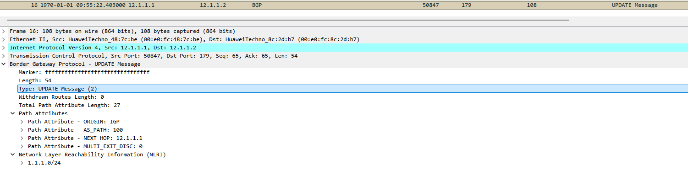
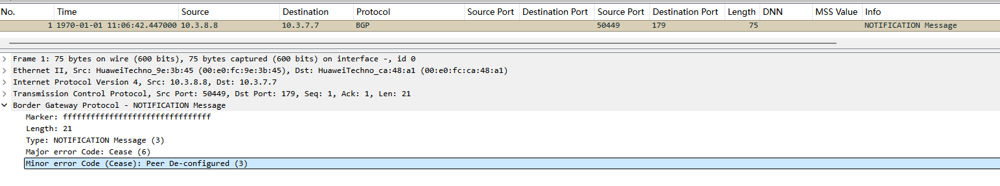
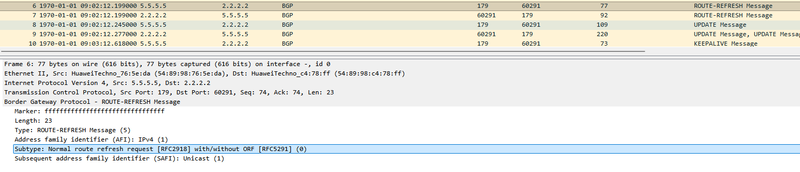
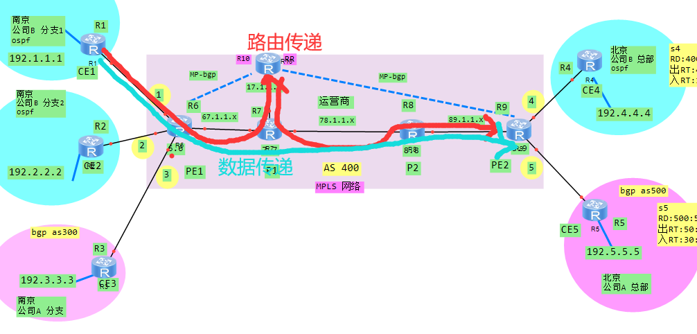
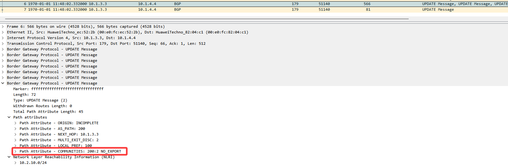

# 1. BGP基本概念

## 1.1 协议概述

**BGP（Border Gateway Protocol，边界网关协议）** 是一个`路径矢量`的`外部网关协议（EGP）`。和OSPF、IS-IS这些IGP完全不同，BGP不是为了快速找到最短路径设计的，而是为了在大型分布式网络中实现可控的路由策略。

- **基于TCP传输**，端口号`179`，可靠性由TCP保证
- **设计目标**：承载大量路由前缀、实现灵活的策略控制、支持大规模网络互联
- **当前版本**：BGP-4（RFC 4271），支持CIDR和路由聚合
- **IPv6支持**：通过MP-BGP（多协议BGP，AFI/SAFI标识地址族）实现

:::tip
**BGP不用组播发现邻居，而是用TCP 179端口主动连接**。这意味着BGP邻居必须手动指定，而且双方不需要直连，只要IP可达就能建立邻居。这个特性让BGP特别适合跨域、跨设备、甚至跨运营商的场景。
:::

----

## 1.2 BGP与IGP的区别

| 对比项 | BGP | IGP（OSPF/IS-IS） |
|--------|-----|-------------------|
| **协议类型** | EGP（外部网关协议） | IGP（内部网关协议） |
| **算法** | **路径矢量（Path Vector）** | 链路状态（Link-State） |
| **传输层** | TCP 179 | IP协议封装（OSPF 89，IS-IS数据链路层） |
| **邻居发现** | 手动指定 | 自动发现（Hello报文） |
| **路由更新** | **增量更新，有变化才发** | 定期刷新+触发更新 |
| **路由规模** | 设计上支持数十万条前缀 | 一般几千条以内 |
| **收敛速度** | 慢（秒级到分钟级） | 快（毫秒到秒级） |
| **策略能力** | 极强，基于属性做策略 | 弱，主要是cost和优先级 |

> **IGP负责"怎么走得快"，BGP负责"往哪走、谁来走"**。在企业网或者数据中心里，通常是IGP跑底层联通，BGP跑业务路由。

----

# 2. BGP邻居类型

## 2.1 iBGP与eBGP

BGP的邻居分两种，这和IGP完全不同——**IGP的邻居叫邻居，BGP的邻居叫Peer（对等体）**。

| 邻居类型 | 全称 | 说明 |
|---------|------|------|
| **eBGP** | External BGP | **不同AS之间**的BGP邻居，通常直连 |
| **iBGP** | Internal BGP | **同一AS内部**的BGP邻居，不需要直连 |

**关键区别**：

- **eBGP邻居**：
  - 一般要求直连（也可以通过多跳建立）
  - 发送路由时**会修改下一跳**为自身
  - 发送路由时**会把AS-Path加上自己的AS号**

- **iBGP邻居**：
  - 不需要直连，只要IP可达就行
  - 发送路由时**不会修改下一跳**（需要手动改或者配next-hop-self）
  - **不会修改AS-Path**
  - **有水平分割规则**：从iBGP学到的路由不会再发给其他iBGP邻居

**华为没有 AD 概念，用 Preference 替代。最关键是 BGP 默认 Preference=255（最低），与 Cisco 的 eBGP=20/iBGP=200 完全不同。**

:::tip
**iBGP的水平分割是为了防环**，但这也导致了一个问题：AS内所有iBGP路由器必须全互联（Full Mesh），否则有些路由器学不到路由。后来就有了`路由反射器（RR）`和联邦（Confederation）来解决这个问题。
:::

----

## 2.2 BGP多跳

eBGP默认TTL为1，要求直连。**如果eBGP邻居不直连，需要配置多跳**：

```bash
# 华为
peer 10.1.1.1 as-number 100
peer 10.1.1.1 ebgp-max-hop 5

```

> 这个在跨运营商对接、通过防火墙或者NAT设备建立BGP的时候经常用到。

----

# 3. BGP状态机

BGP的邻居状态机比IGP复杂，有6个状态：

| 状态 | 说明 |
|------|------|
| **Idle** | 初始状态，不发起连接 |
| **Connect** | 尝试TCP连接（三次握手） |
| **Active** | TCP连接失败，持续重试 |
| **OpenSent** | TCP建立成功，已发送Open报文 |
| **OpenConfirm** | 收到对端的Open报文，参数协商成功 |
| **Established** | 邻居建立成功，可以交换Update报文 |

> 实际排障中，最常见的卡在 **Active** 状态，原因一般是：AS号配错了、IP不可达、TCP 179被防火墙拦截、认证不匹配。

----

# 4. BGP报文类型

BGP有4种报文，全部通过TCP 179传输：

| 报文类型 | 功能 |
|---------|------|
| **Open** | 建立邻居时交换基本参数（AS号、Hold Time、BGP ID等） |
| **Update** | 通告、撤销路由，携带路径属性 |
| **Notification** | 检测到错误时发送，收到后邻居关系直接断开 |
| **Keepalive** | 维持邻居关系，默认间隔60秒，Hold Time为180秒 |
| **Route-Refresh** | 请求对端重新发送路由（用于策略变更后软刷新） |

- **Keepalive**：默认60秒发一次，Hold Time是180秒（3倍关系）
- **Update**：这是唯一携带路由信息的报文，可以通告新路由也可以撤销旧路由
- **Notification**：一旦发送或收到这个报文，邻居关系立即Down掉，需要排查问题重新建立

1. open报文携带的基本参数：


2. keepalive消息：


3. update报文携带的路由信息：


4. notification报文，未配置peer地址：


5. route-refresh报文（ORF 让接收方指导发送方过滤路由的机制，解决传统 BGP 中"发送方推送大量路由，接收方本地丢弃"的资源浪费问题）：


:::tip
**BGP支持路由软刷新（Route Refresh）**，改了策略之后不用断邻居就能让对端重新发路由。之前老版本BGP不支持这个。
:::


----

# 5. BGP路径属性（Path Attributes）

这是BGP最核心的部分，也是它策略能力强的根本原因。**BGP选路是基于路径属性的一套规则**，而不是简单的cost。

## 5.1 公认必遵（Well-known Mandatory）

所有BGP实现都必须识别且必须携带的属性，都得记住：

| 属性 | 说明 |
|------|------|
| **Origin** | 路由来源：`IGP`（i）< `EGP`（e）< `Incomplete`（?），优先级从高到低 |
| **AS_Path** | 路由经过的AS序列，用来防环和选路，越短越优 |
| **Next_Hop** | 下一跳地址，eBGP会改，iBGP默认不改 |

## 5.2 公认自选（Well-known Discretionary）

所有BGP实现都必须识别，但可以不携带：

| 属性 | 说明 |
|------|------|
| **Local_Pref** | 本地优先级，**iBGP选路最重要属性之一**，越大越优，只在AS内传播 |
| **Atomic_Aggregate** | 标记路由是否被聚合，提醒下游可能丢失路径信息 |

## 5.3 可选传递（可选过渡）（Optional Transitive）

BGP实现可以不支持，但收到后必须传递给其他邻居：

| 属性 | 说明 |
|------|------|
| **Community** | 团体属性，用来打标签做批量策略，比如No_Export、No_Advertise |
| **Aggregator** | 聚合者的信息（BGP ID和AS号） |

## 5.4 可选非传递（可选非过渡）（Optional Non-transitive）

BGP实现可以不支持，收到后不传递给其他邻居：

| 属性 | 说明 |
|------|------|
| **MED** | 多出口区分，**eBGP选路用**，建议进入AS的入口，越小越优 |
| **Originator_ID** | 路由反射器场景中使用，标识原始发起者，防环 |
| **Cluster_List** | 路由反射器场景中使用，记录经过的RR簇，防环 |

----

# 6. BGP选路规则

BGP的选路规则是一个**决策树**，按顺序比较，一旦某条规则能分出胜负就不再往下比：

能记全的也是神人了

0. 丢弃下一条不可达路由
1. **最高Weight值**（思科私有，华为叫PrefVal，本地有效）
2. **最高Local_Preference**（本地优先级，AS内传播，仅在IBGP邻居有效）
3. **本地始发路由**（network、aggregate、redistribute），手动聚合>自动聚合>network>import>对等体学习
4. **最短AS_Path**（经过的AS数最少）
5. **最优Origin类型**（IGP > EGP > Incomplete），起源类型 I origin>E>?，可跨AS
6. **最低MED**（多出口区分），优选MED小的，仅在相邻AS传递将IGP引入BGP时，IGP路由开销会移植到MED
7. **eBGP优于iBGP**
8. **最低IGP cost到Next_Hop**，	优选AS内部IGP的Metric最小路由
9. **Cluster_List**（RR的ID）最短的路由
10. **Originator_ID**（起源路由的router id）最小的路由
11. **Router ID**（邻居的BGP ID）最小的路由器发布的路由
12. **最小邻居IP地址**

:::tip
**实际工作中最常用的调优手段**：
- 控制出口流量：改 **Local_Preference**
- 控制入口流量：改 **MED** 或者 **AS_Path Prepend**（在AS_Path前加自己的AS号让它变长，引导对端走别的入口）
- 打标签批量处理：用 **Community**
:::

----

# 7. BGP路由反射器RR（Route Reflector）

## 7.1 为什么需要RR

前面说了iBGP有水平分割，导致AS内必须全互联。如果有n台BGP路由器，需要 `n(n-1)/2` 条iBGP连接，这在大规模网络里不现实。

**路由反射器** 就是来解决这个问题的：

- 指定一台或几台路由器作为RR
- RR从非客户端收到的iBGP路由可以反射给客户端
- 客户端只需要和RR建立iBGP邻居，不需要和其他客户端建



> 在MPLS-VPN中，RR需要  `undo policy vpn-target`  关闭标签验证，以确保收到所有BGP vpnv4路由 

## 7.2 RR的角色

| 角色 | 说明 |
|------|------|
| **RR（Route Reflector）** | 路由反射器，负责接收和反射iBGP路由 |
| **Client** | RR的客户端，只和RR建iBGP邻居 |
| **Non-Client** | 非客户端，和RR保持普通**iBGP邻居关系** |

## 7.3 RR反射规则

1. 从**Client**收到的路由，反射给**所有Client和非Client**
2. 从**Non-Client**收到的路由，反射给**所有Client**
3. 从**eBGP**收到的路由，反射给**所有Client和非Client**

> 简单说就是：RR只帮客户端做中转，客户端之间通过RR互通，非客户端之间RR不管

## 7.4 防环机制

RR场景下的防环靠两个可选非传递属性：

- **Originator_ID**：标识路由的原始发起者（Router ID），如果收到一条路由的**Originator_ID是自己，就丢弃**
- **Cluster_List**：记录路由**经过的RR簇**ID，如果看到自己的簇ID在列表里，就丢弃

:::tip
**一个簇（Cluster）由一个RR和它的所有Client组成**。大型网络中可以部署多组RR做冗余，不同簇用不同的Cluster ID区分。
:::

----

# 8. BGP联邦（Confederation）

另一种解决iBGP全互联问题的方法是 **联邦**：

- 把一个大AS**逻辑上拆分成多个子AS**
- 子AS之间跑eBGP，但对外表现为同一个AS
- 保留了BGP的策略能力，同时避免了全互联

和RR对比：

| 方案 | 优点 | 缺点 |
|------|------|------|
| **RR** | 配置简单，不改变AS结构 | 单点风险（需冗余部署） |
| **联邦** | 天然冗余，保留策略能力 | 配置复杂，需要重新规划子AS |

BGP 联邦，采用 `AS 号 + 团体值` 表示：


**联邦的一些属性：**
| 知名团体                  | 十六进制         | 行为                       |
| -------------------- | ----------- | ----------------------- |
| NO_EXPORT          | 0xFFFFFF01 | 不传给任何 EBGP（含联邦 eBGP）     |
| NO_ADVERTISE        | 0xFFFFFF02 | 完全不传给任何邻居（IBGP/EBGP 都不传） |
| NO_EXPORT_SUBCONFED | 0xFFFFFF03 | 不传给联邦 eBGP，但可传给普通 EBGP   |
| LOCAL_AS            | 0xFFFFFF04 | 不传给任何 EBGP，含联盟子 AS       |


> 实际项目中RR用得更多

----

# 9. BGP常见应用场景

## 9.1 企业网出口多ISP负载

- 通过Local_Pref控制**出站流量**走哪条链路
- 通过MED或者AS_Path Prepend影响**入站流量**
- 接收运营商的默认路由或者全量路由表

## 9.2 数据中心多活

- 通常用eBGP between AS或者同AS内iBGP
- 配合VXLAN/EVPN做东西向流量调度
- Community标记不同数据中心的业务路由

## 9.3 运营商骨干网

- 传递互联网全量路由表
- 通过路由策略控制流量走向和互联互通
- AS_Path是互联网路由防环的核心机制

----

# 10. 常用查看命令

```bash
# 华为
display bgp peer                              # 查看BGP邻居
display bgp peer verbose                      # 查看BGP邻居详细信息
display bgp routing-table                     # 查看BGP路由表
display bgp routing-table x.x.x.x             # 查看特定前缀的BGP详情
display bgp update-peer-group                 # 查看BGP对等体组
display tcp status                            # 查看TCP连接状态
```

----

