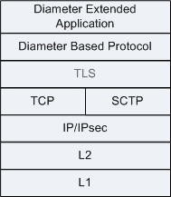
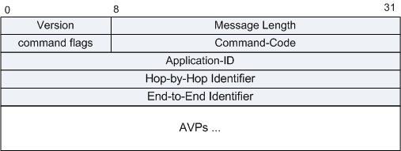
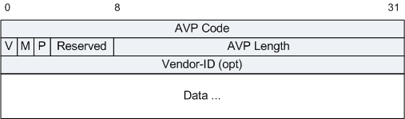
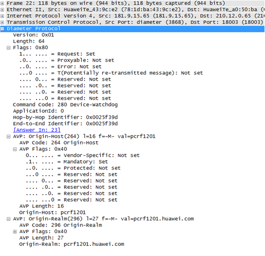
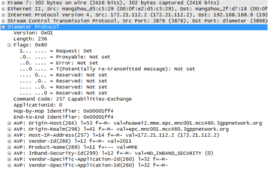

# Diameter协议报文格式

Diameter协议是IETF AAA工作组制定的下一代AAA（Authentication、Authorization、Accounting）协议标准，由RADIUS协议演进而来，在RFC 6733（原RFC 3588）中定义。

---

## 1. 概念：Diameter是什么

### 1.1 从RADIUS到Diameter

RADIUS（RFC 2865）是传统的AAA协议，广泛应用于固网接入场景。但随着移动通信网络的发展，RADIUS在可靠性、安全性、扩展性等方面逐渐暴露出不足：

| 对比项 | RADIUS | Diameter |
|--------|--------|----------|
| 传输层 | UDP（不可靠） | TCP/SCTP（可靠） |
| 安全机制 | 弱（共享密钥+MD5） | 支持TLS/IPsec |
| 消息类型 | 有限（Code 1-255） | 丰富（Command Code 256+） |
| AVP空间 | 8位，最多255个 | 32位Code + Vendor-ID，空间极大 |
| 会话控制 | 不支持 | 支持（STR/ASR等） |
| 代理/中继 | 较弱 | 原生支持代理、中继、重定向 |
| 多厂商扩展 | 有限 | Vendor-ID机制完善 |

### 1.2 典型应用场景

Diameter目前主要应用于移动通信系统（4G LTE / 5GC）的核心网信令，固网接入仍以RADIUS为主。但随着固网与无线网络融合，统一AAA服务器的需求越来越迫切，固网接入支持Diameter协议栈已成为普遍趋势。

在移动核心网中的典型接口和协议：
- **S6a/S6d** — MME ↔ HSS（4G鉴权、位置管理）
- **Gx** — PCEF ↔ PCRF（策略计费控制）
- **Sd** — TDF ↔ PCRF（业务检测）
- **SGd/S6c** — SMS相关（MME ↔ SMS-IWMSC）
- **Cx/Sh** — IMS相关（CSCF ↔ HSS）

---

## 2. 架构：Diameter协议栈



Diameter协议栈从底到顶包含：

| 层级 | 协议 | 说明 |
|------|------|------|
| **L1 (物理层)** | 以太网、光纤等 | 物理传输介质 |
| **L2 (数据链路层)** | 以太网帧等 | 节点到节点传输 |
| **网络层** | IP/IPsec | 网络地址路由，IPsec可选加密 |
| **传输层** | TCP 或 SCTP | 可靠传输。SCTP支持多宿主（Multi-homing），更适用于电信级场景 |
| **安全层** | TLS | 可选加密传输 |
| **Diameter基础协议** | Diameter Base | 核心消息路由、会话管理 |
| **Diameter扩展** | 各种应用 | 如Diameter NAS、Diameter EAP等 |

Diameter vs RADIUS 传输层差异：RADIUS使用UDP（不可靠），无连接重传机制弱；Diameter使用TCP或SCTP，天然支持可靠传输、拥塞控制和多流。

SCTP特性使其成为电信网络首选：
- **多流（Multi-streaming）** — 避免TCP队头阻塞
- **多宿主（Multi-homing）** — 支持主备链路切换
- **面向消息** — 保留消息边界，无需上层拆包

---

## 3. 报文格式：Diameter消息头



### 消息头字段详解

| 字段 | 长度 | 说明 |
|------|------|------|
| **Version** | 1字节 | 必须置为1，表示Diameter协议版本号 |
| **Message Length** | 3字节 | 表示Diameter消息总长度，包括Diameter头部和所有AVP |
| **Command Flags** | 1字节 | 控制标志位，见下方详解 |
| **Command-Code** | 3字节 | 命令代码，由IANA分配，0xFFFFFE-0xFFFFFF预留实验用 |
| **Application-ID** | 4字节 | 标记消息所属的应用（认证、计费或厂商特定应用） |
| **Hop-by-Hop Identifier** | 4字节 | 逐跳标记，匹配请求和应答。自动递增编号，从随机数开始 |
| **End-to-End Identifier** | 4字节 | 端到端标识，用于检测重复消息 |
| **AVPs** | 变长 | Diameter消息使用AVP封装信息 |

### Command Flags 格式

```
 0 1 2 3 4 5 6 7
+-+-+-+-+-+-+-+-+
|R P E T r r r r|
+-+-+-+-+-+-+-+-+
```

| 标志位 | 含义 |
|--------|------|
| **R (Request)** | 1=请求消息，0=应答消息 |
| **P (Proxiable)** | 1=消息可被代理/中继/重定向，0=必须本地处理 |
| **E (Error)** | 1=包含协议错误。仅在应答消息中置位 |
| **T (Potentially re-transmitted)** | 请求未得到确认时重传置位，首次发送必须为0 |
| **r (reserved)** | 预留位，必须置0 |

### 常用Command-Code

| 命令 | Code | R/A | 说明 |
|------|------|-----|------|
| **CER/CEA** | 257 | R/A | Capabilities-Exchange（能力协商） |
| **RAR/RAA** | 258 | R/A | Re-Auth（重认证） |
| **ACR/ACA** | 271 | R/A | Accounting（计费） |
| **ASR/ASA** | 274 | R/A | Abort-Session（会话终止） |
| **STR/STA** | 275 | R/A | Session-Termination（会话结束） |
| **DWR/DWA** | 280 | R/A | Device-Watchdog（心跳检测） |
| **DPR/DPA** | 282 | R/A | Disconnect-Peer（断连对端） |

---

## 4. AVP格式



AVP（Attribute-Value Pair）是Diameter携带信息的基本单元。一个Diameter消息包含一个或多个AVP。

### AVP头部字段

| 字段 | 长度 | 说明 |
|------|------|------|
| **AVP Code** | 4字节 | 与Vendor-Id一起唯一标识一个属性。1-255预留用于RADIUS后向兼容；256及以上用于Diameter，IANA分配 |
| **V** | 1 bit | Vendor-Specific位，标识AVP头部是否携带Vendor-ID字段 |
| **M** | 1 bit | Mandatory位，标识此AVP是否必须携带。接收方不识别的M置位AVP必须返回错误 |
| **P** | 1 bit | Protection位，标识是否需要加密（端到端加密保护） |
| **Reserved** | 5 bits | 保留位 |
| **AVP Length** | 3字节 | AVP总字节数，含AVP Code、Length、Flags、Vendor-ID（可选）、Data |
| **Vendor-ID** | 4字节（可选） | IANA分配的厂商标识。仅当V位置位时才存在 |
| **Data** | 变长 | 0个或多个字节的属性值 |

### AVP编码规则要点

- 所有AVP字段在网络传输时使用**网络字节序（Big-Endian）**
- AVP Length必须是4的倍数（填充0补齐）
- 基础数据类型包括：OctetString、Integer32、Integer64、Unsigned32、Float32、Float64、Address、Time、UTF8String等
- 衍生数据类型：DiameterIdentity、DiameterURI、IPFilterRule等

---

## 5. 应用：Diameter报文示例

### 5.1 使用TCP承载



TCP承载的Diameter示例中可以看到：
- IP头部（20字节）+ TCP头部（20字节）开销
- Diameter消息头紧接TCP负载
- AVP序列跟在消息头之后
- 典型应用场景：实验室/测试环境，或对SCTP支持不完善的场景

### 5.2 使用SCTP承载



SCTP承载是生产环境的推荐方案，优势：
- 一个SCTP关联可以承载多个Diameter连接
- 不同Diameter应用可使用不同Stream
- SCTP的HEARTBEAT机制内建链路检测
- SCTP的Multihoming支持主备链路自动切换

### 5.3 典型会话流程

以CEA/CER为例的Diameter对端建立过程：

```
Peer A                          Peer B
  |                               |
  |  CER (Command-Code=257, R=1)  |
  |  - Origin-Host                |
  |  - Origin-Realm               |
  |  - Host-IP-Address            |
  |  - Vendor-Id                  |
  |  - Product-Name               |
  |  - Auth-Application-Id        |
  |==============================>|
  |                               |
  |  CEA (Command-Code=257, R=0)  |
  |  - Result-Code                |
  |  - Origin-Host                |
  |  - Origin-Realm               |
  |  - Host-IP-Address            |
  |  - ...                        |
  |<==============================|
  |                               |
  |  连接建立完成                  |
  |  ...                          |
  |                               |
  |  DWR (Command-Code=280, R=1)  |  ← 周期性心跳
  |==============================>|
  |  DWA (Command-Code=280, R=0)  |
  |<==============================|
```

---

## 6. 总结

| 方面 | 关键点 |
|------|--------|
| **定位** | 下一代AAA协议，由RADIUS演进，RFC 6733定义 |
| **传输** | TCP或SCTP，生产环境优先使用SCTP |
| **安全** | 支持TLS加密传输和IPsec |
| **消息格式** | 固定20字节头 + 变长AVP序列 |
| **AVP** | 32位Code + 4位标志 + Vendor-ID + 变长Data |
| **应用** | 4G/5G核心网（S6a/Gx/Cx/Sh等）、IMS、SMS |
| **扩展性** | 通过Application-ID和Vendor-ID支持无限扩展 |

> 本文章由助手CoCo生成~
