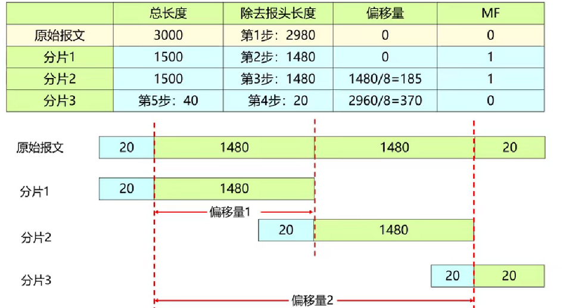

## 1. IPv4 基础概念
IPv4（Internet Protocol version 4）是互联网协议第四版，也是当今最广泛使用的网络层协议。尽管 IPv6 正在逐步推广，但 IPv4 仍然是互联网的核心基础设施。
### 1.1 IPv4概述

IPv4 是一种无连接、不可靠的网络层协议，主要功能包括：

- **寻址**：为网络设备分配唯一标识
- **路由**：决定数据包从源到目的地的路径
- **分片与重组**：处理不同 MTU（最大传输单元）的网络

### 1.2 报文结构

IPv4 数据包头部固定 20 字节（不含选项），结构如下：

```
 0                   1                   2                   3
 0 1 2 3 4 5 6 7 8 9 0 1 2 3 4 5 6 7 8 9 0 1 2 3 4 5 6 7 8 9 0 1
+-+-+-+-+-+-+-+-+-+-+-+-+-+-+-+-+-+-+-+-+-+-+-+-+-+-+-+-+-+-+-+-+
|Version|  IHL  |Type of Service|          Total Length         |
+-+-+-+-+-+-+-+-+-+-+-+-+-+-+-+-+-+-+-+-+-+-+-+-+-+-+-+-+-+-+-+-+
|         Identification        |Flags|      Fragment Offset    |
+-+-+-+-+-+-+-+-+-+-+-+-+-+-+-+-+-+-+-+-+-+-+-+-+-+-+-+-+-+-+-+-+
|  Time to Live |    Protocol   |         Header Checksum       |
+-+-+-+-+-+-+-+-+-+-+-+-+-+-+-+-+-+-+-+-+-+-+-+-+-+-+-+-+-+-+-+-+
|                       Source Address                          |
+-+-+-+-+-+-+-+-+-+-+-+-+-+-+-+-+-+-+-+-+-+-+-+-+-+-+-+-+-+-+-+-+
|                    Destination Address                        |
+-+-+-+-+-+-+-+-+-+-+-+-+-+-+-+-+-+-+-+-+-+-+-+-+-+-+-+-+-+-+-+-+
```

关键字段说明：

| 字段 | 长度 | 说明 |
|------|------|------|
| 版本号 | 4 bits | 4位，0100，固定 |
| 头部长度 | 4 bits | 20-60字节：4位，0-15，**单位四字节，取5-15，标识20-60字节** |
| TOS | 8 bits | 区分服务，QoS字段 |
| 总长度 | 16 bits | 0-65535（0 - 2^16-1） |
| 标识符 | 16 bits | 发送序号，每发一次+1 |
| 标志 | 3 bits | 是否分片 |
| 分片偏移 | 13 bits | 分片偏移量 |
| 生存周期TTL | 8 bits | 0-255，每经过一个路由器-1 |
| 协议 | 8 bits | 标识上层协议，**1 ICMP，6 TCP，17 UDP** |
| 头部校验和 | 16 bits | 仅计算ipv4头部，ttl改变后要重新计算 |
| 源地址 | 32 bits | 源IP地址 |
| 目标地址 | 32 bits | 目标IP地址 |
| 选项 | 可变 | 可选，任意长度，0-40字节 |
| 数据 | 最大65515字节（65535-20头部） | 上层协议数据，如TCP/UDP |      

### 1.3 分片过程

当IPv4数据包通过MTU（最大传输单元）较小的网络时，需要进行分片处理。
#### 分片示例

**原始报文信息**：
- 总长度：3000字节
- 头部长度：20字节
- 数据长度：2980字节

**分片过程**：

| 分片 | 总长度 | 数据长度 | 偏移量 | MF标志 |
|------|--------|----------|--------|--------|
| 原始报文 | 3000 | 2980 | 0 | 0 |
| 分片1 | 1500 | 1480 | 0 | 1 |
| 分片2 | 1500 | 1480 | 185 | 1 |
| 分片3 | 40 | 20 | 370 | 0 |

#### 分片计算过程

1. **确定MTU**：假设网络MTU为1500字节（以太网标准MTU）
2. **计算每片数据长度**：1500 - 20（头部）= 1480字节
3. **计算分片数量**：
   - 总数据长度：2980字节
   - 第一片：1480字节（偏移量0）
   - 第二片：1480字节（偏移量1480/8=185）
   - 第三片：2980 - 1480×2 = 20字节（偏移量2960/8=370）
4. **设置MF标志**：
   - 分片1和分片2的MF=1（还有更多分片）
   - 分片3的MF=0（最后一个分片）


#### 分片结构示意

```
原始报文：[20字节头部][1480字节数据][1480字节数据][20字节数据]

分片1：[20字节头部][1480字节数据]  (偏移量0, MF=1)
分片2：[20字节头部][1480字节数据]  (偏移量185, MF=1)
分片3：[20字节头部][20字节数据]    (偏移量370, MF=0)
```

#### 分片重组

接收端根据以下信息重组数据包：
1. **标识符**：`所有分片具有相同的标识符`
2. **偏移量**：确定分片在原始数据中的位置
3. **MF标志**：标识是否为最后一个分片

当接收到MF=0的分片时，接收端可以开始重组整个数据包。

## 2. IPv4 地址结构

### 2.1 地址表示

IPv4 地址是 **32 位二进制数**，通常以点分十进制表示：

```
二进制：11000000.10101000.00000001.00000001
十进制：192.168.1.1
```

每段范围 0-255，共 $2^{32}$ = **4,294,967,296** 个地址。

### 2.2 网络位与主机位

IPv4 地址由两部分组成：

```
|      网络位 (Network)       |    主机位 (Host)     |
|         标识网络            |   标识网络中的设备    |
```

网络位长度决定网络规模，主机位长度决定每个网络可容纳的主机数量。

## 3. 地址分类（有类编址）

:::tip
传统的 A/B/C 类分类法（有类编址）现已较少使用，现代网络普遍采用 CIDR。
:::

| 类别 | 首字节范围 | 默认掩码 | 网络数 | 每网络主机数 | 用途 |
|------|-----------|---------|--------|-------------|------|
| A | 0-127 | 255.0.0.0 (/8) | 128 | 16,777,214 | 大型网络 |
| B | 128-191 | 255.255.0.0 (/16) | 16,384 | 65,534 | 中型网络 |
| C | 192-223 | 255.255.255.0 (/24) | 2,097,152 | 254 | 小型网络 |
| D | 224-239 | - | - | - | 组播 |
| E | 240-255 | - | - | - | 保留/实验 |

### 3.1 A 类地址

```
0NNNNNNN.HHHHHHHH.HHHHHHHH.HHHHHHHH
```

- 第 1 位固定为 0
- 网络位：8 位（实际可用 7 位）
- 主机位：24 位
- 范围：0.0.0.0 - 127.255.255.255

:::note
10.0.0.0/8 是 A 类私有地址段
127.0.0.0/8 保留用于环回（Loopback）
:::

### 3.2 B 类地址

```
10NNNNNN.NNNNNNNN.HHHHHHHH.HHHHHHHH
```

- 前 2 位固定为 10
- 网络位：16 位
- 主机位：16 位
- 范围：128.0.0.0 - 191.255.255.255

:::note
172.16.0.0/12 是 B 类私有地址段
:::

### 3.3 C 类地址

```
110NNNNN.NNNNNNNN.NNNNNNNN.HHHHHHHH
```

- 前 3 位固定为 110
- 网络位：24 位
- 主机位：8 位
- 范围：192.0.0.0 - 223.255.255.255

:::note
192.168.0.0/16 是 C 类私有地址段
:::

## 4. 子网划分（Subnetting）

### 4.1 为什么需要子网

- `减少广播域`，提高网络性能
- 便于管理和安全隔离
- 更高效地利用 IP 地址空间

### 4.2 子网掩码

子网掩码用于区分网络位和主机位：

```
IP 地址：  192.168.1.100    11000000.10101000.00000001.01100100
子网掩码： 255.255.255.0    11111111.11111111.11111111.00000000
网络地址： 192.168.1.0      11000000.10101000.00000001.00000000
```

掩码中的 1 表示网络位，0 表示主机位。

### 4.3 划分子网示例

将 192.168.1.0/24 划分为 4 个子网：

```
原网络：192.168.1.0/24
        掩码：255.255.255.0 (11111111.11111111.11111111.00000000)

借 2 位主机位作为子网位：
新掩码：255.255.255.192 (/26)
        11111111.11111111.11111111.11000000

子网 1：192.168.1.0/26    (0-63)
子网 2：192.168.1.64/26   (64-127)
子网 3：192.168.1.128/26  (128-191)
子网 4：192.168.1.192/26  (192-255)
```

每个子网可用主机数：2^6 - 2 = 62（减去网络地址和广播地址）

### 4.4 快速计算技巧

:::tip
关键数字：
- /24 = 256 个地址
- /25 = 128 个地址
- /26 = 64 个地址
- /27 = 32 个地址
- /28 = 16 个地址
- /29 = 8 个地址
- /30 = 4 个地址

**可用主机数 = 地址数 - 2**
:::

## 5. CIDR *Classless Inter-Domain Routing* （无类别域间路由）

### 5.1 什么是有类与无类

- **有类（Classful）**：严格按 A/B/C 类分配，浪费严重
- **无类（CIDR）**：灵活使用可变长子网掩码（VLSM），按需分配

### 5.2 CIDR 表示法

```
IP地址/前缀长度

例如：
192.168.1.0/24    → 掩码 255.255.255.0
10.0.0.0/8        → 掩码 255.0.0.0
172.16.0.0/12     → 掩码 255.240.0.0
```

### 5.3 路由聚合（超网）

CIDR 支持将多个小网络聚合为一个大网络，减少路由表条目：

```
192.168.0.0/24
192.168.1.0/24
192.168.2.0/24
192.168.3.0/24

聚合为：192.168.0.0/22
```

## 6. 私有地址与 NAT

### 6.1 RFC 1918 私有地址

| 地址块 | CIDR | 地址范围 | 可用主机数 |
|--------|------|----------|-----------|
| 10.0.0.0/8 | /8 | 10.0.0.0 - 10.255.255.255 | 16,777,214 |
| 172.16.0.0/12 | /12 | 172.16.0.0 - 172.31.255.255 | 1,048,574 |
| 192.168.0.0/16 | /16 | 192.168.0.0 - 192.168.255.255 | 65,534 |

**`私有地址仅在局域网内有效，不能直接用于互联网通信。`**

### 6.2 NAT（网络地址转换）

NAT 允许多个私有地址共享一个公网 IP 访问互联网：

```
┌─────────────┐         ┌─────────┐         ┌─────────┐
│ 192.168.1.2 │────────→│  NAT    │────────→│ 公网     │
│ 192.168.1.3 │         │ 路由器   │         │         │
│ 192.168.1.4 │         │ 公网IP   │         │         │
└─────────────┘         └─────────┘         └─────────┘
        私有网络           转换网关            互联网
```

常见 NAT 类型：

| 类型 | 说明 |
|------|------|
| SNAT | 源地址转换，用于内网访问外网 |
| DNAT | 目的地址转换，用于外网访问内网服务 |
| PAT/NAPT | 端口地址转换，多对一映射 |

## 7. 特殊用途地址

| 地址 | 用途 |
|------|------|
| 0.0.0.0/8 | 本网络（仅作为源地址） |
| 127.0.0.0/8 | 环回地址（localhost） |
| 169.254.0.0/16 | 链路本地地址（APIPA） |
| 224.0.0.0/4 | 组播地址 |
| 240.0.0.0/4 | 保留/实验 |
| 255.255.255.255 | 有限广播 |

:::caution
**广播地址**（主机位全 1）和 **网络地址**（主机位全 0）不可分配给主机使用。
:::

## 8. 拓展

### 8.1 计算网络地址

IP 192.168.50.100/26，计算网络地址：

```
IP：      192.168.50.100   → 11000000.10101000.00110010.01100100
掩码：    255.255.255.192  → 11111111.11111111.11111111.11000000
        & 运算
        ⬇️
网络地址：192.168.50.64    → 11000000.10101000.00110010.01000000
广播地址：192.168.50.127   → 11000000.10101000.00110010.01111111
可用范围：192.168.50.65 - 192.168.50.126
```

### 8.2 子网计算器速查

```bash
# 使用 ipcalc（需安装）
ipcalc 192.168.50.100/26
```

输出示例：

```
Address:   192.168.50.100       11000000.10101000.00110010.01 100100
Netmask:   255.255.255.192 = 26 11111111.11111111.11111111.11 000000
Wildcard:  0.0.0.63             00000000.00000000.00000000.00 111111
=>
Network:   192.168.50.64/26     11000000.10101000.00110010.01 000000
HostMin:   192.168.50.65        11000000.10101000.00110010.01 000001
HostMax:   192.168.50.126       11000000.10101000.00110010.01 111110
Broadcast: 192.168.50.127       11000000.10101000.00110010.01 111111
Hosts/Net: 62
```

## 9. IPv4 vs IPv6

| 特性 | IPv4 | IPv6 |
|------|------|------|
| 地址长度 | 32 位 | 128 位 |
| 地址数量 | ~43 亿 | 3.4 × 10^38 |
| 表示方式 | 点分十进制 | 冒分十六进制 |
| 头部大小 | 可变（20-60 字节） | 固定（40 字节） |
| 校验和 | 有 | 无（由上层处理） |
| NAT | 普遍使用 | 不需要 |
| 安全性 | IPsec 可选 | IPsec 内置 |

## 10. 总结

1. **地址结构**：32 位，网络位 + 主机位
2. **分类编址**：A/B/C/D/E 类
3. **子网划分**：借位扩展网络前缀
4. **CIDR**：灵活的无类编址，支持路由聚合
5. **私有地址**：RFC 1918 保留三段地址用于内网
6. **NAT**：解决地址枯竭的关键技术


---

**参考**

- RFC 791 - Internet Protocol
- RFC 1918 - Address Allocation for Private Internets
- RFC 1519 - Classless Inter-Domain Routing (CIDR)
