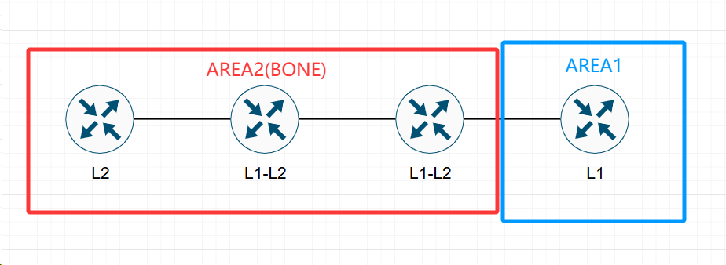
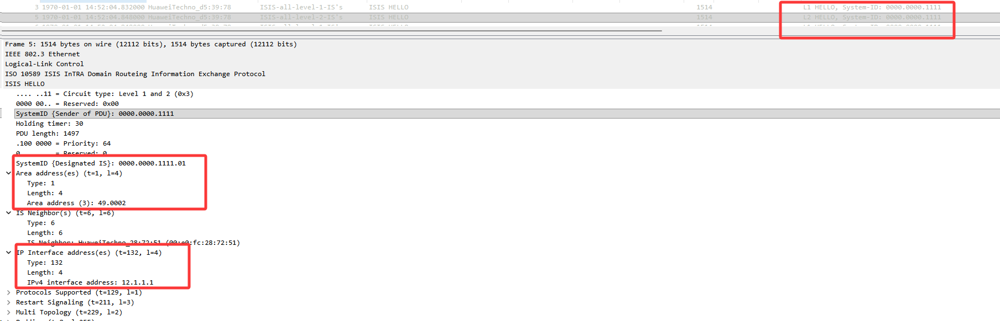
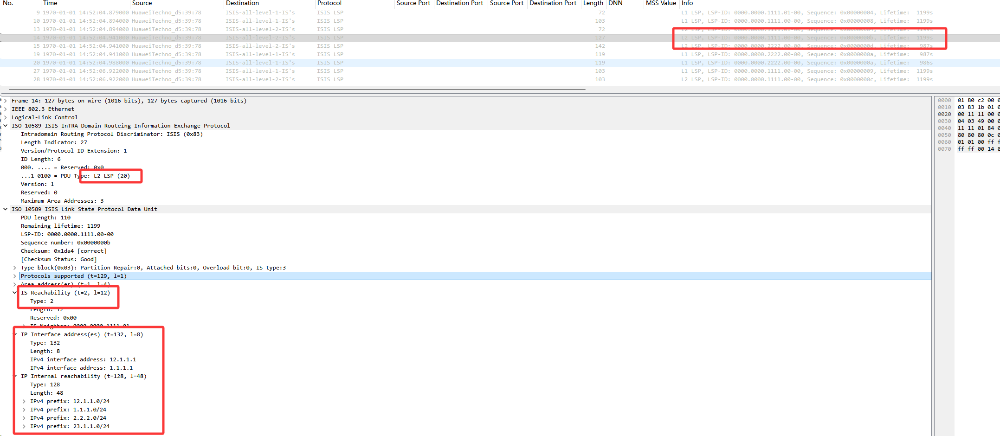
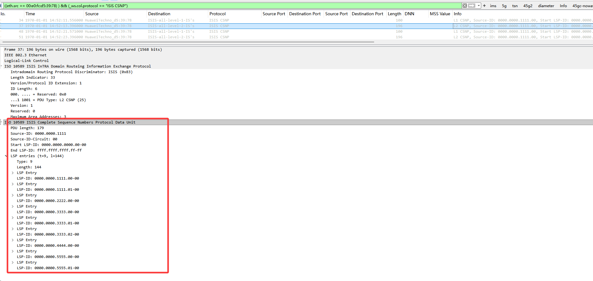
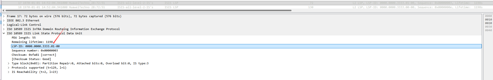
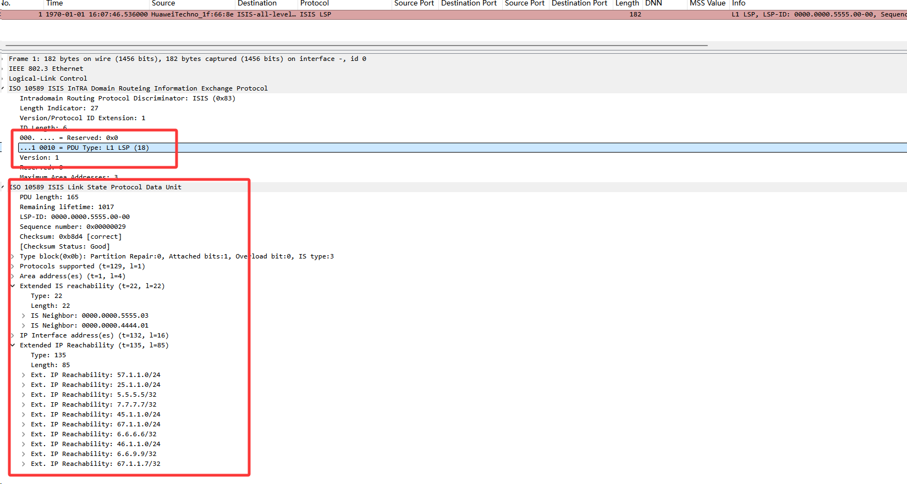
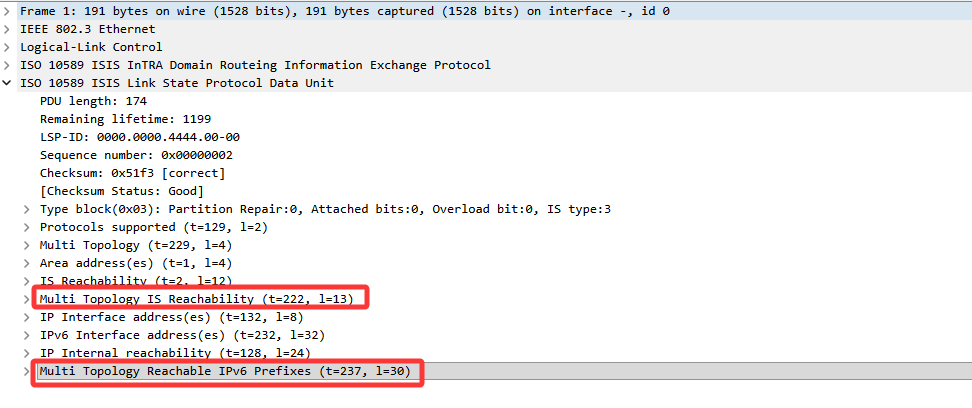

# 1. IS-IS基本概念

## 1.1 协议概述

**IS-IS（Intermediate System to Intermediate System，中间系统到中间系统）** 是一个`基于链路状态`的`内部网关协议（IGP）`。最早是为CLNP（无连接网络协议）设计的，后来扩展支持IPv4和IPv6，也就是所谓的`集成IS-IS（Integrated IS-IS）`。<br>

- **管理距离为115**（比OSPF的110优先级低）
- **直接封装在数据链路层**，协议号为`0x83FE`（Ethertype），不依赖IP协议
- 收敛速度快，适合大规模网络，运营商骨干网用得很多
- 天然支持IPv6（通过添加TLV即可扩展），不像OSPF还得搞个v3
- 只支持P2P和Broadcast两种网络类型，比OSPF简单

----

## 1.2 IS-IS与OSPF的区别

都是链路状态IGP，但设计理念差别挺大的：

| 对比项 | IS-IS | OSPF |
|--------|-------|------|
| **设计起源** | 最初为CLNP设计，后扩展支持IP | 专为IP设计 |
| **协议层次** | 直连数据链路层，不依赖IP | 封装在IP层，协议号89 |
| **扩展性** | 好，通过TLV灵活扩展 | 较差，需修改协议结构 |
| **网络类型** | 仅P2P、Broadcast两种 | P2P、Broadcast、NBMA、P2MP |
| **区域结构** | 两级结构（L1、L2），更简单 | 多区域层次结构（Area 0为骨干） |
| **路由计算** | 使用SPF，全网使用同一个算法 | 区域内SPF，区域间距离矢量 |
| **适用场景** | 运营商骨干网、大型园区网 | 企业网、中小型网络 |

:::tip
**IS-IS不依赖IP的特点很关键**，这意味着即使IP地址配错了或者网络层有问题，IS-IS邻居照样能建立。这一点在运营商网络里做基础架构承载的时候特别有用。
:::

----

## 1.3 NSAP地址

IS-IS用 **NSAP（Network Service Access Point）** 地址来标识路由器和区域。

NSAP地址结构：`AREA ID（区域编号最长13字节,49固定） + System ID（固定6字节） + SEL（1字节）`

```
示例：47.0001. 0000.0000.0001.  00
      |_____| |______________| |_|
       区域ID    System ID      SEL
```

- **AREA ID**：标识区域，可变长度（1-13字节），同一个区域的路由器AREA ID必须相同
- **System ID**：类似于OSPF的Router-ID，固定6字节，全网唯一
- **SEL（N-Selector）**：固定为`00`，表示网络层协议是IP

**NET（Network Entity Title）** 就是SEL为00的NSAP地址，实际配置中用的都是NET。

> 配IS-IS的时候经常把 loopback0 的IP地址转成System ID，比如 10.0.0.1 转成 0100.0000.0001

----

# 2. IS-IS的区域与路由器角色

## 2.1 两级区域结构

IS-IS的区域结构比OSPF简单，只有两级：

- **Level-1（L1）区域**：相当于OSPF的普通区域，只维护本区域内的拓扑和路由
- **Level-2（L2）区域**：相当于OSPF的骨干区域（Area 0），L2路由器维护的是区域间的路由
- **骨干网**：由所有的L2路由器以及它们之间的链路组成，注意IS-IS的骨干是`虚拟的`，不像OSPF的Area 0是固定编号

:::tip
**IS-IS的区域边界在链路上，而不是在路由器上**。也就是说，一台IS-IS路由器可以同时属于L1和L2，它的不同接口可以处于不同区域。OSPF的区域边界是在ABR设备上。
:::

----

## 2.2 路由器类型

| 路由器类型 | 说明 | 路由维护范围 |
|-----------|------|-------------|
| **L1路由器** | 只参与本区域内的L1路由 | 只维护L1 LSDB，类似OSPF的IR |
| **L2路由器** | 只参与骨干网L2路由 | 只维护L2 LSDB，负责区域间路由 |
| **L1/L2路由器** | 同时参与L1和L2 | 维护两个LSDB，相当于OSPF的ABR |

- **L1路由器** 只能和同一区域的**L1或L1/L2**路由器建立邻居
- **L2路由器** 可以和任何**L2或L1/L2**路由器建立邻居（不要求区域相同）
- **L1/L2路由器** 是最常见的，实际部署中骨干节点通常都配成L1/L2

> L1路由器默认只会收到一条默认路由指向最近的L1/L2路由器，用来访问其他区域。这一点和OSPF的Totally Stub区域有点像。

----

# 3. IS-IS报文类型

**IS-IS的报文直接封装在二层**的，PDU（Protocol Data Unit）分为`IIH`、`LSP`、`SNP`三大类：

| 报文类型 | 全称 | 功能 |
|---------|------|------|
| **IIH（L1/L2）** | IS-IS Hello PDU | **建立和维护邻居**关系，分L1 IIH和L2 IIH |
| **LSP（L1/L2）** | Link-State PDU | **链路状态通告，携带拓扑和路由信息** |
| **CSNP（L1/L2）** | Complete Sequence Number PDU | **完整序列号报文，用于数据库同步**（类似OSPF的DD） |
| **PSNP（L1/L2）** | Partial Sequence Number PDU | 部分序列号报文，**用于请求和确认LSP**（类似OSPF的LSR/LSAck） |

- **IIH**：广播网络10秒发一次，P2P也是10秒，hold时间是30秒
- **LSP**：真正携带路由信息的报文，每个LSP有一个LSP ID唯一标识
- **CSNP**：广播网络中DIS每10秒发一次，用来确保所有人数据库同步
- **PSNP**：用来请求特定的LSP，或者对收到的LSP做确认

## 3.1 IS-IS报文说明
以下报文为广播网络中捕获。
1. **IS-IS Hello PDU**

这里是L1/L2路由器，同一个接口会发出L1/L2两个Hello报文。



2. **Link-State PDU**

以L2 LSP为例，其中携带了链路状态通告，携带拓扑和路由信息：



3. **Complete Sequence Number PDU**


----

# 4. IS-IS邻居建立与数据库同步

## 4.1 邻居建立条件

两台路由器要建立IS-IS邻居，得满足以下条件：

1. **同一层次**：L1只能和L1/L1-L2建邻居（同一区域），L2可以和L2/L1-L2建邻居
2. **同一区域（L1邻居）**：L1邻居要求AREA ID相同
3. **网络类型匹配**：P2P和Broadcast之间不能直接建邻居
4. **Hello报文参数一致**：hold time、区域认证等

## 4.2 邻居状态机

IS-IS的邻居状态比较简单，就三种：

| 状态 | 说明 |
|------|------|
| **Down** | 初始状态，还没收到Hello |
| **Init** | 收到了Hello，但还没看到自己 |
| **Up** | Hello里看到了自己的信息，邻居建立成功 |


## 4.3 LSP同步过程

1. **邻居Up之后**，互相发送CSNP（广播网络）或者直接在Hello里交换LSP摘要（P2P）
2. 对比自己的LSDB，发现缺失或过时的LSP
3. 发送PSNP请求需要的LSP（P2P），或者在广播网络中直接请求
4. 收到LSP后更新LSDB，发送PSNP确认
5. 运行SPF算法计算路由

:::tip
**广播网络中会选举DIS（Designated IS）**，相当于OSPF的DR。**但IS-IS的DIS是可以抢占的，优先级高的可以立即取代**，不像OSPF的DR选举是非抢占的。
:::

----

# 5. DIS与伪节点

## 5.1 DIS选举

广播网络中IS-IS也会选举一个DIS来减少邻接关系数量：

- **选举参数**：接口优先级`（0-127，默认64）> System ID（越大越优）`
- **可抢占**：新的高优先级路由器可以`立即成为DIS`
- **没有备份DIS**：不像OSPF有BDR，`IS-IS只有DIS`，DIS挂了会重新选举

## 5.2 伪节点（Pseudonode）

DIS会产生一个 **伪节点LSP** 来代表**这个广播网络**：

- 伪节点的LSP ID格式：`System ID (6B) + 伪节点ID (1B) + 分片号 (1B)`，分片号常见为0，**若伪节点ID不为0x00，则代表是伪节点，常见0x01**。

- 所有路由器只需要和伪节点建立邻接关系
- SPF计算时把广播网络当作一个虚拟的节点处理

> 这一点和OSPF的Type 2 LSA（Network LSA）很像，都是通过一个虚拟节点来简化拓扑。

----

# 6. IS-IS路由计算

## 6.1 度量方式

IS-IS的cost计算比OSPF灵活一些：

- **默认度量**：基于接口带宽，但默认所有接口cost都是10，不会自动根据带宽变化
- **Wide Metric**：扩展度量，支持更大的cost范围，现代网络基本都开这个
- **需要在接口上手动配置cost**，或者配自动计算

```bash
# 华为 开启自动计算 宽度量
isis 1
 cost-style wide
 bandwidth-reference 100000   # 参考带宽100G

```

:::tip
**IS-IS默认所有接口cost=10，不区分带宽**，如果忘了手动配置或者开自动计算，千兆口和万兆口在IS-IS看来是一样的。
:::

## 6.2 路由渗透（Route Leaking）

默认情况下L1路由器只有本区域路由和一条默认路由。如果需要让L1路由器学到其他区域的明细路由，需要做 **路由渗透**：

Level-1-2 路由器通过 `TLV 135` 将 Level-2 路由写入 Level-1 LSP，并设置 `U/D=1` 防止环路；ATT 位则用于下发默认路由作为兜底。

- 在L1/L2路由器上把L2的路由引入到L1中
- 可以避免次优路径问题
- 常用在双归属场景下，让L1路由器知道两条上行路径的cost差异

> 类似于OSPF的FA（Forwarding Address）解决次优路径，但IS-IS的路由渗透更直接。

```bash
# 华为 一般结合路由策略使用，筛选引入的路由
system-view
isis 1                          
 import-route isis level-2 into level-1
```

----

# 7. IS-IS TLV与扩展

IS-IS通过 **TLV（Type-Length-Value）** 来扩展功能，这是它最大的优势之一：

| TLV类型 | 说明 |
|---------|------|
| `128/130` | IP Internal/External Reachability，携带 IPv4 路由前缀 信息。TLV 128 表示内部路由（区域内），TLV 130 表示外部路由（从其他协议引入）。仅支持窄度量（最大 63）。 |
| `132` | **IP Interface Address，接口IP地址**，用于建立邻居关系、生成拓扑图，以及后续计算 SPF 树时识别节点。 |
| `135` | **Extended IP Reachability（Wide Metric），扩展IP可达性** ，携带 IPv4 路由前缀，是 TLV 128/130 的增强版。IPv4 路由主要通过此 TLV 传播。|
| 236 | **IPv6 Reachability，IPv6路由** |
| 237 | MT IPv6 Reachability，多拓扑IPv6路由信息|
| 232 | **IPv6 Interface Address，IPv6接口地址** |
| 137 | Hostname，主机名映射 |
| 211 | M-ISIS，Multi-Topology（多拓扑），允许 IS-IS 同时维护多个独立的拓扑（如 IPv4 拓扑、IPv6 拓扑、组播拓扑等），每个拓扑独立运行 SPF 计算，避免 IPv4/IPv6 混合网络中的路由黑洞问题。 |
| `222` | MT IPv4 Reachability，多拓扑IPv4路由信息 |

多拓扑TLV携带：



:::tip
**IS-IS支持IPv6不需要跑一个新的协议进程**，只需要在原来的IS-IS进程里加IPv6的TLV就行。这也是运营商采用IS-IS的原因之一，不需要对协议本身做过多修改，添加IPv6不影响现有网络。
:::

----

# 8. 常用查看命令

```bash
# 华为
display isis peer                          # 查看IS-IS邻居
display isis interface                     # 查看IS-IS接口状态
display isis lsdb                          # 查看链路状态数据库
display isis route                         # 查看IS-IS路由表
display isis topology                      # 查看拓扑信息
display isis statistics                    # 查看统计信息
```

----

# 9. 简单总结

1. **不依赖IP**，链路层就能跑通，基础承载能力强
2. **两级区域结构简单**
3. **TLV扩展机制好**，加功能不需要改协议框架
4. **DIS可抢占**虽然看起来不如OSPF稳定，但实际工程中反而更灵活
5. **默认cost策略坑多**，所有接口cost=10，一般直接用宽度量

