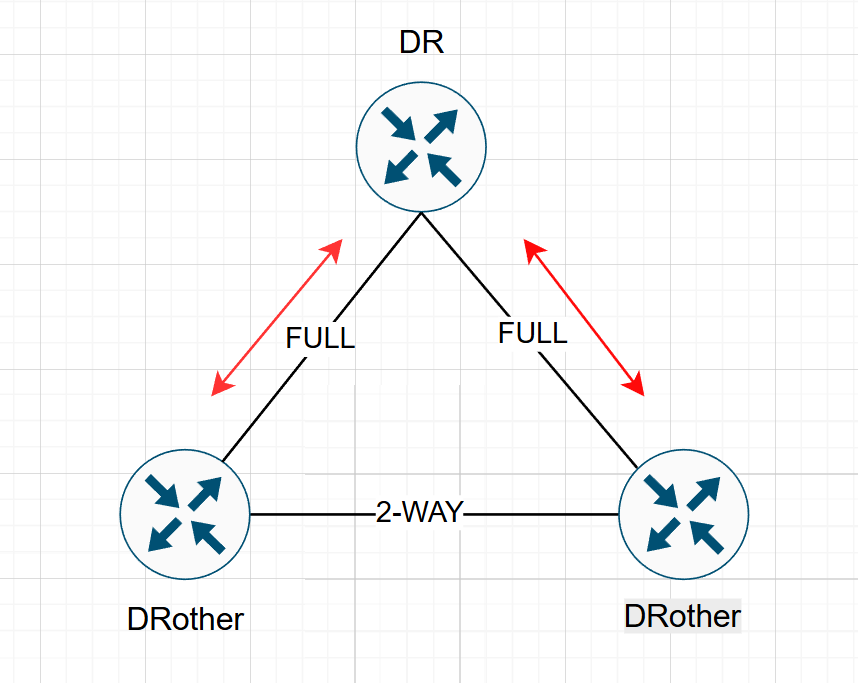
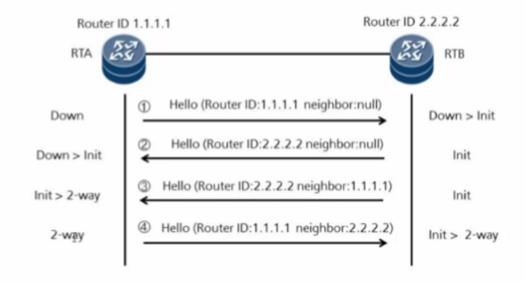
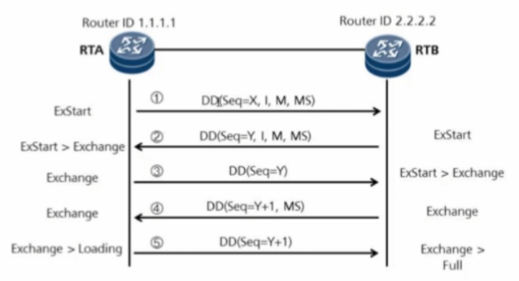
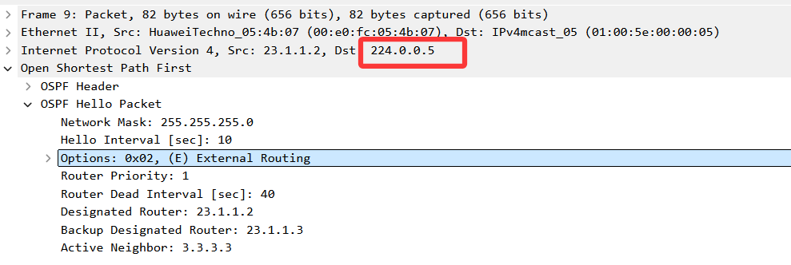
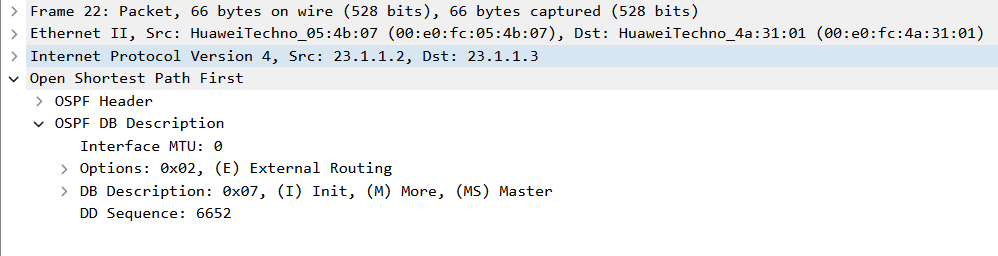
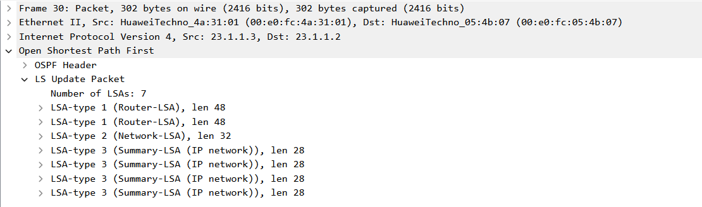
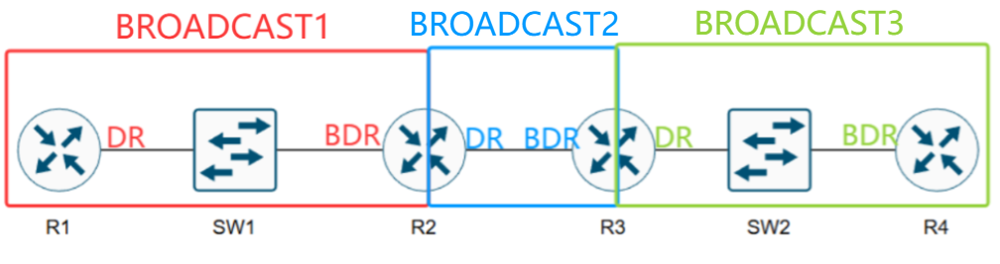
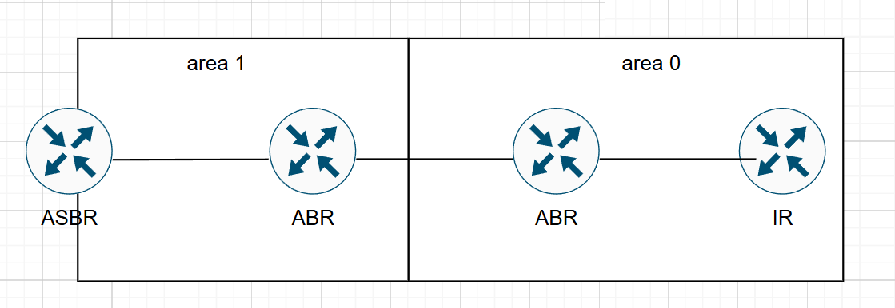
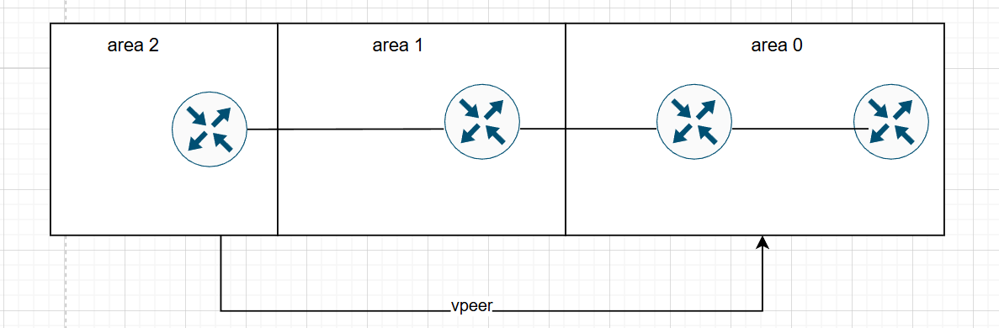

最开始考完IE想着找一个数通或者数据中心的活干，结果投来投去莫名其妙干了核心网，项目数通几乎不由我设计，学的路由协议那些也很少用到了，正好折腾博客可以重新回顾下。

# 1. OSPF基本概念
## 1.1 协议概述
**OSPF（Open Shortest Path First，开放最短路径优先协议）** 是一个`基于链路状态`的`内部网络路由协议（IGP）`。支持VLSM、路由汇总、等价负载均衡、区域划分、认证。 
-    **管理距离是为110**
-    **IP协议号89**，封装在IP报文中
-    无环路、收敛快、扩展性好
-    OSPFv2支持IPv4、OSPFv3支持IPv6
----
## 1.2 度量方式
OSPF基于物理链路的带宽来计算度量值，OSFP路由条目总cost值为沿路cost值之和。 
默认计算基数= 10^8 bit=100M，`cost=默认计算基数/物理链路带宽（Bit为单位）`  
> 如：100M带宽的接口，100M/100M=1，Cost值为1； 10M带宽的接口，100M/10M=10，Cost值为10
> 可在接口处修改 cost值 或者 修改默认计算基数 。

----

## 1.3 标识 Router-ID
- 在AS（Autonomous System，自治系统）中**唯一标识一台运行OSPF的路由器编号**
- OSPF的路由器都必须有一个Router ID，同一个AS内，Router ID不可重复
- Router ID可以手动指定，也可以系统自动选举产生，**手动指定的为最优**
> **自动选举优先使用loopbackIP地址，其次为最大活跃物理口IP**

----

## 1.4 OSPF关系
- `邻居Neighbor` 关系： 
两台运行OSPF协议的路由器相连的接口上会互相发出各自的OSPF参数，如果双方的参数符合建立邻居的条件，就会形成**邻居关系**。`状态为2-way`，**代表可以交换信息**。

- `邻接Adjacency` 关系： 
**邻居不一定邻接**，当两台路由设备之间交换链路状态信息，并**根据更新后的数据库计算出OSPF路由，才能称为邻接关系**。`状态为Full`，代表已经交换完信息。

----

## 1.5 DR、BDR和DR other
在以太网接口下，默认的OSPF网络类型为Broadcast，OSPF在广播多路访问的网络上，会进行`DR（Designated Router指定路由器）`和`BDR（Backup Designated Router备份指定路由器）`的选举。
- DR与BDR能够与该链路上`其它路由器（DR other）`建立邻接关系，进入Full状态
- **DR other之间建立邻居，停留在 2-way状态，不会交换LSA**
- **DR和BDR是一个`广播域内`选举一个，不是整个区域选举一个**

:::tip
**DR/BDR 是接口级概念，不是区域级概念。每个广播域独立选举，互不影响。**
- 接口 1 → 广播域 A → 选举 DR1、BDR1
- 接口 2 → 广播域 B → 选举 DR2、BDR2
- 接口 3 → 广播域 C → 选举 DR3、BDR3
:::

# 2. OSPF邻居发现和建立流程
1. **init -> 2-way** 发现邻居，建立邻居关系状态：通过Hello报文发现并形成邻居关系形成邻居表。

:::tip
每`10s`发送一次hello维护邻居关系，`40s`超时视为邻居失效
:::

2. **2-way -> Full** 邻接关系建立，路由通告，包含`exstart和exchange`两个中间态。
- 在exstart和exchange转换中，会交互DD（database description）报文
- `routerID大的优先发送`
- **DD只携带LSA头部，不携带完整LSA内容，相当于互相发送链路状态数据库目录**。

3. SPF算法路由计算
- 链路状态信息作为使用SPF算法计路由的原材料。
- 链路状态信息即路由器接口状态，包含：
    1. 接口IP地址和掩码
    2. 接口的带宽
    3. 接口邻居
接口链路类型等

> 简单的状态转换就是 down - init - 2way - exstart - exchange - full

-----

# 3. OSPF五种报文类型
`224.0.0.5` 为OSPF组播地址，所有启用 OSPF 的接口都会监听这个地址； 
`224.0.0.6` 所有OSPF指定路由器 (DR/BDR)监听；

类型 |	报文类型|	功能
|------|------|------|
1	|Hello 报文	|携带参数，建立和维持邻居关系
2	|DD 数据库描述报文（链路状态摘要，相当于是 LSA 目录）|	携带 LSA 头部信息，向邻居描述 LSDB
3	|LSR 链路状态请求报文	|`向邻居请求特定的 LSA`
4	|**LSU 链路状态更新报文**	| 向邻居通告拓扑信息，**LSA（链路状态通告）封装 在其中，真正包含路由信息**。
5	|LSAck 链路状态应答报文	|对收到的 LSU 中的 LSA 信息进行确认

其中LSU存在`定时更新`和`触发更新`:
- **定时更新**：LSA每`1800s(30min)`更新一次，`3600s(1h)`失效。
- **触发更新**：当链路状态发生变化时立即发送链路状态更新。

还是用报文来看下，比较容易理解：
1. Hello 报文

2. DD 数据库描述报文

3. LSR 链路状态请求报文

4. LSU 链路状态更新报文

5. LSAck 链路状态应答报文

-----

# 4. OSPF的三张表
表项|	说明|
|------|------|
邻居表 Neighbor Table | 所有建立 OSPF 邻居关系的路由器，包括Router ID、接口、状态等内容
链路状态数据库 LSDB	| 所有路由器的 LSA（链路状态通告） 都存在这里，通过LSU更新，同一区域的路由器LSDB相同
路由表 RIB	| 经SPF计算得出的最优路径

-----

# 5. OSPF的网络类型
OSPF根据链路层协议将网络分为几种不同的类型，不同网络类型的OSPF操作机制存在差异，主要区别体现在：**是否选举DR/BDR、如何发现邻居、报文发送方式（组播/单播）以及Hello报文的发送间隔**，最常用的就是Broadcast类型。

网络类型	|链路类型|	是否选举 DR/BDR|	邻居发现方式|	报文发送方式|	Hello / Dead 间隔
|------|------|------|------|------|------|
|P2P	|点到点（PPP 专线、HDLC 串行链路）|	否|	自动|	组播|	10s / 40s
**Broadcast** 	|**多路访问（以太网局域网）**|	**是**|	**自动**|	**组播/单播**|	**10s / 40s**
NBMA	|多路访问（早期的帧中继、ATM 全互联网络）|	是|	手动指定|	单播|	30s / 120s
P2MP	|点到多点（非全互联的帧中继网络、部分 VPN 场景）|	否|	自动|	组播/单播|	30s / 120s

:::tip
dead时间间隔为hello的四倍，P2P和broadcast之间能够建立邻居，但是不能传路由
:::

## 5.1 多路访问网络DR & BDR选举流程
多路访问网络中不可能让每台OSPF路由器形成FULL关系来泛洪LSA。

- **DR（指定路由器）**：代表该多路访问网络，负责唯一的 LSA 生成与转发。**所有路由器只与 `DR` 和 `BDR` 建立邻接关系**。
- **BDR（备份指定路由器）**：实时同步状态，在 DR 失效时立即接管，确保无缝切换。

**OSPF DR选举参数**：
1. 第一优先级：接口 OSPF 优先级（Priority）
> 范围：`0-255` ，默认 `1` ，越大越优，0不参加选举（只能是DROTHER）
2. 第二优先级：Router-ID
> 类似于IP（1.1.1.1这种），越大越优

**DR&BDR 选举的其他特性**：
- 当**DR故障时，BDR会立即成为新的DR，从成员设备中选举新的BDR**，RouterID高的成为新BDR
- **非抢占原则**，新加入设备，就算priority还是RouterID都最高，也只能选举为BDR，避免重复选举。

前面提到DR/BDR 是接口级概念，不是区域级概念。每个广播域独立选举，互不影响。如图所示，R1-R4优先级由高到低排列。
- R1-SW1-R2广播域，R1作为DR
- R2-R3广播域，R2作为DR
- R3-SW2-R4广播域，R3作为DR

----

# 6.  路由器角色 & OSPF 区域
区域（Area）主要用来将一个自治域AS划分为较小的逻辑管理域，**避免大型网络中链路状态数据库（LSDB）过大、路由计算消耗CPU资源以及网络拓扑变化时路由收敛慢等问题**。
## 6.2 路由器角色
- **IR（内部路由器）**：所有接口在同一区域。
- **ABR（区域边界路由器）**：连接骨干和非骨干区域，负责区域间路由汇总与转发。
- **ASBR（自治系统边界路由器）**：引入外部路由（如静态、RIP、BGP）到 OSPF。

## 6.1 OSPF区域

OSPF区域可分为以下`五类`：

1. **骨干区域 / 标准区域**

标准区域，没有特殊限制。
- 所有非骨干区域必须直接或通过虚链路连接到 Area 0，非骨干区域之间不能直接交换路由，必须经过 Area 0。
- Area 1 2 3 ...等属于标准区域
- **允许 Type 1、2、3、4、5 所有 LSA**。
- 能传递内部、区域间、外部路由。
- 骨干区域必须是标准区域。

---

2. **Stub 末梢区域**
- **禁止 Type 4、5（外部路由）**。
- **允许 Type 1、2、3（内部 + 区域间）**。
- ABR 自动下发一条 默认路由 0.0.0.0/0（Type 3）。
- 不能有 ASBR，不能引入外部路由。
- **适用于：末端、单出口、不需要外部明细的区域**

---

3. **Totally Stub 完全末梢区域**

相较于stub区域，可接受的lsa type更少，`去往外部只通过ABR下发的默认路由，不接受其他域间或外部路由`。
- **禁止 Type 3、4、5（区域间 + 外部）**。
- 只保留：本区域路由 + ABR 默认路由。
- LSDB 最小，最省资源。

---

4. **NSSA 非纯末梢区域**

可以看作连接外部网络的区域，`通过连接外部网络的ASBR产生特殊的7类LSA`。
- **禁止 Type 5（其他区域外部路由）**。
- **允许本区域 ASBR 引入外部路由，用 Type 7 LSA 在本区域内泛洪**。
- Type 7 到达 ABR 后转为 Type 5 注入骨干，即7类LSA只存在于NSSA区，到其他区域需要转为5类。
- ABR 下发默认路由（可关闭）。
- 末梢区域需要引入本地外部路由（如本地连静态 / 专线）

---

5. **Totally NSSA 完全非纯末梢区域**
- **禁止 Type 3、4、5**。
- 允许本区域 Type 7。
- 只有本区域路由 + 默认路由 + 本地引入外部路由。
- 最精简的带外部引入能力的区域。

## 6.2 VLINK
作用：**把不连续的骨干或无法直接连 Area 0 的非骨干逻辑接入 Area 0。穿越的中间区域必须是标准区域**，不能是 Stub/NSSA

# 7.  OSPF LSA
## 7.1  LSA类型
**LSA（Link-State Advertisement，链路状态通告）** 是链路状态信息交换的基本单元。是OSPF协议中最重要的一部分。

---

1. **Type 1 — Router LSA（路由器LSA）**

| 属性 | 说明 |
|------|------|
| **产生者** | 每个OSPF路由器 |
| **传播范围** | 仅在所属区域内泛洪（Intra-Area） |
| **内容** | 直连链路的状态、开销（Cost）、邻居关系 |
| **特点** | 每台路由器必产生，描述直连拓扑 |

- 包含链路类型（P2P、Transit、Stub、Virtual Link）
- 是SPF计算的基础数据

---

2. **Type 2 — Network LSA（网络LSA）**

| 属性 | 说明 |
|------|------|
| **产生者** | DR（Designated Router，指定路由器） |
| **传播范围** | 仅在所属区域内泛洪 |
| **内容** | 广播/NBMA网络中所有邻居路由器列表 |
| **特点** | 描述Transit网络（多路访问网络）的拓扑 |

- **仅在存在DR的广播或NBMA网络中产生**
- 与Type 1配合完整描述区域内拓扑

---

3. **Type 3 — Summary LSA（汇总LSA / Inter-Area LSA）**

| 属性 | 说明 |
|------|------|
| **产生者** | ABR（Area Border Router，区域边界路由器） |
| **传播范围** | 跨区域传播（从一个区域到另一个区域） |
| **内容** | 区域间路由前缀及开销 |
| **特点** | 用于区域间路由汇总与传递 |

- 每个ABR为所知区域生成Type 3 LSA
- 默认携带所有明细路由，可通过 `area range` 命令汇总

---

4. **Type 4 — ASBR Summary LSA（ASBR汇总LSA）**

| 属性 | 说明 |
|------|------|
| **产生者** | ABR |
| **传播范围** | 跨区域传播（除ASBR所在区域外） |
| **内容** | ASBR的位置信息（到达ASBR的开销） |
| **特点** | 告诉其他区域如何到达ASBR |

- 配合Type 5使用，提供到达ASBR的路径
- 如果ASBR与ABR在同一区域，则该区域不需要Type 4

---

5. **Type 5 — External LSA（外部LSA / AS-External LSA）**

| 属性 | 说明 |
|------|------|
| **产生者** | ASBR（Autonomous System Boundary Router） |
| **传播范围** | 整个OSPF域（除Stub/NSSA区域外） |
| **内容** | 外部AS路由（如RIP、静态路由、BGP重分布） |
| **特点** | 描述OSPF域外的路由信息 |

- 外部路由标记（Tag）可用于路由策略
- 支持两种度量类型：
  - **E1**：外部开销 + 内部开销，开销更精确
  - **E2**：仅外部开销（默认），忽略内部开销

---

6. **Type 6 — Group Membership LSA（组成员LSA）**

| 属性 | 说明 |
|------|------|
| **用途** | MOSPF（Multicast OSPF）专用 |
| **现状** | 实际网络中极少使用，MOSPF已被PIM-SM取代 |

---

7. **Type 7 — NSSA External LSA（NSSA外部LSA）**

| 属性 | 说明 |
|------|------|
| **产生者** | NSSA区域的ASBR |
| **传播范围** | 仅在NSSA区域内泛洪 |
| **内容** | NSSA区域引入的外部路由 |
| **转换** | 由ABR转换为Type 5 LSA后传播到其他区域 |

- NSSA（Not-So-Stub Area）是Stub区域的扩展变体
- **解决了Stub区域不能引入外部路由的限制**
- **Type 7通过ABR转换为Type 5继续传播**

---

8. **Type 8 — Link-local LSA（链路本地LSA，OSPFv3新增）**

| 属性 | 说明 |
|------|------|
| **用途** | OSPFv3专用 |
| **范围** | 仅在本地链路传播 |
| **内容** | 链路本地IPv6地址前缀信息 |
| **特点** | 每个链路产生一个 |

---

9. **Type 9 — Intra-Area Prefix LSA（区域内前缀LSA，OSPFv3新增）**

| 属性 | 说明 |
|------|------|
| **用途** | OSPFv3专用 |
| **范围** | 区域内 |
| **内容** | IPv6前缀信息（替代OSPFv2中Type 1/2携带的地址信息） |
| **特点** | OSPFv3将拓扑与地址分离 |

---

## 7.2  LSA 类型对比

| LSA类型 | 名称 | 产生者 | 传播范围 | 主要用途 |
|:-------:|------|--------|----------|----------|
| **Type 1** | Router LSA | 所有路由器 | 区域内 | 描述直连链路拓扑 |
| **Type 2** | Network LSA | **DR** | 区域内 | 描述Transit网络 |
| **Type 3** | Summary LSA | **ABR** | 跨区域 | 区域间路由 |
| **Type 4** | ASBR-Summary | **ABR** | 跨区域 | 通告ASBR位置 |
| **Type 5** | External LSA | **ASBR** | 整个OSPF域 | 外部AS路由 |
| Type 6 | Group LSA | - | - | MOSPF（已淘汰） |
| **Type 7** | NSSA External | **NSSA ASBR** | NSSA区域内 | NSSA区域外部路由 |
| Type 8 | Link-local LSA | OSPFv3路由器 | 本地链路 | IPv6链路本地前缀 |
| Type 9 | Prefix LSA | OSPFv3路由器 | 区域内 | IPv6前缀信息 |

---

## 7.3 特殊区域与LSA过滤

| 区域类型 | 允许的LSA | 过滤的LSA |
|----------|-----------|-----------|
| **普通区域** | Type 1, 2, 3, 4, 5 | 无 |
| **Stub Area** | Type 1, 2, 3 | 过滤Type 4, 5，使用默认路由 |
| **Totally Stub** | Type 1, 2 | 过滤Type 3, 4, 5，使用默认路由 |
| **NSSA** | Type 1, 2, 3, 7 | 过滤Type 4, 5，允许本地引入外部路由 |
| **Totally NSSA** | Type 1, 2, 7 | 过滤Type 3, 4, 5，使用默认路由 |

---

## 7.4 总结

1. **区域内路由（Type 1 + 2）**：构建区域内最短路径树的基础
2. **区域间路由（Type 3 + 4）**：ABR作为"桥梁"，实现区域间互联互通
3. **外部路由（Type 5 + 7）**：ASBR将外部路由注入OSPF，实现域间互联
4. **OSPFv3的改进**：Type 8和Type 9将拓扑与地址信息解耦，支持IPv6的灵活性

