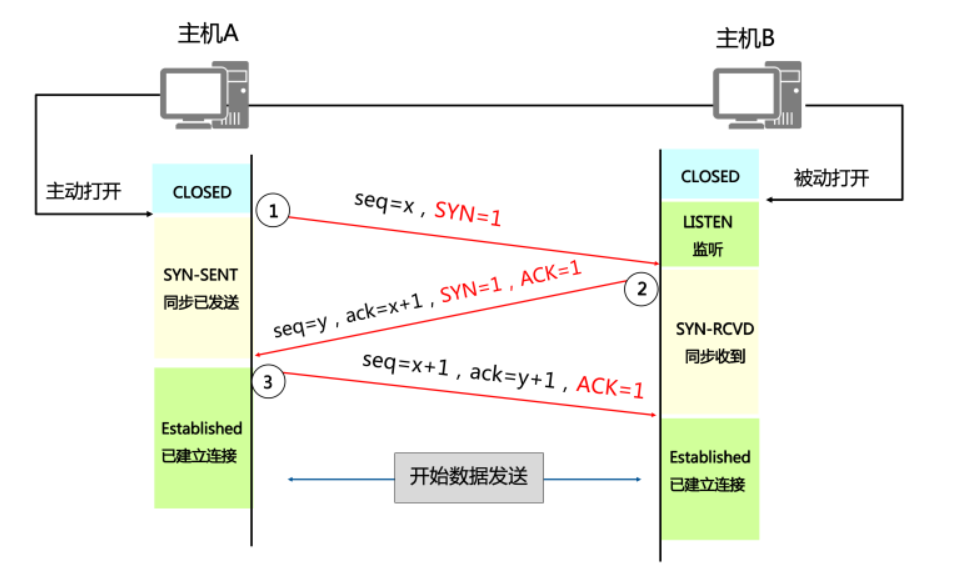
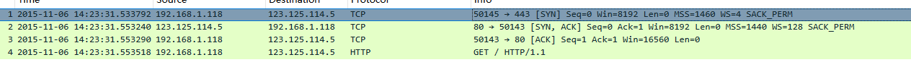
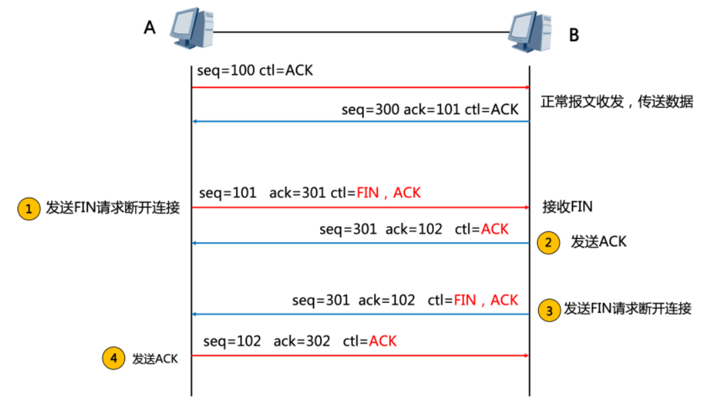
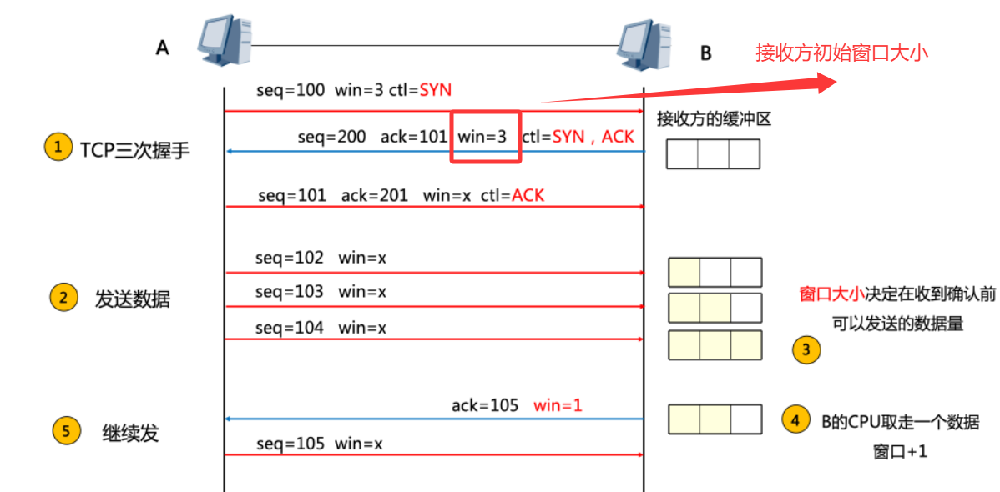
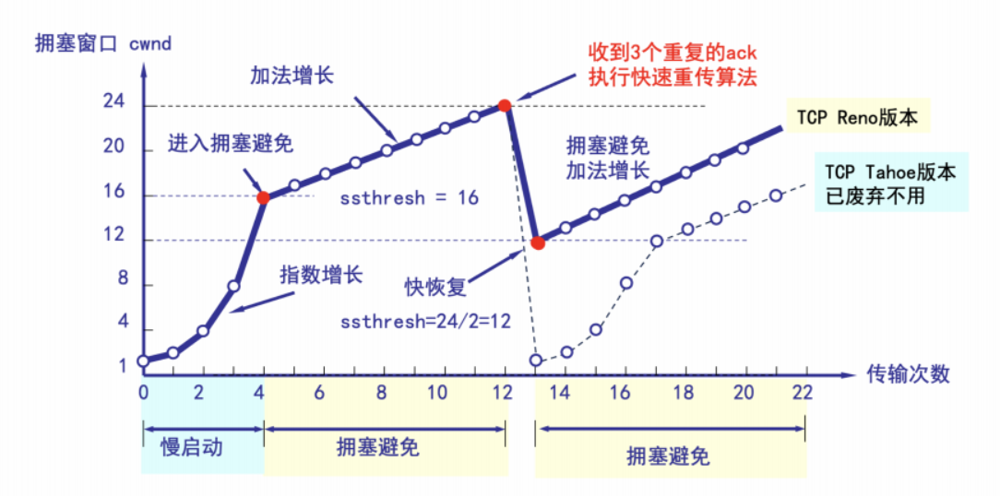
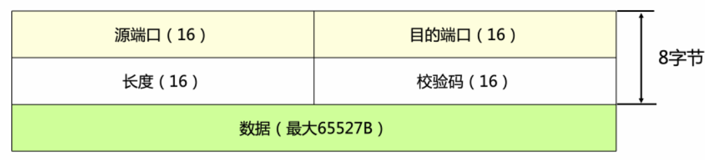

## 1. 概述

**TCP（Transmission Control Protocol，传输控制协议）** 和 **UDP（User Datagram Protocol，用户数据报协议）**是 TCP/IP 协议族中**传输层**的两大核心协议。它们负责在源主机和目的主机之间提供`端到端`的数据传输服务。

| 特性 | TCP | UDP |
|------|-----|-----|
| **连接方式** | 面向连接 | 无连接 |
| **可靠性** | 可靠传输 | 不可靠传输 |
| **传输顺序** | 有序交付 | 不保证顺序 |
| **流量控制** | 支持 | 不支持 |
| **拥塞控制** | 支持 | 不支持 |
| **头部开销** | 20~60 字节 | 8 字节 |
| **传输效率** | 较低（机制复杂） | 较高（轻量级） |
| **适用场景** | 文件传输、网页浏览、邮件 | 视频流、语音通话、DNS、游戏 |

---

## 2. TCP

### 2.1 TCP 头部格式

```
 0 1 2 3 4 5 6 7 8 9 0 1 2 3 4 5 6 7 8 9 0 1 2 3 4 5 6 7 8 9 0 1
+-+-+-+-+-+-+-+-+-+-+-+-+-+-+-+-+-+-+-+-+-+-+-+-+-+-+-+-+-+-+-+-+
|          Source Port          |       Destination Port        |  源端口/目的端口
+-+-+-+-+-+-+-+-+-+-+-+-+-+-+-+-+-+-+-+-+-+-+-+-+-+-+-+-+-+-+-+-+
|                        Sequence Number                        |  序列号 (32位)
+-+-+-+-+-+-+-+-+-+-+-+-+-+-+-+-+-+-+-+-+-+-+-+-+-+-+-+-+-+-+-+-+
|                    Acknowledgment Number                      |  确认号 (32位)
+-+-+-+-+-+-+-+-+-+-+-+-+-+-+-+-+-+-+-+-+-+-+-+-+-+-+-+-+-+-+-+-+
|  Data |           |U|A|P|R|S|F|                               |
| Offset| Reserved  |R|C|S|S|Y|I|            Window             |  标志位 / 窗口
|       |           |G|K|H|T|N|N|                               |
+-+-+-+-+-+-+-+-+-+-+-+-+-+-+-+-+-+-+-+-+-+-+-+-+-+-+-+-+-+-+-+-+
|           Checksum            |         Urgent Pointer        |  校验和 / 紧急指针
+-+-+-+-+-+-+-+-+-+-+-+-+-+-+-+-+-+-+-+-+-+-+-+-+-+-+-+-+-+-+-+-+
|                    Options                    |    Padding    |  选项 / 填充
+-+-+-+-+-+-+-+-+-+-+-+-+-+-+-+-+-+-+-+-+-+-+-+-+-+-+-+-+-+-+-+-+
|                             data                              |  数据部分
+-+-+-+-+-+-+-+-+-+-+-+-+-+-+-+-+-+-+-+-+-+-+-+-+-+-+-+-+-+-+-+-+
```
:::tip[关键标志位]
| 标志 | 含义 | 作用 |
|------|------|------|
| **SYN** | Synchronize | 同步序号，用于建立连接 |
| **ACK** | Acknowledgment | 确认序号有效 |
| **FIN** | Finish | 释放连接 |
| **RST** | Reset | 重置连接（异常中断） |
| **PSH** | Push | 立即推送数据到应用层 |
| **URG** | Urgent | 紧急指针有效 |
:::

### 2.2 TCP 核心特性

TCP 是一种**面向连接、可靠、基于字节流**的传输层协议，通过一系列机制确保数据能够完整、有序地到达目的地。

:::tip[TCP 核心机制一览]
1. **三次握手建立连接** —— 确保双方收发能力正常
2. **四次挥手释放连接** —— 优雅地终止连接
3. **序列号与确认应答（ACK）** —— 保证数据有序且完整到达
4. **超时重传** —— 丢失的数据包自动重传
5. **滑动窗口（流量控制）** —— 防止发送方淹没接收方
6. **拥塞控制（慢启动、拥塞避免、快重传、快恢复）** —— 防止网络拥塞
7. **全双工通信** —— 双方可同时发送和接收数据
:::

---

### 2.3 TCP 三次握手（建立连接）

TCP三次握手流程：


三次握手抓包：


:::note[为什么是三次握手？]
- **第一次**：客户端证明自己能发
- **第二次**：服务器证明自己能收、能发
- **第三次**：客户端证明自己能收
- 三次是最小次数，既能确认双方收发能力，又能防止历史重复连接初始化造成错乱
:::

---

### 2.4 TCP 四次挥手（释放连接）



:::note[为什么是四次挥手？]
TCP 连接是全双工的，每个方向都需要单独关闭。被动关闭方在收到 FIN 后，可能还有数据要发送，所以不能将 ACK 和 FIN 合并。
:::

:::warning[2MSL 等待时间]
- **MSL**（Maximum Segment Lifetime）为报文最大生存时间
- 等待 **2MSL** 确保最后一个 ACK 能被对方收到，若丢失可重传
- 防止已失效的连接请求报文出现在本连接中
:::

---

### 2.5 TCP 可靠传输机制

#### 2.5.1 序列号与确认应答

每个字节的数据都有`编号`（Sequence Number）。接收方回复`确认号`（Acknowledgment Number），表示期望收到的下一个字节序号。支持**累积确认**：`ACK=501` 表示 `1~500` 都已正确接收。

#### 2.5.2 超时重传

发送方启动定时器，超时未收到 ACK 则重传。`超时时间（RTO）`基于 RTT（往返时间）动态计算（RFC 6298）。

RTO太短网络轻微延迟就触发重传，造成不必要的重复数据，加剧拥塞；太长丢包后等待过久，降低吞吐量，延迟敏感应用体验差。


#### 2.5.3 快速重传

收到 **3 个重复 ACK** 时，立即重传丢失的报文段，不必等待超时。

:::tip
收到 `ACK=100, ACK=100, ACK=100`（三次重复），立即重传 `seq=100` 的数据
:::

---

### 2.6 TCP 流量控制（滑动窗口）

**目的**：防止发送方发送速率过快，导致接收方缓冲区溢出。

窗口在TCP头部占16bit，用于可变大小的滑动窗口。

TCP滑动窗口机制如图所示：


- 接收方通过 TCP 头部的 Window 字段通告剩余缓冲区大小（接收窗口 rwnd）
- 发送方取 min(拥塞窗口 cwnd, 接收窗口 rwnd) 作为实际发送窗口


---

### 2.7 TCP 拥塞控制

**目的**：防止过多数据注入网络导致路由器/链路拥塞。

| 阶段 | 算法 | 行为 |
|------|------|------|
| **慢启动** | Slow Start | cwnd 从 1 开始，每收到一个 ACK 增加 1，指数增长 |
| **拥塞避免** | Congestion Avoidance | cwnd 达到阈值后，每 RTT 增加 1，线性增长 |
| **快重传** | Fast Retransmit | 3 个重复 ACK 立即重传，不等待超时 |
| **快恢复** | Fast Recovery | 快重传后，cwnd 减半而非降到 1，避免过于激进 |



:::important[拥塞发生时的两种处理]
| 触发条件 | ssthresh | cwnd | 后续行为 |
|---------|----------|------|---------|
| **超时重传** | cwnd / 2 | 1 | 重新慢启动 |
| **快重传（3 个 dup ACK）** | cwnd / 2 | ssthresh + 3 | 进入快恢复 |
:::


---

## 3. UDP 

### 3.1 UDP 核心特性

UDP 是一种**无连接、不可靠、面向数据报**的传输层协议，设计目标是在 IP 之上提供最小的、最简单的服务。

:::note[UDP 核心特点]
1. **无连接**：发送前不需要建立连接，减少开销和延迟
2. **不可靠**：不保证数据到达、不保证顺序、不重传丢失报文
3. **面向数据报**：保留报文边界，一次发送对应一次接收
4. **头部极小**：仅 8 字节，处理开销低
5. **支持一对一、一对多、多对一、多对多**（支持广播和多播）
6. **无流量控制和拥塞控制**：发送方可以任意速率发送
:::

---

### 3.2 UDP 头部格式



- **长度字段**：UDP 头部 + 数据的总长度（最小值为 8，即仅头部）
- **校验和**：可选（IPv4 中可为 0 表示不使用），覆盖头部、数据和伪头部

---

### 3.3 UDP 伪头部（校验和计算用）

```
+-+-+-+-+-+-+-+-+-+-+-+-+-+-+-+-+-+-+-+-+-+-+-+-+-+-+-+-+-+-+-+-+
|                       Source Address                          |  源 IP 地址 (32位)
+-+-+-+-+-+-+-+-+-+-+-+-+-+-+-+-+-+-+-+-+-+-+-+-+-+-+-+-+-+-+-+-+
|                    Destination Address                        |  目的 IP 地址 (32位)
+-+-+-+-+-+-+-+-+-+-+-+-+-+-+-+-+-+-+-+-+-+-+-+-+-+-+-+-+-+-+-+-+
|     Zero      |   Protocol    |         UDP Length            |  0 + 协议号(17) + UDP长度
+-+-+-+-+-+-+-+-+-+-+-+-+-+-+-+-+-+-+-+-+-+-+-+-+-+-+-+-+-+-+-+-+
```

- 伪头部 + 整个 UDP 报文，一起计算校验和
- 与报文里的 UDP 校验和字段比对，一致则合法


:::note
伪头部不实际传输，仅用于校验和计算，以确保数据送到了正确的目的地。
:::

---

## 4. TCP vs UDP 对比

| 对比维度 | TCP | UDP |
|---------|-----|-----|
| **连接性** | 面向连接（三次握手） | 无连接 |
| **可靠性** | 可靠（确认、重传、排序） | 不可靠（尽力而为） |
| **有序性** | 保证数据按序到达 | 不保证顺序 |
| **传输方式** | 面向字节流（无边界） | 面向数据报（保留边界） |
| **头部大小** | 20~60 字节 | 8 字节 |
| **传输效率** | 较低（机制复杂、开销大） | 较高（极简设计） |
| **流量控制** | 滑动窗口机制 | 无 |
| **拥塞控制** | 慢启动、拥塞避免、快重传/快恢复 | 无 |
| **广播/多播** | 不支持 | 支持 |
| **安全性** | 相对更高（连接状态可追踪） | 需应用层自行实现 |
| **连接数限制** | 受系统资源限制 | 理论上无限制 |


