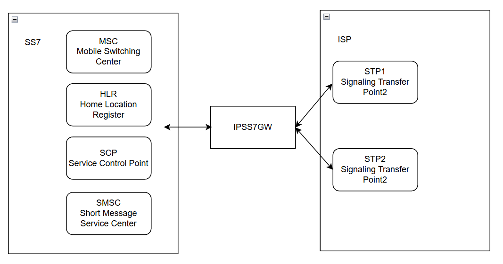
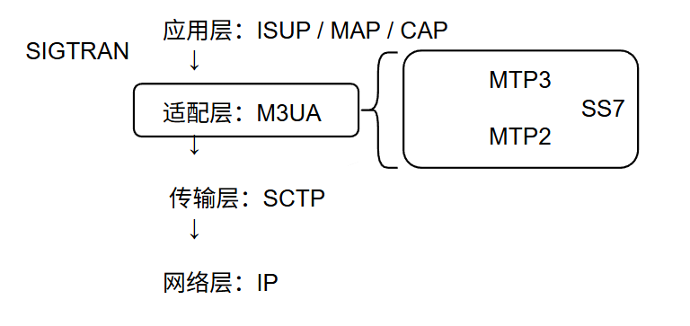
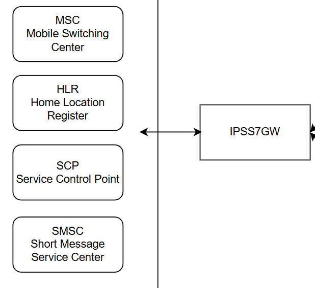
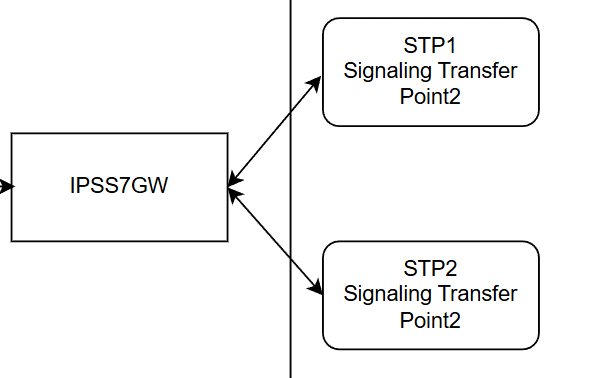

简单记录下关于IPSS7GW的项目。

# 1. 背景

某现网环境下，需要部署IPSS7GW网元对接SS7域网元和IP域运营商。
- 环境信息: **部署有IPSS7GW的主机，两个业务地址到运营商用于对接的公网地址。运营商提供两个STP的PC。** 
 架构如图所示: 左边主要为SS7域，右边为对接运营商的IP域，采用SCTP对接传输。

---------

# 2. IPSS7GW简述
## 2.1 IPSS7GW定义
**传统 SS7 电路交换信令网与 IP 分组信令网之间的互通桥梁。** 在SS7域和IP域之间完成协议转换、格式封装等功能。

## 2.2 IPSS7GW功能
1. `协议转换`：终结传统 SS7 信令（MTP2/MTP3/SCCP 等），将其转换为基于 IP 的 SIGTRAN 协议栈（SCTP+M3UA/SUA 等），反之亦然。
2. `信令路由`：作为信令转发节点，根据目的`信令点码（DPC）`、`全局码（GT）`或`路由键（Routing Key）`，将消息转发至正确的目标网元。
3. `地址映射`：完成 SS7 网络地址（如点码）与 IP 网络地址（如 IP 地址 + SCTP 端口）之间的映射。
4. `可靠性保障`：通过 SCTP 的多归属、多流特性，以及 MTP3 的链路集、负荷分担机制，提供电信级的高可靠传输。

# 3. IP侧 M3UA协议
主要涉及M3UA链路，M3UA展开的话涉及比较多，只说下关键部分。

## 3.1 M3UA协议定义
- *`（MTP3用户适配层协议 User Adaptation Layer）`* 属于 SIGTRAN 协议族, M3UA就是把传统SS7的`MTP3消息（可以理解为SS7域的IP层）`，封装到IP网络里传输的适配器。
- SIGTRAN 协议族架构中M3UA和SS7的MTP2/3的关系类似于这样：

## 3.2 M3UA作用和相关术语
- **适配 SS7 到 IP**：把 MTP3 消息 封装成 M3UA 数据单元，通过 SCTP 传输。
- **提供信令点路由**：M3UA 使用 路由键（Routing Key） 实现 IP 侧信令路由。对应 SS7 侧的 DPC/OPC（目的/源 信令点码）。
:::tip
`点码（Point Code）`：简单理解为SS7中的IP地址，长度有14位（383）和24位（888）两种。
:::
- **提供设备之间的信令关系建立**：M3UA负责建立ASP（Application Server Process）和SG（Signaling Gateway 这里就是IPSS7GW）之间的关系。基于SCTP。

## 3.3 对接运营商M3UA配置
涉及产品，这里简单用文字描述下流程。 

M3UA & SIGTRAN配置:
1. 配置SCTP相关连接参数。
2. 本地点码配置，SIGTRAN层相关参数。
3. M3UA链路配置，这里主要指向运营商提供的IP地址和点码。我方作为客户端向运营商地址发起SCTP INIT链接。

---------

# 4. SS7侧 SCCP协议
**SCCP（Signaling Connection Control Part）**：SS7 域的信令控制协议，负责信令路由、信令关系建立、信令处理等功能。位于MTP3层之上。

传统 SS7 协议栈：

    应用层：ISUP / TCAP(MAP/CAP) / ...
    ↕
    SCCP（信令连接控制部分）
    ↕
    MTP3（网络层，负责点码路由）
    ↕
    MTP2（链路层）
    ↕
    物理层（E1/T1/STM-1）

在 IP 侧（SIGTRAN）：

    应用层：MAP / CAP / ...
    ↕
    SCCP
    ↕
    SUA / M3UA（适配层）
    ↕
    SCTP（传输层）
    ↕
    IP

## 4.1 SCCP作用和相关术语
1. **扩展寻址能力**：MTP3 只能用 ** 点码（OPC/DPC）** 寻址，SCCP 增加了 `全局码`（Global Title, GT） 和 `子系统号`（Subsystem Number, SSN）。

:::tip
例如：用手机号（GT）+ HLR（SSN=6）就能寻址到用户归属的 HLR，而不需要知道它的具体点码。
:::

2. 支持无连接和面向连接业务: 
- 无连接业务（Class 0/1）：类似 IP 的 UDP，用于单次查询 / 响应（如 MAP 位置查询）。
- 面向连接业务（Class 2/3）：类似 TCP，用于需要建立可靠连接的长交互（较少使用）。

3. **全局码翻译（GT Translation GTT）**
`这个比较重要，SCCP 可以将**手机号、IMSI 等用户标识（GT）翻译成对应的信令点码（DPC）和子系统号（SSN）**，从而实现跨网、跨地域的路由`。这是实现移动用户在全国 / 全球漫游的关键技术之一。

4. 分段与重组：当上层消息（如 TCAP/MAP）超过 MTP3 的最大传输单元时，SCCP 负责将消息分段发送，并在对端重组。

**相关术语：**
术语|英文全称|含义
|------|------|------|
**GT** |Global Title	|全局码，如手机号、IMSI，用于用户级寻址
**SSN**	|Subsystem Number	|`子系统号，标识目标网元的应用实体，如 HLR (6)、VLR (7)、SCP (8)、SMSC (9)`
**DPC/OPC**	|Destination/Originating Point Code	|目的 / 源信令点码，MTP3 层的网络节点地址
SCCP 路由	|-	|基于 GT、SSN、DPC 的组合进行路由决策
STP	|Signaling Transfer Point	|信令传输点，负责信令路由和转发，类似于IP网络的路由器

## 4.2 SCCP配置简述
同样的，使用文字简述。
1. SCCP层全局配置
2. 本地信令点信息，包括本地的子系统号（SSN可有多个）和本地点码
3. 对端网元点码和SSN配置

4. **`GTT RESULT配置`，可以看作是路由信息配置，处理GT的转发。**
- 指向本地的result，这里本地有多个网元，配置对应的子系统号，采用route on ssn方式，目标指向本地点码。

- 指向对端的result，运营商提供了两个远端PC，因此配置两条route on gt的链路，分别指向对端STP的两个PC。
 

 

5. `GTT ENTRY配置，绑定GTT RESULT，指明如何处理收到的GT。`
- `本地设备有多个且GT码不同`，绑定这些设备的GTT为本地result。
- `对端会包括全球各地的GT`，配置通配符指向GTT为运营商的两条result。
