原本只是工作时摸鱼，因为对AI这块确实很有兴趣，所以部署来玩玩.
# 1. OPENCLAW部署
需要什么？
- 很简单，一台闲置服务器，云服务器或本地，我这里选的腾讯云，白嫖的三个月免费，适合拿来玩玩。:spoiler[薅公司服务器也行]
> ` 这里贴个codebuddy的推广链接` https://www.codebuddy.ai/promotion/?ref=bv1aa85rdbifx
- 飞书平台或QQ开放平台账号，其他平台还没使用，但看起来目前都是傻瓜式接入。

## 1.1 腾讯云主机配置
在创建主机时选择腾讯云提供的OPENCLAW镜像即可，如果已经有闲置的或装错的同样是使用这个方式来安装。最低档的配置即可。
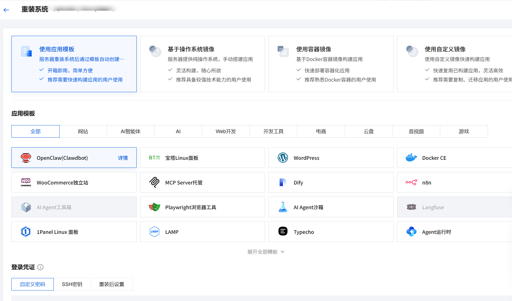

## 1.2 API配置
龙虾的本质其实就是个系统级别的AI客户端，推理还是需要借助大模型的API来完成。
腾讯云这里也集成了API快速配置。选择对应的模型，填写API就行了。
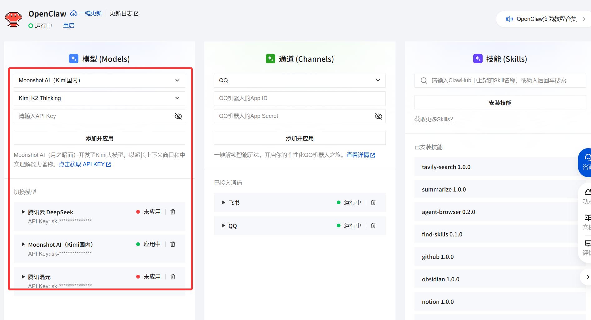
实际上是添加了`/root/.openclaw/openclaw.json`中的模型配置部分：

```js "apiKey"
  "models": {
    "providers": {
      "qcloudlkeap": {
        "baseUrl": "https://api.lkeap.cloud.tencent.com/v1",
        "apiKey": "",
        "api": "openai-completions",
        "models": [
          {
            "id": "deepseek-v3-0324",
            "name": "DeepSeek V3 0324"
          }
        ]
      },
    "mode": "merge"
  }
```

APIkey的我这里使用的是月之暗面的（感觉聪明点），虽然说大部分服务商都会送一点TOKEN，但实际用起来是完全不够的。KEY复制了直接填就行。
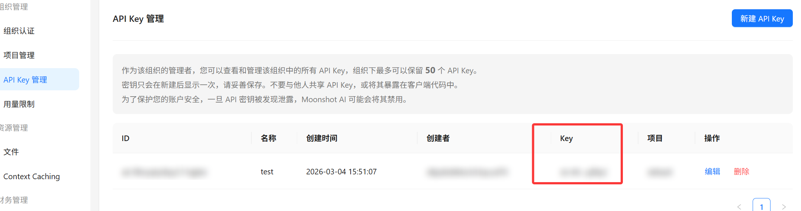
傻瓜式部署就走完了，保险起见，可以进主机CMD用`openclaw gateway restart`重启下网关服务。
- `openclaw dashboard ` 可以使用该命令起一个WEB进行对话。<br>
> openclaw的Gateway作用如图所示，网关是会话、路由和渠道连接的唯一来源。[OpenclawDoc](https://docs.openclaw.ai/zh-CN)
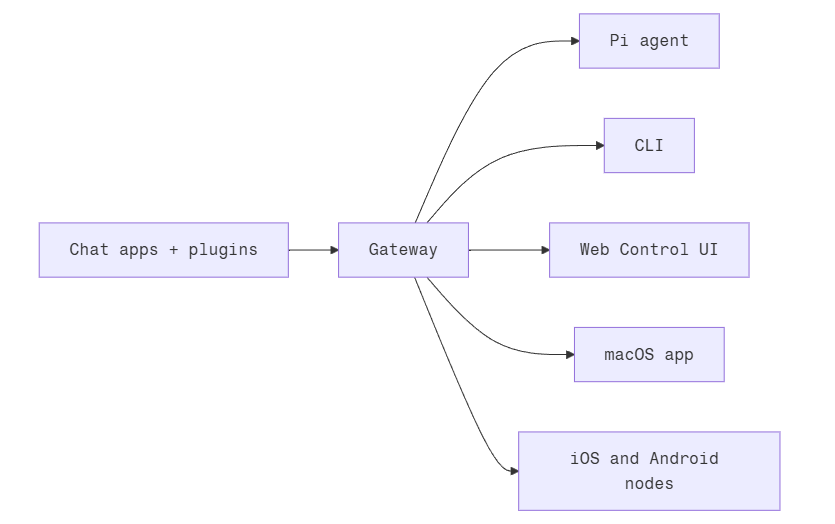

## 1.3 第三方应用接入
这里以飞书为例。
1. 创建飞书机器人，如图所示：

2. 创建后点击机器人会出现**ID和Key**，填到腾讯云提供的channels接口就行。
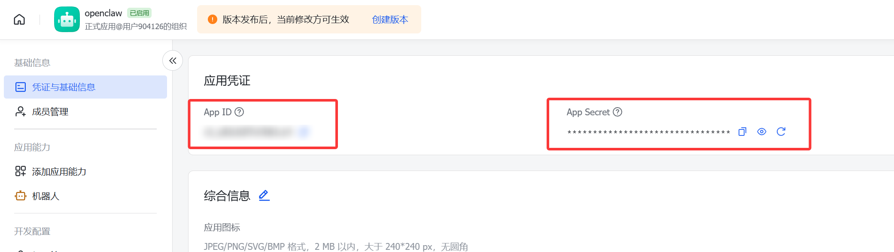
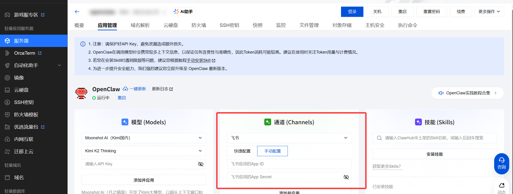
3. 返回飞书，给机器人刷权限，这里把**消息与群组**权限都给上。
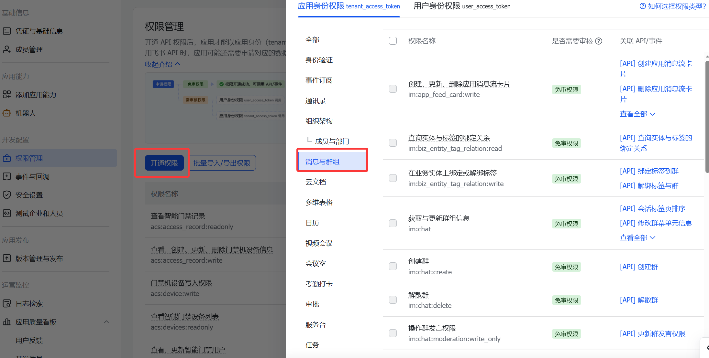
4. 在**事件和回调**中勾选**长连接**接收事件。
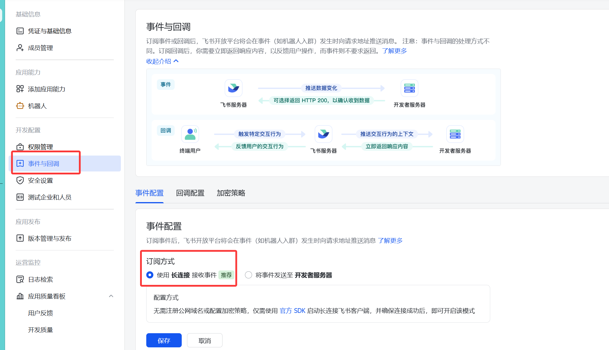
5. 之后选择**添加事件**，勾选**消息与群组**的所有类型。
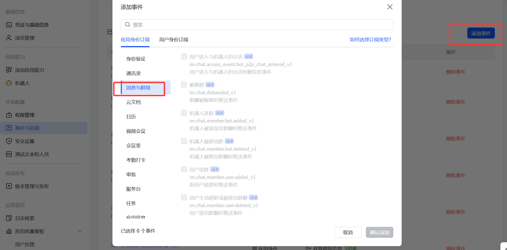  
6. 点版本发布和管理这一块，把机器人发布后就行。
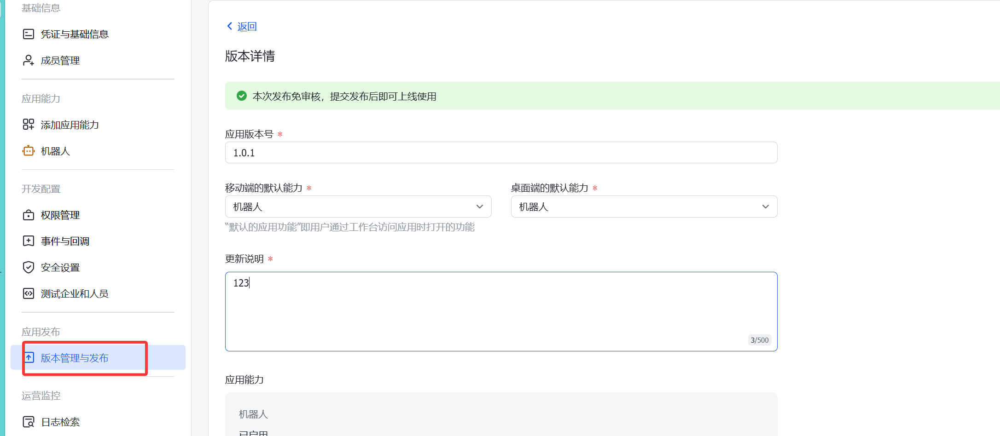

:::note
QQ接入很简单了，腾讯云提供了一键接入，不过对群使用也需要发布版本审核。
:::

## 1.4 初始化配置
- `/root/.openclaw/workspace/IDENTITY.md` Openclaw模型的身份定义文件，可自定义。
- `/root/.openclaw/workspace/SOUL.md` Openclaw的角色定义文件，可自定义。
- `/root/.openclaw/workspace/USER.md` 使用者的定义文件，可自定义。

使用移动端飞书登录后和机器人发送消息，将机器人回复的这段消息在Openclaw的CMD中输入即可配对。
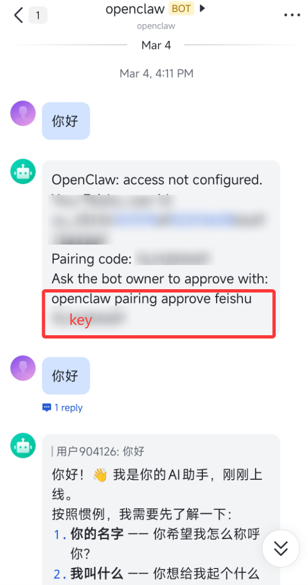

# 2.END
- 基础部署差不多结束了，这玩意好就好在是能够自主执行任务和学习能力，不需要一直下命令，有很大的拓展空间。
- 至于用法有时间也会继续研究下，网上一堆自动工作流变现什么的属实有点夸张了。:spoiler[变现来的钱都不知道够不够token花的。。。]

# 推荐项目
::github{repo="mengjian-github/openclaw101"}