搞了一年多的5GC EPC IMS，大部分时间还是处于半知半解状态，工作主要是以国内专网5G和IMS为主，EPC网络虽然也搞了挺多次，架构和流程虽然都清楚，但打心底还是对底层逻辑不太熟悉，然后问了下世界上最伟大的员工Caim要了这本书看看，无古不成今。


# 1. 概念和架构
## 1.1 4G网络概念
- 早期核心网也称为`PS（package switching 分组交换）`，以`SAE（系统架构演进 system architecture evolution）`作为**PS网络核心网**工作项目并向4G演进；
- `LTE（长期演进 Long Term Evolution）` **无线接口部分**项目4G网络的演进。
- EPC（4g 核心网 evolved packet core）作为SAE的研究对象；E-UTRAN（演进的UMTS陆地无线接入网络 evolved umts terrestrial radio access network）则作为LTE的研究对象。

## 1.2 演进过程
1. `扁平化`：从SGSN（Serving *GeneralPacketRadioService* Support Node）到MME，接入只需要一个节点，且该节点只处理信令流程，转控分离。
2. `IP化`：除空口以外的接口均使用IP协议。
3. `共存`：与2/3G或非3GPP网络还会长时间共存。


扁平化网络架构同时带来了风险更为集中的特点，如更多的信令交互、对网络的可靠性要求更高。

## 1.3 EPC网元
EPC包含的网元，简单概括下定位和功能。
1. **eNodeB（evolved Node B）**： 
    - 定位：4G网络的无线`接入节点`，负责与用户设备进行无线通信。
    - 功能：`无线资源管理、上下行数据分类与 QoS 执行、空口数据压缩与加密`；与 MME 完成信令处理，与 S-GW 完成用户面数据转发。

2. **MME（mobile management entity）**：
    - 定位：EPC核心网的`控制面核心`，负责移动用户的移动管理。
    - 功能：`移动性管理、用户上下文与状态管理、分配用户临时身份标识`；统一协调内部（Intra System）和外部（Inter System）切换。
3. **HSS（home subscriber server）**：   
    - 定位：用户`签约数据中心`，类似 2G/3G 的 HLR 网元。
    - 功能：`存储 LTE 用户的签约与鉴权信息`，提供用户`签约管理和位置管理`；在 4G 网络中通常与 2G/3G 的 HLR 融合部署。
4. **SGW（serving gateway）**：
    - 定位：EPC 的`用户面锚点`，终结 E-UTRAN 方向的接口。
    - 功能：负责用户在不同接入技术间移动时的用户面数据交换，屏蔽 3GPP 内部接入网络的接口差异。
5. **PGW（packet data network gateway）**：
    - 定位：EPC 与`外部 PDN（分组数据网络，如互联网）的网关，终结 SGi 接口`。
    - 功能：作为 3GPP 与非 3GPP 接入网络的用户锚点，一个终端可同时通过多个 P-GW 访问多个 PDN。
6. **PCRF（policy control function）**：
    - 定位：EPC 的`策略控制中心`。
    - 功能：完成`动态 QoS 策略控制`和`基于流的计费控制`；提供基于用户签约的授权控制。P-GW 识别业务流后通知 PCRF，PCRF 下发规则决定业务可用性与 QoS。


## 1.4 EPC网络协议
全面IP化使得网络协议架构变得明显且好理解，EPC网络协议图：

这里简单记录下作用，字段后面再说。
1. *MME和ENB*  **S1接口** `S1AP` ，用于MME和ENB**之间完成无线资源管理、移动性管理**等。
2. *MME和HSS*  **S6a接口** *PGW和PCRF* **Gx接口** `Diameter` ，用于MME和HSS之间传递签约信息、PGW和PCRF之间传递策略信息，diameter的AVP能够携带大量信息。
> 大多数情况下diameter都使用SCTP进行传输，避免TCP的拥塞。
3. *SGW和PGW*  **S5/S8接口控制面** `GTPv2（GTP-C）` ，控制面协议，用于维护GTP-U的隧道。
4. *UE数据面*  **S1U** *SGW和PGW* **S5/S8接口数据面** `GTPv1（GTP-U）` ，数据面协议，基于UDP，保证功能的情况下减小开销。

## 1.4 EPC网络的业务
与传统有线网络不同，无线移动网由于需要考虑到无线资源，在信令面和数据面可以看作有两套协议栈。
UE-MME的控制面协议栈：


UE-MME的数据面协议栈：


EPC业务可大致分为：
1. 公众应用
    - 普通用户的上网业务
2. 行业应用
    - 行业需求，如IoT、POS机等
3. 语音应用，在这存在四种方案
    - **SVLTE** simultaneous voice and LTE 即单卡双待，能够同时在2/3G和4G中进行业务
    - **CSFB** CS fall back 电路域回落 进行语音业务时回落到2/3G网络，需要4G网络在建立语音链接时参与
    - **VoLTE** voice over LTE 基于IMS来提供语音业务，配合SRVCC single radio voice call continuity 来保证从4G到2/3G的语音业务连续性。
    - **OTT** over the top 通过互联网提供语音业务，如微信语音、抖音语音等。

# 2. EPC网络基本流程
## 2.1 状态
由于空口资源和终端资源的限制，EPC定义了`EMM（EPC mobile management ）、ECM（EPC connection management）和RRC(radio resource control)`三种状态。
1. **RRC状态**：RRC-IDLE 和 RRC-CONNECTED
2. **EMM状态**：EMM-DEREGISTERED 和 EMM-REGISTERED
3. **ECM状态**：ECM-IDLE 和 ECM-CONNECTED
三种状态关系：


**EMM-REGISTERED只会出现在附着的情况下**。
> EMM和ECM的状态转换都由流程来触发，如ECM状态可由RRC状态或S1链接状态触发转换。

## 2.2 附着流程
附着流程是最重要的流程之一，逐步说太多了，简化下比较好理解。<br>
附着流程简化图如下，红色内容为流程中比较重要的字段：


-----
这张图不涉及到新旧MME的切换流程和旧session的释放流程，简单来说就是这几步：
1. **ue**向**enb**发起附着请求，enb透传该消息到MME
2. **MME**向**HSS**发起鉴权请求，然后将HSS返回的鉴权信息发到UE
3. 收到UE回复的鉴权响应后，**MME**向**HSS**发update location携带UE相关信息，HSS返回鉴权结果等信息，包含默认的签约信息
4. **MME**根据attach中携带内容向**SGW**发起session建立（EPS 承载）请求，之后**SGW**向**PGW**发起create session request
5. 如果有部署动态规则，**PGW**则会向**PCRF**获取对应的策略信息CCR消息，否则使用本地默认策略
6. **PCRF**授权并返回决策CCA消息
7. **PGW**创建一个EPS承载，并生产一个chargingid，并向**SGW**返回create session response
8. **SGW**向**MME**返回create session response，包含pdn地址、SGWu地址等隧道信息。
9. **MME**向**enb**发送attach accept消息，请求建立无线空口资源
10. **enb**向**ue**发送RRC消息分配空口资源，并携带attach accept，之后**ue**回复携带attach complete消息
11. 此时UE获得了APN地址并可以通过**enb**向**SGW**发送上行数据包，通过modify bearer request消息来动态调整承载QoS、速率、隧道等参数

> 结合报文看更为清晰（这里没有PCRF的流程）：


## 2.3 承载
- UE到外部PDN的IP链接被称为EPS承载。
- EPS承载不仅定义终端地址，还定义QoS等参数、S5/S8接口GTP层的TEID信息等。

两种承载：
- `GBR（Guaranteed Bit Rate）承载` ：业务不低于该保证速率带宽。
- `NonGBR（NonGuaranteed Bit Rate）承载` ：空闲时，业务速率可以上升到该速率；资源紧张时可能会低于该值。

Qos与承载关系：
- 默认QoS中速率控制只能是NonGBR
- 专有承载的QoS控制可以是NonGBR或GBR，但通常为GBR

EPS承载由三部分组成，包括 `无线承载` `S1承载` 和 `S5/S8承载`;<br>
无线承载 和 S1承载 合起来被称为` eRAB（eRadio Access Bearer）`，eRAB的建立成功率为重要指标。


## 2.4具体流程分解
按书中将附着流程分为5个部分，这里还是根据书和自己的抓包来吧，全是文字流程能看下去的也是神人了。
1. 初始请求阶段
2. 鉴权和安全阶段
3. 更新位置阶段
4. 网元和拓扑选择
5. 会话和承载建立阶段


### 2.4.1 初始请求阶段
这里不考虑UE发送RRC连接请求的随机接入。

-----
1. **S1接口信令链接**，UE始发的消息如下：
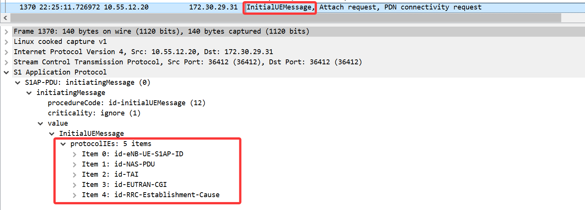
**包含5个items**：
- Id-eNB-UE-S1AP-ID：`建立 S1 接口信令连接内容`。
- Id-NAS-PDU：`非接入层业务信息（UE 和 MME 交互的消息）`。
- Id-TAI：用户当前所在的跟踪区。
- Id-EUTRAN-CGI：用户当前的小区。
- Id-RRC-Establishment-Cause：**RRC 建立的原因**，如 mo-Signalling、mo-Data、mt-Access、highPriorityAccess、emergency 等。表明终端 RRC 建立是由初始信令、初始数据，还是其他原因触发。
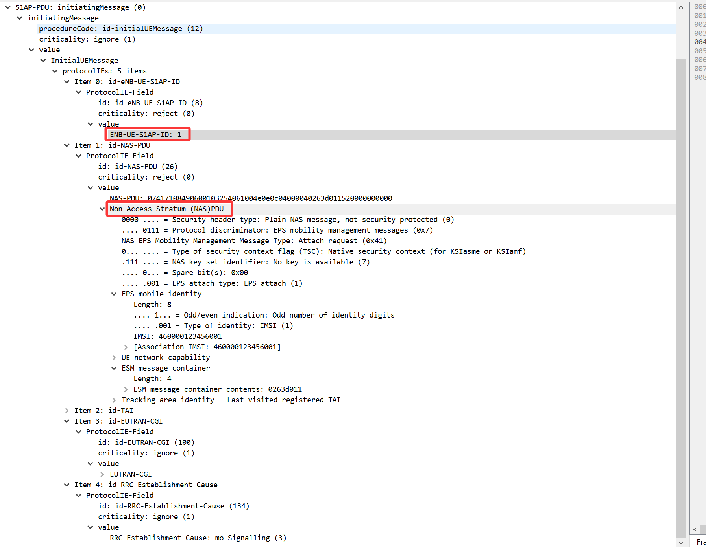
> 这里携带enb为ue分配的S1接口信令ID，在同一enb内唯一；
> NAS-PDU中包含UE和MME交互的消息；

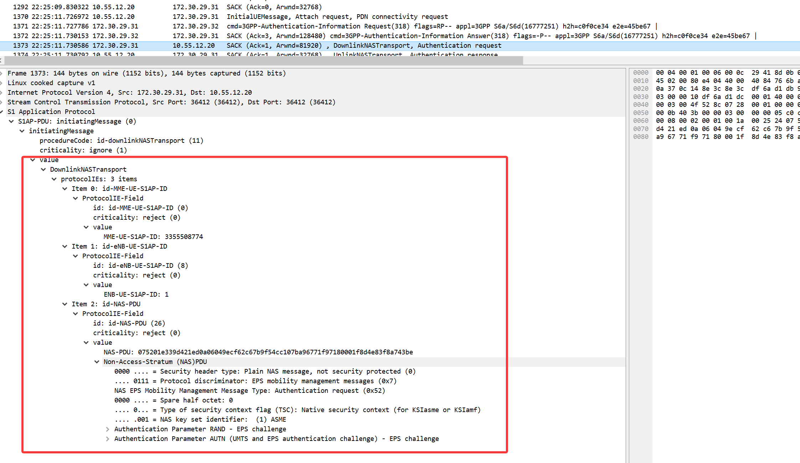
> 随后的第一条下行消息会携带 **MME和UE的S1信令链接ID**，NAS-PDU中包含认证信息
:::tip
NAS层是在SCTP之上的，所以不需要协商地址和端口信息
:::

-----
2. **UE身份获取**
首先明确两个概念：<br>
- **IMSI**(International Mobile Subscriber Identity)：国际移动用户识别码，用于唯一标识用户，通常在首次附着时携带，网络中尽量少使用。
- **GUTI**(Global Unique Tracking Identifier)：MME分配，全局唯一跟踪标识符，用于在不同小区之间跟踪用户位置

**UE上报的标识类型：**
- IMSI
- 上一次使用的native GUTI
- 由2/3G映射而来的GUTI

`倘若上报的GUTI并非本MME分配，则需要通过MME之间的交互来从old mme获取GUTI`，简单流程如下：
- mme之间通过ip/gtp通信，这时候就需要根据GUTI里的内容构建old mme域名，GUTI到MME FQDN的映射如下：
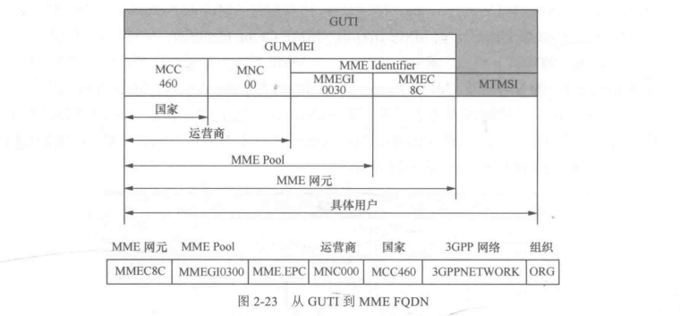
- 之后MME通过dns的NAPTR类型（基于正则表达式的 DNS 查询）查询后的结果，使用A类型请求交互后获得old mme的S10地址
- 想odl mme发起identification request获取用户信息
- 若失败则直接向UE发送identification request
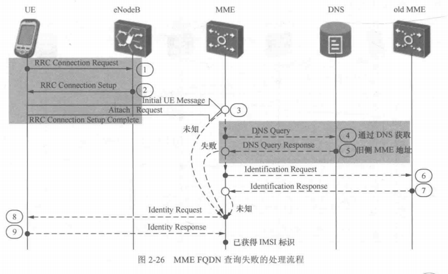

尽量少使用空口以提高安全性。


### 2.4.2 鉴权和安全流程
鉴权只看流程的话还是算比较简明的，就不深究具体加密过程了。
```bash
UE → MME：附着请求
MME → HSS：请求鉴权向量
HSS → MME：返回鉴权向量 (AV)
MME → UE：鉴权请求 (RAND+AUTN)
UE → MME：鉴权响应 (RES)
MME 对比 RES = XRES → 鉴权成功
之后便是NAS加密
```

常见的错误主要有两个：
1. MAC failure问题
实际项目中常是ki值或算法问题导致

2. syn failure问题
这个遇到的比较少，简言之就是`终端计算的SQN`（鉴权里的序列号，核心作用是 防重放攻击 + 保证新鲜度）比自身存储的最大SQN小，导致终端发起重新同步以获取新的鉴权结果。
在HSS和HLR分设时容易出现这个情况，在其中一个域和另外一个域不同步，**如核心网和IMS不是同一厂家，HSS和HLR相互处于两个域的情况下就容易发生**。

### 2.4.3 S6a接口选路
#### 2.4.3.1 Gr接口
Gr是早期**SGSN和HLR之间**的4G/3G PS域控制接口，**基于电路技术的七号信令网（SS7）**。

SS7链路选路过程如图所示，采用了分层寻址，先靠GT SSN定位业务，再靠OPC/DPC选路由，最终通过MTP3转发到目标网元。
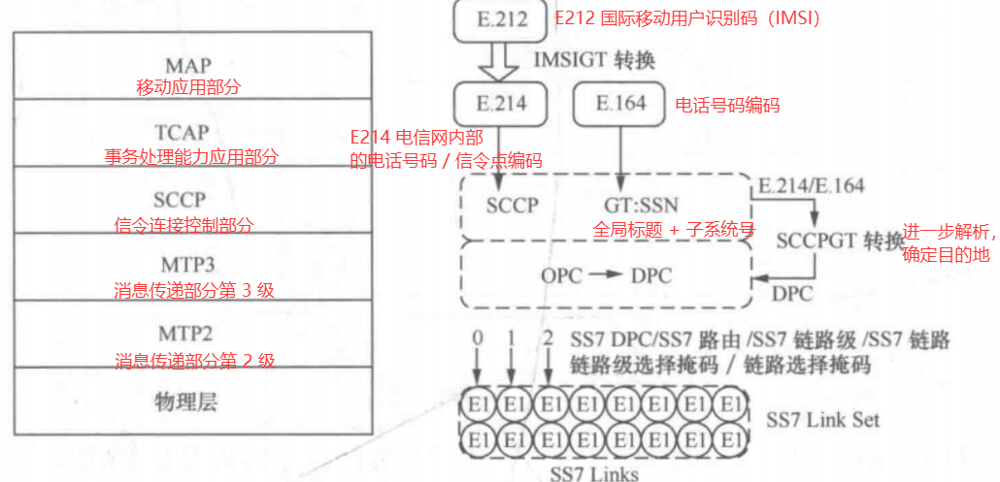
**通过SCCPGT的编码转换，将E214 E164格式的地址转换为SS7的MTP信令点。**

#### 2.4.3.2 S6a接口选路
IP化时代，**MME和HSS之间的S6a接口采用了diameter协议**，diameter协议处在最上层，能够携带多个AVP，实现高效信息传递。

当前接触的环境大多是MME和HSS直连，现网环境下存在中继设备`DRA（Diameter Router Agent）`来实现S6a接口的选路。
> DRA完成SCTP偶联建立和diameter层转发

### 2.4.4 位置更新
在鉴权过后，需要进行位`置更新流程`，这是`移动性管理`的核心。

简单来说就是 **MME 需要将自身信息注册到 HSS** （HSS通过S6a接口选路确认地址），通过位置更新响应，**HSS返回用户的签约信息**。

- MME → HSS：位置更新请求 （Update Locaiton Request）
- HSS → MME：位置更新响应 （Update Location Answer）

HSS会在以下情况主动发消息到MME：
- 位置取消（cancel location）：在 HSS回收签约信息 或 向旧MME/SGSN发送 时产生。
- 插入用户数据（insert user data）：HSS修改用户信息时产生。
- 删除用户数据（delete user data）：HSS删除用户信息时产生。
- 复位（reset）：HSS重启时发到MME/SGSN。


### 2.4.5 承载建立
PDN（packet data network）连接是4G（EPC）网络中的核心概念，用于为用户提供到外部数据网络的IP连接。（5G中称为PDU Session 本质都一样）

- **PDN连接**：用IP确认身份、APN来确认网络，PDN连接还包含支持QoS等内容；
- **EPS bearer**：用来识别UE到某个外部PDN连接采用相同QOS控制的数据流，是PDN连接的子集； 

#### 2.4.5.1 承载建立流程
当UE发起附着（Attach）流程并申请建立PDN连接时，EPS默认承载的建立流程如下（简化的核心步骤）：

1. UE发起附着请求：UE向MME发送附着请求（Attach Request），其中包含PDN Connectivity Request，请求建立到某个APN的连接。
- *在标准流程中MME会首先向DNS解析获得该位置（TAI决定）的S-GW列表和P-GW列表。*
2. MME选择S-GW和P-GW：MME根据UE的请求信息，选择为UE服务的Serving Gateway (S-GW)和PDN Gateway (P-GW)。
3. MME向S-GW发送创建会话请求：MME向选定的S-GW发送“Create Session Request”消息，请求建立默认承载。消息中包含UE的IMSI、EPS承载ID、P-GW地址等。
4. S-GW向P-GW发送创建会话请求：S-GW向选定的P-GW转发“Create Session Request”消息，请求建立EPS承载并分配IP地址。
5. P-GW创建默认承载并分配IP：P-GW为UE分配IP地址，创建默认EPS承载上下文，并确定QoS参数（如QCI=5，ARP等）。P-GW向S-GW返回“Create Session Response”，携带分配的IP地址和EPS承载上下文。
- *当需要为特定业务（如VoLTE语音）提供特定QoS保障时，会触发专有承载建立。该流程由网络侧发起（通常是P-GW）*
6. 创建无线侧承载：
- *MME向eNodeB发送“Initial Context Setup Request / Attach Accept”消息，携带UE的EPS承载上下文（包括QoS信息），请求eNodeB建立无线承载。*
- *eNodeB分配无线资源，并向UE发送“RRC Connection Reconfiguration”消息，携带EPS Radio Bearer ID（ERAB ID）和无线侧QoS参数。*
- *UE完成配置后，向eNodeB返回“RRC Connection Reconfiguration Complete”消息，确认无线承载建立完成。*
7. S-GW更新用户面路径：eNodeB建立无线承载后（步骤2b），MME向S-GW发送“Modify Bearer Request”，将eNodeB的N3隧道（GTP-U）信息告知S-GW。S-GW更新用户面路径后，返回“Modify Bearer Response”，确认承载建立完成。
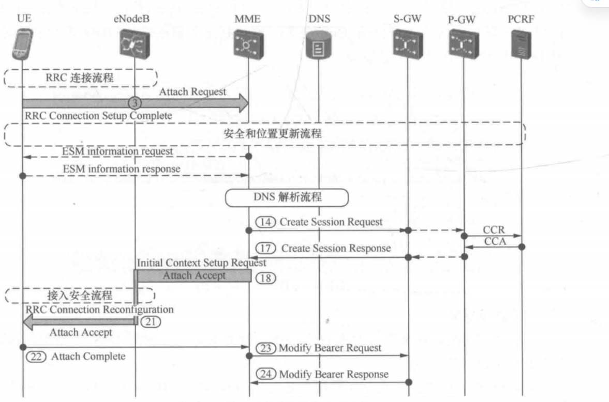

#### 2.4.5.2 承载建立的关键点
1. **端到端可达性**
   - 不同接口使用不同协议来承载；
   - 承载创建过程中，将本端的 GTP地址+TEID 发送到对端，对端根据该信息发送用户数据；
   - 本端收到数据后识别承载做出对应的数据处理；
2. **移动可达**
   - 移动状态下，数据可达性通过隧道来实现；
   - 用户移动到新enb或S-GW时，S-GW或P-GW会和新enb或新S-GW创建GTP隧道；
   - 切换后的数据包会封装新对端的GTP信息；
3. **QoS保障**
   - 各个节点在创建承载上下文时会包含QoS上下文，端到端QoS上下文保持一致；
   - 基于承载（Bearer），一个承载对应一组QoS参数；

-----


# 3. 移动状态流程
移动切换（handover ho）需要保证业务的连续性。

蜂窝网络理论覆盖范围和实际覆盖范围如图所示。
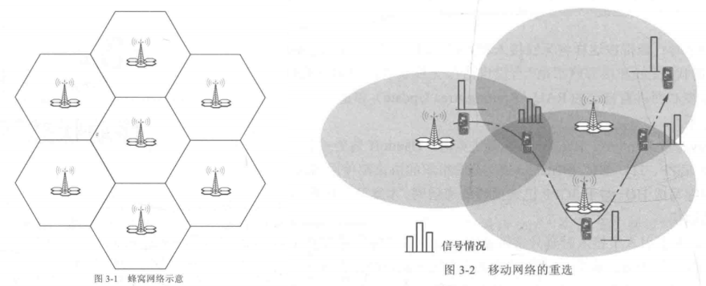

- **切换**（Handover）：**连接态流程**，eNodeB主导，UE与网络有RRC连接可进行信令交互。先在目标侧建立承载，再指示UE切换，是无损过程
- **重选**（Reselection）：**空闲态流程**，UE自主决定，无RRC连接。先断开再连接，是有损过程

## 3.1 位置标识
1. 2/3G 位置区 LAI
- 地理位置相近、终端移动频繁的多个小区划分到一个位置区。
- `终端在空闲态下发生小区切换，若在这个位置区里则不会通知网络`。
- 终端到达新小区后，若位置区改变，则通知网络更新位置区信息。
LAI标识组成：
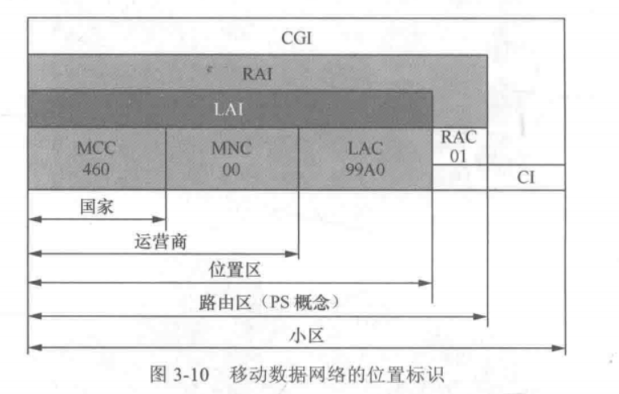
> RAI：Routing Area Identity，通过加上两位RAC组成，RAI是空闲态PS寻呼终端的范围

| 标识          | 作用域 | 说明                                                    |
| ----------- | --- | ----------------------------------------------------- |
| **位置区（LA）** | CS域 | CS域寻呼单位。终端到达新位置区时发起位置更新。同一位置区内的小区切换不上报网络侧，避免大量空闲态用户信令 |
| **路由区（RA）** | PS域 | PS域寻呼单位。终端到达新路由区时发起RAU流程                              |


2. 4G/5G 跟踪区标识 TAI
```
TAI = MCC + MNC + TAC
      │    │     │
      │    │     └── 跟踪区码（Tracking Area Code）
      │    └──────── 移动网络码（Mobile Network Code）
      └───────────── 移动国家码（Mobile Country Code）
```
- 多个TAI组成一个 TA list
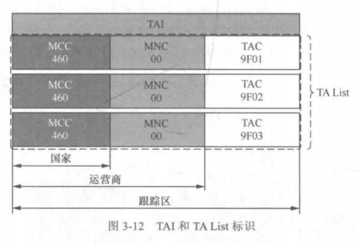
- TA list通过attach accept/tau accept下发终端
- 终端在进入到ta list之外的跟踪区时才会发起TAU流程

## 3.2 TAU 流程
当UE移动到新的TA list时，需要发起TAU流程。

以MME + SGW 改变TAU流程为例：
1. UE触发TAU请求
2. NEW MME从 OLD MME（old mme地址由FQDN解析得出）获取UE的上下文（context），发送context request消息（包含EPS承载上下文 MME上下文 SGW信令面地址和TEID PGW FQDN等）
3. 安全流程，和附着相同，HSS校验UE合法性
4. 承载切换，MME根据终端上报的的信息构建 TAC FQDN 来解析可用的`SGW列表`，再根据PGW FQDN`选择SGW`
5. NEW mme发起位置更新，将NEW MME ID注册到HSS
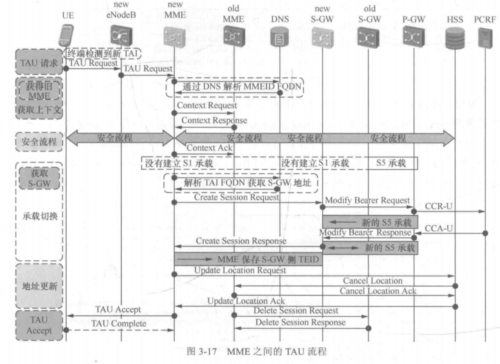
- TAU accept包含新的TA list，如果同时携带了GUTI，UE需要给MME返回TAU complete
- TAU accept携带了T3412计时器，用于周期性更新，让终端能够定期向网络汇报状态


## 3.3 Service Request
Service Request（业务请求）流程是`UE在ECM-IDLE状态下，需要恢复数据传输时触发的流程`。其核心目的是将`UE从ECM-IDLE状态转换到ECM-CONNECTED状态`，重建无线承载和S1-U用户面承载。
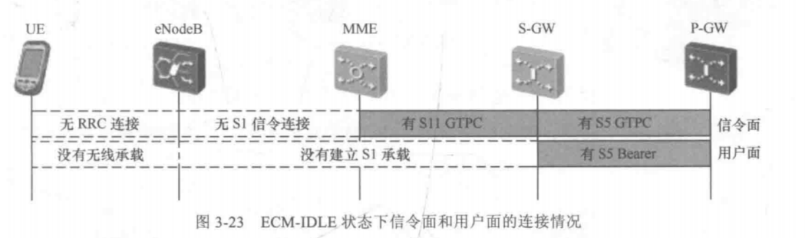
- **UE触发**：上行有数据待发送、上行信令待处理（如TAU、Detach）
- **网络触发**：MME收到下行数据通知，需要寻呼UE


Service Request 流程：
1. 网络侧触发（S5承载保留） 
- -> paging寻呼终端 
- -> 终端发起service request 
- -> MME 发送context setup request携带SGW S1和TEID到eNodeB 
- -> 无线承载建立 
- -> modify bearer request携带eNB S1用户面地址和TEID到SGW

service request流程如图所示：
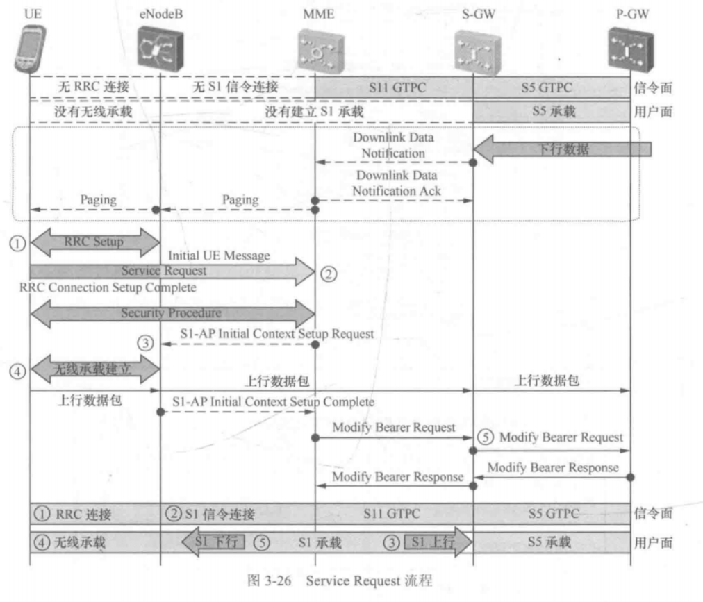

2. UE触发
终端直接发起service request即可。

## 3.4 Handover流程
**Handover（切换）是连接态下的流程**。当UE在eNodeB之间移动时，为保证数据连接的连续性，由eNodeB主导将UE的服务从源eNodeB转移到目标eNodeB。

**Handover和TAU的区别**：
对比项|	TAU（跟踪区更新）|	Handover（切换）
| ----------- | --- | ----------------------------------------------------- |
触发方|	UE 主动发起	|网络侧（基站）控制
状态|	空闲态（IDLE）/ 连接态（CONNECTED）|	仅连接态（通话 / 数据中）
目的|	更新位置、便于寻呼、周期性保活	|无线质量差→换小区，业务无缝延续
中断|	空闲态无影响；跨核心网有短暂中断	|几乎无中断（硬切换 < 50ms）
范围|	跨 TA	|跨 小区 / 基站（可同 TA 或跨 TA）

Handover的两种切换方式
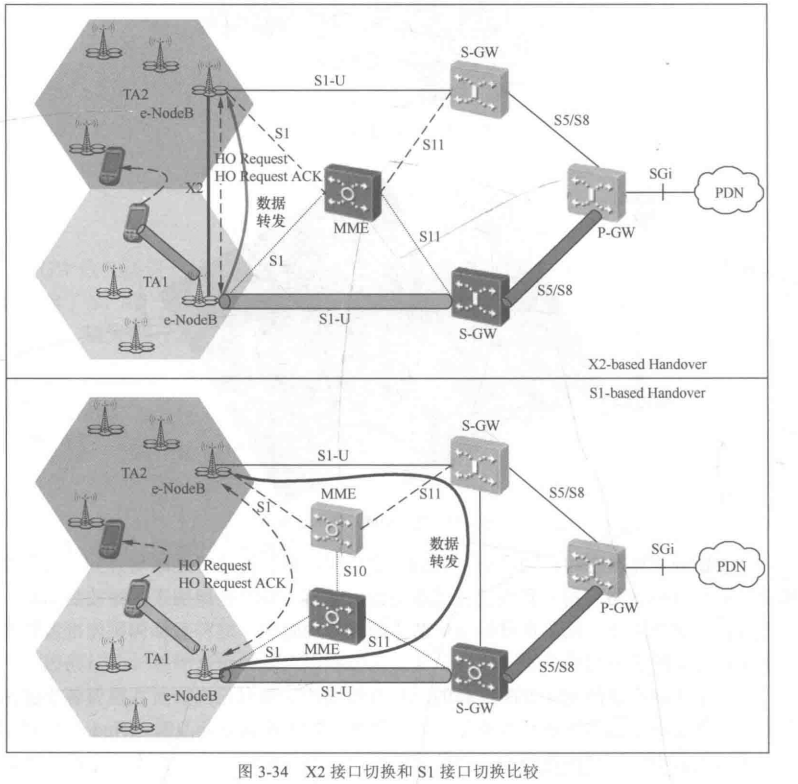

### 3.4.1 基于X2接口的切换
X2切换是LTE系统中首选的切换方式，适用于X2接口可用的场景。`其核心特点是MME不直接参与切换过程（MME不变），切换主要在源eNodeB和目标eNodeB之间直接完成。`
描述流程太折磨了 贴图了
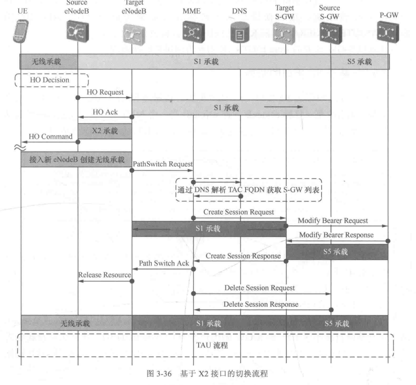

### 3.4.2 基于S1接口的切换
S1切换在以下场景使用：
- X2接口不可用
- X2切换失败回退
- 需要MME重定位（UE离开MME Pool Area）
- 需要SGW重定位且目标eNodeB与源SGW无IP连接
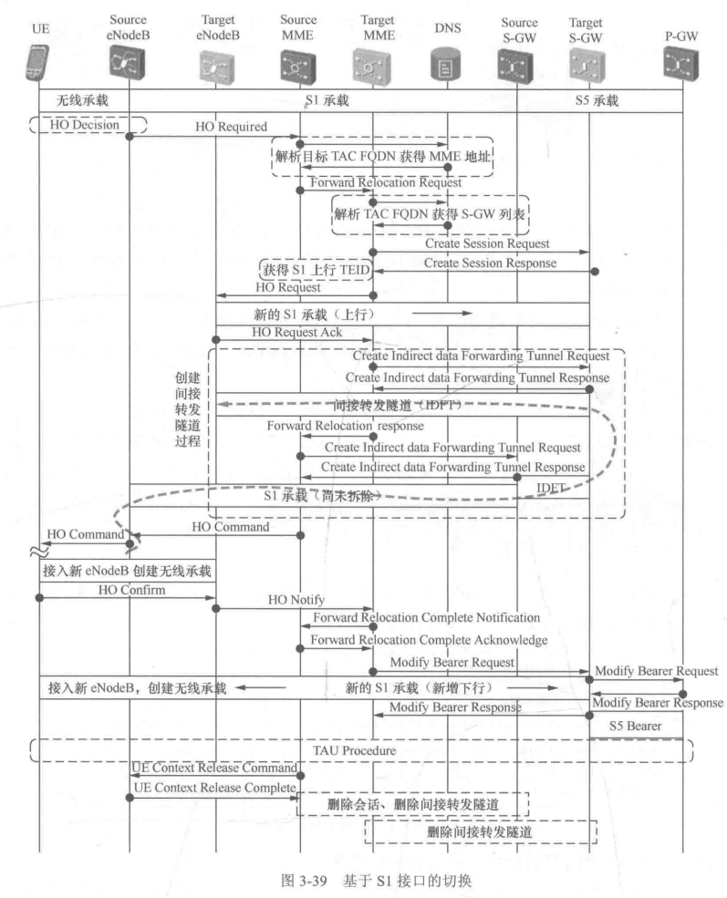


# 4. 3GG内互操作
EPC到传统2/3G网络有较多不同，因此互操作的前提是实现语言（协议、字段）的统一。
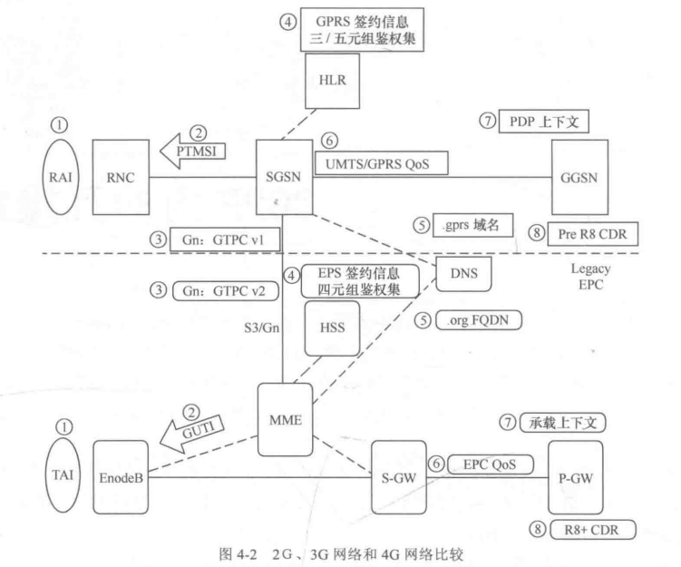

## 4.1 基于UE能力选择网关
具有4G能力的UE在2/3G网络时一定需要选择融合了GGSN和PGW能力的网关。
- 网关不具备融合能力，在2/3G切换到4G时，PGW不会存在相关的承载信息