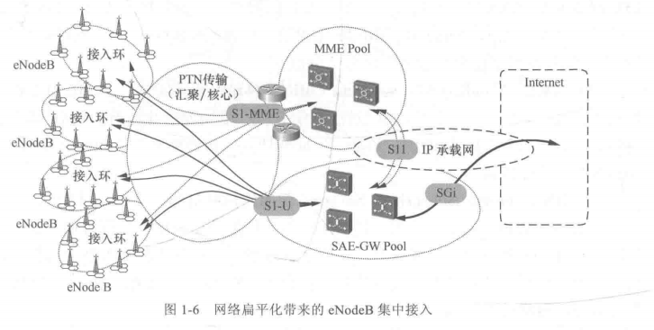
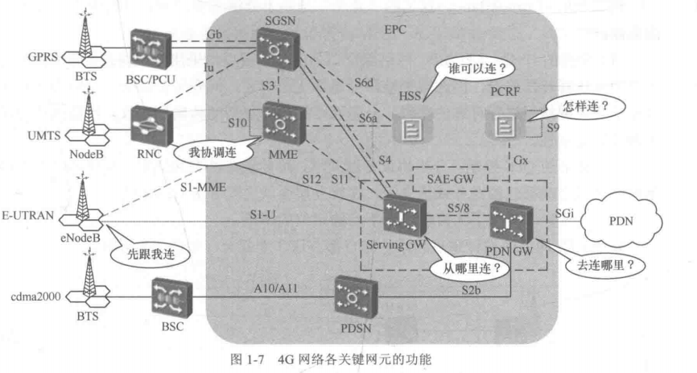
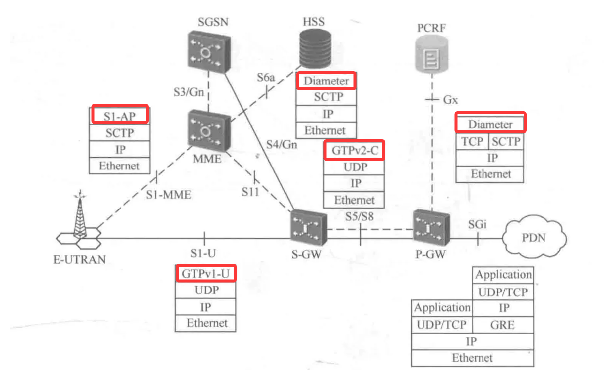
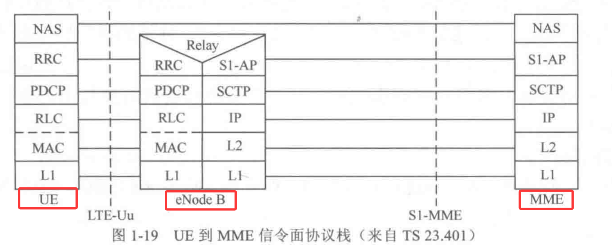
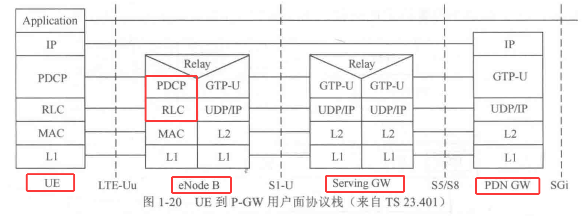
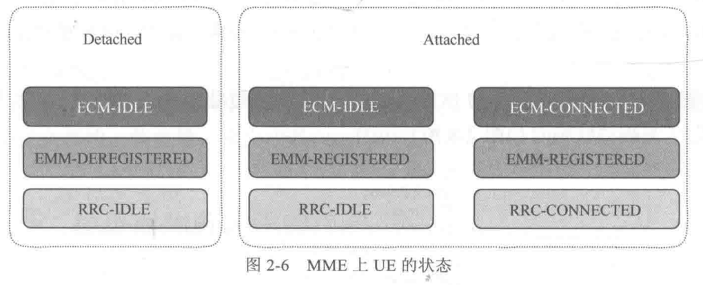
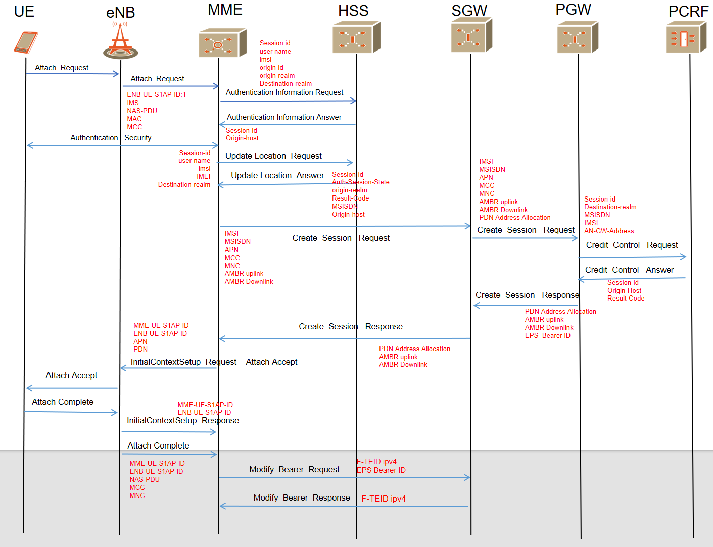
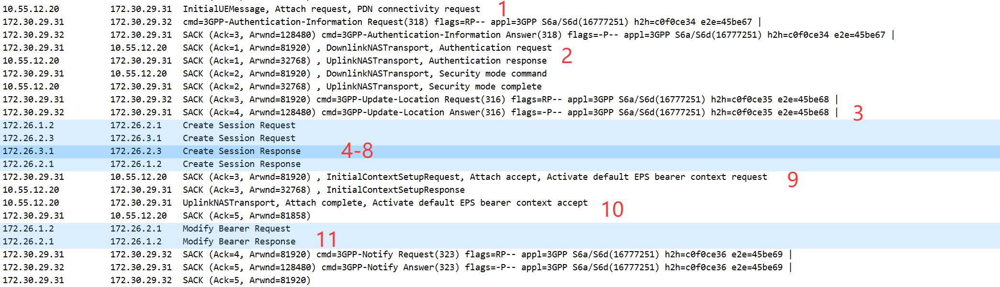
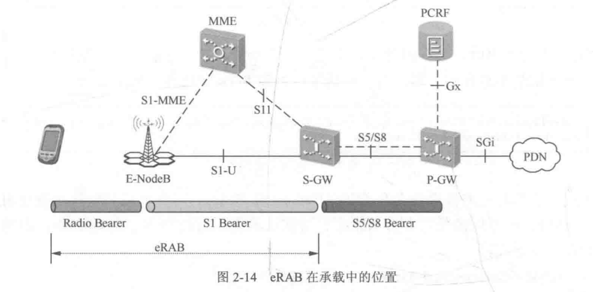

搞了一年多的5GC EPC IMS，大部分时间还是处于半知半解状态，工作主要是以国内专网5G和IMS为主，EPC网络虽然也搞了挺多次，架构和流程虽然都清楚，但打心底还是对底层逻辑不太熟悉，然后问了下世界上最伟大的员工Caim要了这本书看看，无古不成今。

# 1. 概念和架构
## 1.1 4G网络概念
- 早期核心网也称为`PS（package switching 分组交换）`，以`SAE（系统架构演进 system architecture evolution）`作为**PS网络核心网**工作项目并向4G演进；
- `LTE（长期演进 Long Term Evolution）` **无线接口部分**项目4G网络的演进。
- EPC（4g 核心网 evolved packet core）作为SAE的研究对象；E-UTRAN（演进的UMTS陆地无线接入网络 evolved umts terrestrial radio access network）则作为LTE的研究对象。

## 1.2 演进过程
1. `扁平化`：从SGSN（Serving *GeneralPacketRadioService* Support Node）到MME，接入只需要一个节点，且该节点只处理信令流程，转控分离。
2. `IP化`：除空口以外的接口均使用IP协议。
3. `共存`：与2/3G或非3GPP网络还会长时间共存。

扁平化网络架构同时带来了风险更为集中的特点，如更多的信令交互、对网络的可靠性要求更高。

## 1.3 EPC网元
EPC包含的网元，简单概括下定位和功能。
1. **eNodeB（evolved Node B）**： 
    - 定位：4G网络的无线`接入节点`，负责与用户设备进行无线通信。
    - 功能：`无线资源管理、上下行数据分类与 QoS 执行、空口数据压缩与加密`；与 MME 完成信令处理，与 S-GW 完成用户面数据转发。

2. **MME（mobile management entity）**：
    - 定位：EPC核心网的`控制面核心`，负责移动用户的移动管理。
    - 功能：`移动性管理、用户上下文与状态管理、分配用户临时身份标识`；统一协调内部（Intra System）和外部（Inter System）切换。
3. **HSS（home subscriber server）**：   
    - 定位：用户`签约数据中心`，类似 2G/3G 的 HLR 网元。
    - 功能：`存储 LTE 用户的签约与鉴权信息`，提供用户`签约管理和位置管理`；在 4G 网络中通常与 2G/3G 的 HLR 融合部署。
4. **SGW（serving gateway）**：
    - 定位：EPC 的`用户面锚点`，终结 E-UTRAN 方向的接口。
    - 功能：负责用户在不同接入技术间移动时的用户面数据交换，屏蔽 3GPP 内部接入网络的接口差异。
5. **PGW（packet data network gateway）**：
    - 定位：EPC 与`外部 PDN（分组数据网络，如互联网）的网关，终结 SGi 接口`。
    - 功能：作为 3GPP 与非 3GPP 接入网络的用户锚点，一个终端可同时通过多个 P-GW 访问多个 PDN。
6. **PCRF（policy control function）**：
    - 定位：EPC 的`策略控制中心`。
    - 功能：完成`动态 QoS 策略控制`和`基于流的计费控制`；提供基于用户签约的授权控制。P-GW 识别业务流后通知 PCRF，PCRF 下发规则决定业务可用性与 QoS。

## 1.4 EPC网络协议
全面IP化使得网络协议架构变得明显且好理解，EPC网络协议图：

这里简单记录下作用，字段后面再说。
1. *MME和ENB*  **S1接口** `S1AP` ，用于MME和ENB**之间完成无线资源管理、移动性管理**等。
2. *MME和HSS*  **S6a接口** *PGW和PCRF* **Gx接口** `Diameter` ，用于MME和HSS之间传递签约信息、PGW和PCRF之间传递策略信息，diameter的AVP能够携带大量信息。
> 大多数情况下diameter都使用SCTP进行传输，避免TCP的拥塞。
3. *SGW和PGW*  **S5/S8接口控制面** `GTPv2（GTP-C）` ，控制面协议，用于维护GTP-U的隧道。
4. *UE数据面*  **S1U** *SGW和PGW* **S5/S8接口数据面** `GTPv1（GTP-U）` ，数据面协议，基于UDP，保证功能的情况下减小开销。

## 1.4 EPC网络的业务
与传统有线网络不同，无线移动网由于需要考虑到无线资源，在信令面和数据面可以看作有两套协议栈。
UE-MME的控制面协议栈：

UE-MME的数据面协议栈：

EPC业务可大致分为：
1. 公众应用
    - 普通用户的上网业务
2. 行业应用
    - 行业需求，如IoT、POS机等
3. 语音应用，在这存在四种方案
    - **SVLTE** simultaneous voice and LTE 即单卡双待，能够同时在2/3G和4G中进行业务
    - **CSFB** CS fall back 电路域回落 进行语音业务时回落到2/3G网络，需要4G网络在建立语音链接时参与
    - **VoLTE** voice over LTE 基于IMS来提供语音业务，配合SRVCC single radio voice call continuity 来保证从4G到2/3G的语音业务连续性。
    - **OTT** over the top 通过互联网提供语音业务，如微信语音、抖音语音等。

# 2. EPC网络基本流程
## 2.1 状态
由于空口资源和终端资源的限制，EPC定义了`EMM（EPC mobile management ）、ECM（EPC connection management）和RRC(radio resource control)`三种状态。
1. **RRC状态**：RRC-IDLE 和 RRC-CONNECTED
2. **EMM状态**：EMM-DEREGISTERED 和 EMM-REGISTERED
3. **ECM状态**：ECM-IDLE 和 ECM-CONNECTED
三种状态关系：

**EMM-REGISTERED只会出现在附着的情况下**。
> EMM和ECM的状态转换都由流程来触发，如ECM状态可由RRC状态或S1链接状态触发转换。

## 2.2 附着流程
附着流程是最重要的流程之一，逐步说太多了，简化下比较好理解。 
附着流程简化图如下，红色内容为流程中比较重要的字段：

这张图不涉及到新旧MME的切换流程和旧session的释放流程，简单来说就是这几步：
1. **ue**向**enb**发起附着请求，enb透传该消息到MME
2. **MME**向**HSS**发起鉴权请求，然后将HSS返回的鉴权信息发到UE
3. 收到UE回复的鉴权响应后，**MME**向**HSS**发update location携带UE相关信息，HSS返回鉴权结果等信息，包含默认的签约信息
4. **MME**根据attach中携带内容向**SGW**发起session建立（EPS 承载）请求，之后**SGW**向**PGW**发起create session request
5. 如果有部署动态规则，**PGW**则会向**PCRF**获取对应的策略信息CCR消息，否则使用本地默认策略
6. **PCRF**授权并返回决策CCA消息
7. **PGW**创建一个EPS承载，并生产一个chargingid，并向**SGW**返回create session response
8. **SGW**向**MME**返回create session response，包含pdn地址、SGWu地址等隧道信息。
9. **MME**向**enb**发送attach accept消息，请求建立无线空口资源
10. **enb**向**ue**发送RRC消息分配空口资源，并携带attach accept，之后**ue**回复携带attach complete消息
11. 此时UE获得了APN地址并可以通过**enb**向**SGW**发送上行数据包，通过modify bearer request消息来动态调整承载QoS、速率、隧道等参数

> 结合报文看更为清晰（这里没有PCRF的流程）：

## 2.3 承载
- UE到外部PDN的IP链接被称为EPS承载。
- EPS承载不仅定义终端地址，还定义QoS等参数、S5/S8接口GTP层的TEID信息等。

两种承载：
- `GBR（Guaranteed Bit Rate）承载` ：业务不低于该保证速率带宽。
- `NonGBR（NonGuaranteed Bit Rate）承载` ：空闲时，业务速率可以上升到该速率；资源紧张时可能会低于该值。

Qos与承载关系：
- 默认QoS中速率控制只能是NonGBR
- 专有承载的QoS控制可以是NonGBR或GBR，但通常为GBR

EPS承载由三部分组成，包括 `无线承载` `S1承载` 和 `S5/S8承载`; 
无线承载 和 S1承载 合起来被称为` eRAB（eRadio Access Bearer）`，eRAB的建立成功率为重要指标。

## 2.4具体流程分解
按书中将附着流程分为5个部分，这里还是根据书和自己的抓包来吧，全是文字流程能看下去的也是神人了。
1. 初始请求阶段
2. 鉴权和安全阶段
3. 更新位置阶段
4. 网元和拓扑选择
5. 会话和承载建立阶段